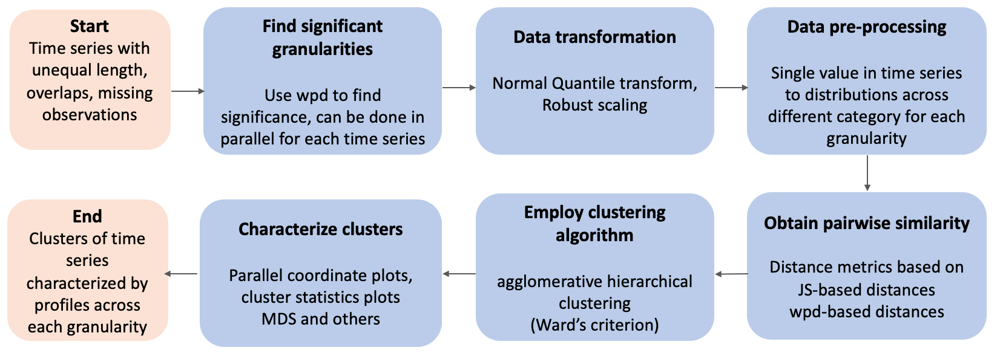
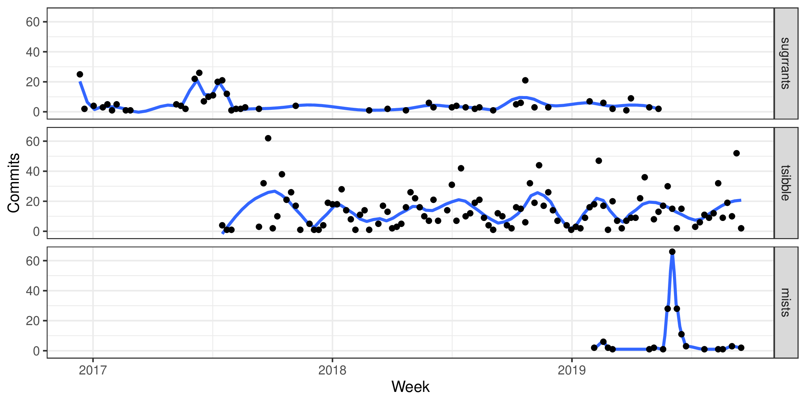

```{r initial, echo = FALSE, cache = FALSE, results = 'hide'}
options("knitr.graphics.auto_pdf" = TRUE)
library(knitr)
opts_chunk$set(
  warning = FALSE, message = FALSE, echo = FALSE,
  fig.path = 'figure/', fig.align = 'center', fig.show = 'hold',
  cache = TRUE, external = TRUE, comment = "#>", dpi = 300,
  out.width = ifelse(is_html_output(), "100%", "\\textwidth"),
  cache.path = ifelse(is_html_output(), 'cache-gitbook/', 'cache-pdfbook/')
)
hook_output <-  knit_hooks$get('output')
knit_hooks$set(output = function(x, options) {
  # this hook is used only when the linewidth option is not NULL
  if (!is.null(n <- options$linewidth)) {
    x = knitr:::split_lines(x)
    # any lines wider than n should be wrapped
    if (any(nchar(x) > n)) x = strwrap(x, width = n)
    x = paste(x, collapse = '\n')
  }
  hook_output(x, options)
})
```

`r if (knitr::is_latex_output()) '<!--'` 

# Welcome {-}

This is the website for my PhD thesis at Monash University (Australia), titled "Visualization and analysis of probability distributions of large temporal data".

`r Sys.Date()`

`r if (knitr::is_latex_output()) '-->'`

<!--chapter:end:index.Rmd-->

`r if (knitr::is_html_output()) '<!--'` 

# Copyright notice {-}

\textcopyright { }Sayani Gupta (\number\the\year). 

I certify that I have made all reasonable efforts to secure copyright permissions for third-party content included in this thesis and have not knowingly added copyright content to my work without the owner's permission.

\newpage

`r if (knitr::is_html_output()) '-->'`

<!--chapter:end:Rmd//00-a-copyright.Rmd-->

# Abstract {-}

The research was motivated by the desire to understand the Australian smart meters data, which was collected half-hourly for two years at the household level. With temporal data available at ever finer scales, exploring periodicity can become overwhelming with so many possible temporal deconstructions to explore. Analysts are expected to comprehensively explore the many ways to view and consider temporal data. However, the plethora of choices and the lack of a systematic approach to do so quickly can make the task overwhelming.


<!-- exploration may be required to be carried out across both finer and coarser scales to draw useful inferences about the underlying process. It is important to be able to navigate through all the temporal deconstructions that accommodate for periodicities to have multiple perspectives of the observed data. This idea aligns with the notion of EDA (Tukey 1977) which emphasizes the use of multiple perspectives on data to help formulate hypotheses before proceeding to hypothesis testing. Slicing and dicing the data in all possible temporal scales as suggested by EDA can be a daunting task as it leads to a -->
<!-- myriad of possibilities. -->


<!-- Analysts are expected to comprehensively explore the many ways to view and consider temporal data. However, the plethora of choices and the lack of a systematic approach to do so quickly can make the task overwhelming -->


<!-- exploring periodicity can become overwhelming with so many possible temporal deconstructions to explore. Analysts are expected to comprehensively explore the many ways to view and consider temporal data. However, the plethora of choices and the lack of a systematic approach to do so quickly can make the task overwhelming. -->

<!-- <WHY> <WHAT> <HOW> -->

This work investigates how time may be dissected, resulting in alternative data segmentation and, as a result, different visualizations that can aid in the identification of underlying patterns. The first contribution (Chapter \@ref(ch:gravitas)) describes classes of time deconstructions using linear and cyclic time granularities. It provides tools to compute possible cyclic granularities from an ordered (usually temporal) index and also a framework to systematically explore the distribution of a univariate variable conditional on two cyclic time granularities by defining "harmony". "harmony" denotes pairs of granularities that could be analyzed together and reduces the search from all possible options. This approach is still overwhelming for human consumption because there would still be a huge number of harmonies. Hence, the second contribution (Chapter \@ref(ch:hakear)) refines the search of informative granularities by identifying those for which the differences between the displayed distributions are greatest and rating them in order of importance of capturing maximum variation. The third contribution (Chapter \@ref(ch:gracsr)) builds upon the first two to provide methods for exploring heterogeneities in repetitive behavior for many households and over multiple granularities. It accomplishes this by providing a way to cluster time series based on probability distributions across informative cyclic granularities. Although we were motivated by the smart meter example, the problem and the solutions we propose are practically relevant to any temporal data observed more than once per year.

<!-- there is a need to resort to clustering, which has been addressed in  It approaches the problem by computing pairwise distances between time series based on probability distributions over multiple cyclic granularities at once. -->
\newpage

<!--chapter:end:Rmd//00-b-abstract.Rmd-->

`r if (knitr::is_html_output()) '<!--'` 

\newpage

# Declaration {-}


I have not renumbered sections of submitted or published papers in order to generate a consistent presentation within the thesis.

\textbf{Student name:} Sayani Gupta

\textbf{Student signature:}

```{r signature, out.width = "20%", fig.align = "left", eval = file.exists("img/signature.png")}
knitr::include_graphics("img/signature.png")
```

\textbf{Date:} `r Sys.Date()`

`r if (knitr::is_html_output()) '-->'`

<!--chapter:end:Rmd//00-c-declaration.Rmd-->

# Acknowledgements {-}

# supervisors
Rob and Di are phenomenal leaders in their respective fields, who lead by example. I am inspired by their creativity, wisdom, discipline, and dedication to really contribute to the society through their research. Thank you for constantly pushing me to improve as a programmer and researcher, and for regularly sharing best practices for conducting research. Looking back, I am grateful for how my thoughts and work in statistical computing, graphics, and data analytics in general have evolved over the years. I still have a lot to learn, but I am a much more self-reliant and independent researcher than I was when I started. Di has been instrumental in exposing me to the potential benefits of effective data visualization. As a female researcher, I am encouraged by her willingness to pursue unconventional avenues and have frequently noticed her make a conscious decision to question existing  stereotypes and biases. Thank you Di for being a fantastic female role model.

# department and PhD colleagues


# R community


# friends

PhD in Covid has been harder and I would not have been able to make it through this if not for the emotional support of my friends and family. Thank you Puwasala, Sium for being an epitome of kindness and acting as a pillar of support. Thank you Tushar, Samarpita and Nairita for always motivating me and believing in me when I didn't believe in myself. Thank you Ian for always putting things in perspective when I lost sight. Thank you each one of you for being available, listening to me, and not giving up on me at my lowest. Thanks to my housemates Anjali, Surbhi and Dulaji for the fun company and conversations that kept me sane in the covid lockdowns.

# family
Finally, a big thanks to my family for always being supportive of my choices. Thanks to my mum (Nupur Gupta) and dad (Arun Prasad Gupta), from whom I learnt that no matter where you start from, if you persevere and are sincere in your efforts, you can sail through any difficult situation. They are my constant cheerleaders for all little and big endeavours. Thanks to my brother (Avijit) for always having my back and inspiring me to dream bigger. Thank you, Juhi (sister-in-law) for instilling in me the value of organisation in all aspects of life and the importance of prioritizing my physical health from time to time. Thank you all for your part in supporting me in this journey. I love you. 

<!--chapter:end:Rmd//00-d-acknowlegements.Rmd-->

# Preface {-}

Chapter \@ref(ch:gravitas) has been accepted by the *Journal of Computational and Graphical Statistics*. It has won the ACEMS Business Analytics Prize in 2020. The accompanying R package **gravitas** is on CRAN. Chapter \@ref(ch:hakear) and Chapter \@ref(ch:gracsr) are yet to be submitted.

### Open and reproducible research {-}

This thesis is written in R Markdown [@rmarkdown] with **bookdown** [@bookdown], using **renv** [@renv] to create reproducible environments. The online version of this thesis is hosted at <https://sayani.netlify.app/>, powered by [Netlify](http://netlify.com). All materials (including the data sets and source files) required to reproduce this document can be found at the Github repository <https://github.com/Sayani07/thesis>.

### License {-}

<a rel="license" href="http://creativecommons.org/licenses/by-nc-sa/4.0/"></a>

This work is licensed under a [Creative Commons Attribution-NonCommercial-ShareAlike 4.0 International License](http://creativecommons.org/licenses/by-nc-sa/4.0/).

The code used in this document is available under the [MIT license](https://opensource.org/licenses/MIT).

\clearpage\pagenumbering{arabic}\setcounter{page}{0}

<!--chapter:end:Rmd//00-e-preface.Rmd-->

# Introduction {#ch:intro}

<!-- Introduction -->
<!-- Motivation & Background -->
<!-- Outline of the thesis -->

<!-- To tame the complexity of time, breaking it into years, months, weeks, days and so on in a hierarchical manner is a common way to relate data to time. Such dicrete human made abstractions of time can be thought of as time granularities.(Aigner et al., 2008). -->


<!-- introducing the overall field-->
With the availability of data at more and more finer time scales, exploration of time series data may be required to be carried out across both finer and coarser scales to draw useful inferences about the underlying process. For example, data collected at an hourly scale could be analyzed using coarser temporal scales such as days, months or quarters. This approach requires deconstructing time in various possible ways. Moreover, often it might be interesting to capture calendar or periodic effects like month-of-year, day-of-week or hour-of-day. They help us in answering questions like if certain levels of those time deconstructions are characterized by unusual/routine values of the observed variable. For example, certain days of the week or months of the year are likely to be characterized by higher values. It is important to be able to navigate through all the temporal deconstructions that accommodate for periodicities to have multiple perspectives of the observed data. This idea aligns with the notion of EDA (Tukey 1977) which emphasizes the use of multiple perspectives on data to help formulate hypotheses before proceeding to hypothesis testing.


<!-- outline the intro chapter structure -->

This chapter will provide an introduction to the study by first discussing the background and context, followed by the research aims, objectives and questions.

<!-- Background -->

The motivation for this work comes from the desire to provide methods to better understand large quantities of measurements on energy usage reported by smart meters in household across Australia, and indeed many parts of the world. Smart meters currently provide half-hourly use in kwh for each household, from the time that they were installed, some as early as 2012. Households are distributed geographically, and have different demographic properties such as the existence of solar panels, central heating or air conditioning. The behavioral patterns in households vary substantially, for example, some families use a dryer for their clothes while others hang them on a line, and some households might consist of night owls, while others are morning larks. It is common to see aggregates of usage across households, total kwh used each half hour by state, for example, because energy companies need to understand maximum loads that they will have to plan ahead to accommodate. But studying overall energy use hides the distributions of usage at finer scales, and making it more difficult to find solutions to improve energy efficiency.

<!-- introduce the specific problem  -->


<!-- ## change in data structure as a result of transitioning from linear to cyclic deconstructions -->
<!-- + Existing approaches, why we need to drill down, or why we want to -- probability distributions -->
However, restructuring time in this manner leads to restructured data where each level of the time deconstructions correspond to multiple values of the observed variable. It is common to see aggregation or summarization of these multiple observations with a unique value to study calendar effects. For example, using aggregates of usage across each hour/half-hour has been common in the literature because energy companies need to plan for maximum loads on the network. But studying overall energy use hides the distributions of usage at finer scales, and making it more difficult to find solutions to improve energy efficiency. Summarizing the probability distribution of these multiple observations to capture both the shape and uncertainty could be a potential way to understand the underlying distribution of these observations. Studying probability distributions is likely to focus on features of the data which are not transparent through raw data or a unique summary statistic.

<!-- Following research objectives would facilitate the achievement of this aim -->
<!-- Research objectives -->

<!-- ## Research aims -->

Hence, the overarching research goal is to study the periodic behavior of temporal data in a structured way by studying the probability distributions by best exploiting the characteristics of time. Slicing and dicing the data in all possible temporal scales as suggested by EDA can be a daunting task as it leads to a myriad of possibilities. This inspires the research presented in this thesis, which aims to provide a platform to systematically explore periodicities in temporal data and support finding regular patterns or anomalies, explore clusters of behaviors or summarize the behavior. The first part of the work discusses computation of all possible combinations of cyclic time granularities and a graphical mapping such that distributions of a numeric response variable is displayed across combinations of two cyclic granularities. Even analyzing the distribution of the measured variable across two cyclic granularities at once could amount to displaying many plots in search of potential  patterns. Thus, the first part of the research (@Gupta2020-vo) also introduces "harmony" to denote pairs of granularities that could be analyzed together and reduces the search from all possible options. But this approach is still overwhelming for human consumption because there would still be huge number of harmonies. Hence, the second part of the research extends this work and narrows the search further by finding pair of cyclic granularities which are informative enough and rank them according to their importance. However, to explore periodic patterns of many households, we have to resort to clustering which has been addressed in the third part of the research. Although the motivation came through the smart meter example, this is a problem that is relevant to any temporal data observed more than once per year.

## Visualizing probability distributions across bivariate cyclic temporal granularities {#sec:gravitas}

Deconstructing a time index into time granularities can assist in exploration and automated analysis of large temporal data sets. This paper describes classes of time deconstructions using linear and cyclic time granularities. Linear granularities respect the linear progression of time such as hours, days, weeks and months. Cyclic granularities can be circular such as hour-of-the-day, quasi-circular such as day-of-the-month, and aperiodic such as public holidays. The hierarchical structure of granularities creates a nested ordering: hour-of-the-day and second-of-the-minute are single-order-up. Hour-of-the-week is multiple-order-up, because it passes over day-of-the-week. Methods are provided for creating all possible granularities for a time index. A recommendation algorithm provides an indication whether a pair of granularities can be meaningfully examined together (a "harmony"), or when they cannot (a "clash").  
 
 Time granularities can be used to create data visualizations to explore for periodicities, associations and anomalies. The granularities form categorical variables (ordered or unordered) which induce groupings of the observations. Assuming a numeric response variable, the resulting graphics are then displays of distributions compared across combinations of categorical variables.  
  
 The methods implemented in the open source R package `gravitas` are consistent with a tidy workflow, with probability distributions examined using the range of graphics available in `ggplot2`.

## Detecting distributional differences between temporal granularities for exploratory time series analysis {#sec:hakear}

Cyclic temporal granularities, which are temporal deconstructions of a time period into units such as hour-of-the-day, work-day/weekend, can be useful for measuring repetitive patterns in large univariate time series data. The granularities feed new approaches to exploring time series data. One use is to take pairs of granularities, and make plots of response values across the categories induced by the temporal deconstruction. However, when there are many granularities that can be constructed for a time period, there will also be too many possible displays to decide which might be the more interesting to display. This work proposes a new distance metric to screen and rank the possible granularities, and hence choose the most interesting ones to plot. The distance measure is computed for a single or pairs of cyclic granularities can can be compared across different cyclic granularities and also on a collection of time series. The methods are implemented in the open-source R package `hakear`. 

## Clustering time series based on probability distributions across temporal granularities {#sec:gracsr}


 With more and more time series data being collected at much finer temporal resolution, for a longer length of time, and for a larger number of individuals/entities, time series clustering research is getting a lot of traction. The sort of noisy, patchy, uneven, and asynchronous time series that is typical in many disciplines limits similarity searches among these lengthy time series. In this work, we suggest a method for overcoming these constraints by grouping time series based on probability distributions over cyclic temporal granularities. Cyclic granularities are temporal deconstructions of a time period into units such as hour-of-the-day, work-day/weekend, and so on, and can be helpful for detecting repeating patterns. Looking at probability distributions across cyclic granularities results in an approach that is robust to missing or noisy data, aids in dimension reduction, and ensures small pockets of similar repeated behaviours. The proposed method was tested using a collection of residential electricity customers. The simulated and empirical evidence demonstrates that our method is capable of producing meaningful clusters.


<!-- Time series clustering research is gaining a lot of importance with more and more time series data recorded at much finer temporal resolution, for a longer period of time and for a larger number of individuals/entities.Similarity searches amongst these long time series are often limited by the type of noisy, patchy, unequal and asynchronous time series common in many fields. In this paper we propose a strategy to alleviate these limitations by  clustering time series based on probability distributions across cyclic temporal granularities. Cyclic granularities are temporal deconstructions of a time period into units such as hour-of-the-day, work-day/weekend, which can be useful for measuring repetitive patterns in large univariate time series data. Thus, looking at the probability distributions across cyclic granularity leads to a method which is robust to missing or noisy data, helps in dimension reduction while ensuring small pockets of similar repetitive behaviors. The method is applied to electricity smart meter dat -->
<!-- The suggested approach was evaluated on a set of benchmark time series on residential electricity customers. The empirical results show that our approach is able to yield meaningful clusters. -->

## Summary

The thesis is structured as follows. Chapter \@ref(ch:gravitas) provides details of the cyclic granularities, different classes, and computation, and also its usage in exploratory time series analysis through applications. This is implemented in the R package **gravitas**. Chapter \@ref(ch:hakear) provides guidance on how to choose significant cyclic granularities, which are likely to have interesting patterns across its categories. This is available as the R package **hakear**. The chapter @ref (ch: gracsr) provides similarity measures for comparing multiple time series.This is in the developing R package **gracsr**. Chapter \@ref(ch:conclusion) summarizes the software tools developed for the work, and discusses some future plans.

<!--chapter:end:Rmd//01-intro.Rmd-->

# Visualizing probability distributions across bivariate cyclic temporal granularities {#ch:gravitas}

Deconstructing a time index into time granularities can assist in exploration and automated analysis of large temporal data sets. This paper describes classes of time deconstructions using linear and cyclic time granularities. Linear granularities respect the linear progression of time such as hours, days, weeks and months. Cyclic granularities can be circular such as hour-of-the-day, quasi-circular such as day-of-the-month, and aperiodic such as public holidays. The hierarchical structure of granularities creates a nested ordering: hour-of-the-day and second-of-the-minute are single-order-up. Hour-of-the-week is multiple-order-up, because it passes over day-of-the-week. Methods are provided for creating all possible granularities for a time index. A recommendation algorithm provides an indication whether a pair of granularities can be meaningfully examined together (a "harmony"), or when they cannot (a "clash").  
 
 Time granularities can be used to create data visualizations to explore for periodicities, associations and anomalies. The granularities form categorical variables (ordered or unordered) which induce groupings of the observations. Assuming a numeric response variable, the resulting graphics are then displays of distributions compared across combinations of categorical variables.  
  
 The methods implemented in the open source R package `gravitas` are consistent with a tidy workflow, with probability distributions examined using the range of graphics available in `ggplot2`.


```{r external, include = FALSE, cache = FALSE}
read_chunk('scripts/gravitas.R')
```

```{r load}
```

## Introduction

Temporal data are available at various resolutions depending on the context. Social and economic data are often collected and reported at coarse temporal scales such as monthly, quarterly or annually. With recent advancements in technology, more and more data are recorded at much finer temporal scales. Energy consumption may be collected every half an hour, energy supply may be collected every minute, and web search data might be recorded every second. As the frequency of data increases, the number of questions about the periodicity of the observed variable also increases. For example, data collected at an hourly scale can be analyzed using coarser temporal scales such as days, months or quarters. This approach requires deconstructing time in various possible ways called time granularities [@aigner2011visualization].

It is important to be able to navigate through all of these time granularities to have multiple perspectives on the periodicity of the observed data. This aligns with the notion of exploratory data analysis (EDA) [@Tukey1977-jx] which emphasizes the use of multiple perspectives on data to help formulate hypotheses before proceeding to hypothesis testing. Visualizing probability distributions conditional on one or more granularities is an indispensable tool for exploration. Analysts are expected to comprehensively explore the many ways to view and consider temporal data. However, the plethora of choices and the lack of a systematic approach to do so quickly can make the task overwhelming.

Calendar-based graphics [@wang2020calendar] are useful in visualizing patterns in the weekly and monthly structure and are helpful when checking for the effects of weekends or special days. Any temporal data at sub-daily resolution can also be displayed using this type of faceting [@Wickham2009pk] with days of the week, month of the year, or another sub-daily deconstruction of time. But calendar effects are not restricted to conventional day-of-week or month-of-year deconstructions. There can be many different time deconstructions, based on the calendar or on categorizations of time granularities.

Linear time granularities (such as hours, days, weeks and months) respect the linear progression of time and are non-repeating. One of the first attempts to characterize these granularities is due to @Bettini1998-ed. However, the definitions and rules defined are inadequate for describing non-linear granularities. Hence, there is a need to define some new time granularities, that can be useful in visualizations. Cyclic time granularities can be circular, quasi-circular or aperiodic. Examples of circular granularities are hour of the day and day of the week; an example of a quasi-circular granularity is day of the month; examples of aperiodic granularities are public holidays and school holidays.

Time deconstructions can also be based on the hierarchical structure of time. For example, hours are nested within days, days within weeks, weeks within months, and so on. Hence, it is possible to construct single-order-up granularities such as second of the minute, or multiple-order-up granularities such as second of the hour. The lubridate package [@Grolemund2011-vm] provides tools to access and manipulate common date-time objects. However, most of its accessor functions are limited to single-order-up granularities.

The motivation for this work stems from the desire to provide methods to better understand large quantities of measurements on energy usage reported by smart meters in households across Australia, and indeed many parts of the world. Smart meters currently provide half-hourly use in kWh for each household, from the time they were installed, some as early as 2012. Households are distributed geographically and have different demographic properties as well as physical properties such as the existence of solar panels, central heating or air conditioning. The behavioral patterns in households vary substantially; for example, some families use a dryer for their clothes while others hang them on a line, and some households might consist of night owls, while others are morning larks. It is common to see aggregates [see @Goodwin_2012] of usage across households, such as half-hourly total usage by state, because energy companies need to plan for maximum loads on the network. But studying overall energy use hides the distribution of usage at finer scales, and makes it more difficult to find solutions to improve energy efficiency. We propose that the analysis of smart meter data will benefit from systematically exploring energy consumption by visualizing the probability distributions across different deconstructions of time to find regular patterns and anomalies. Although we were motivated by the smart meter example, the problem and the solutions we propose are practically relevant to any temporal data observed more than once per year. In a broader sense, it could be even suitable for data observed by years, decades, and centuries as might be in weather or astronomical data.

This work provides tools for systematically exploring bivariate granularities within the tidy workflow (@wickham2016r). In particular, we

  * provide a formal characterization of cyclic granularities;
  * facilitate manipulation of single- and multiple-order-up time granularities through cyclic calendar algebra;
  * develop an approach to check the feasibility of creating plots or drawing inferences for any two cyclic granularities.

The remainder of the paper is organized as follows: Section&nbsp;\ref{sec:linear-time} provides some background material on linear granularities and calendar algebra for computing different linear granularities. Section&nbsp;\ref{sec:cyclic-gran} formally characterizes different cyclic time granularities by extending the framework of linear time granularities, and introducing cyclic calendar algebra for computing cyclic time granularities. The data structure for exploring the conditional distributions of the associated time series across pairs of cyclic time granularities is discussed in Section&nbsp;\ref{sec:data-structure}. Section&nbsp;\ref{sec:visualization} discusses the role of different factors in constructing an informative and trustworthy visualization. Section&nbsp;\ref{sec:application} examines how systematic exploration can be carried out for a temporal and non-temporal application. Finally, we summarize our results and discuss possible future directions in Section&nbsp;\ref{sec:discussion}.

## Linear time granularities {#sec:linear-time}

Discrete abstractions of time such as weeks, months or holidays can be thought of as "time granularities". Time granularities are **linear** if they respect the linear progression of time. There have been several attempts to provide a framework for formally characterizing time granularities, including @Bettini1998-ed which forms the basis of the work described here.

### Definitions

\begin{defn}\label{def:definition}
A \textbf{time domain} is a pair $(T; \le)$ where $T$ is a non-empty set of time instants (equivalently, moments or points) and $\le$ is a total order on $T$.
\end{defn}

\noindent The time domain is assumed to be *discrete*, and there is unique predecessor and successor for every element in the time domain except for the first and last.

\begin{defn}\label{def:index set}
The \textbf{index set}, $Z=\{z: z \in \mathbb{Z}_{\geq 0}\}$, uniquely maps the time instants to the set of non-negative integers.
\end{defn}

\begin{defn}\label{def:linear}
A \textbf{linear granularity} is a mapping $G$ from the index set, $Z$, to subsets of the time domain such that:
  (1) if $i < j$ and $G(i)$ and $G(j)$ are non-empty, then each element of $G(i)$ is less than all elements of $G(j)$; and
  (2) if $i < k < j$ and $G(i)$ and $G(j)$ are non-empty, then $G(k)$ is non-empty.
Each non-empty subset $G(i)$ is called a \textbf{granule}.
\end{defn}

\noindent This implies that the granules in a linear granularity are non-overlapping, continuous and ordered. The indexing for each granule can also be associated with a textual representation, called the label. A discrete time model often uses a fixed smallest linear granularity named by @Bettini1998-ed **bottom granularity**. \autoref{fig:linear-time} illustrates some common linear time granularities. Here, "hour" is the bottom granularity and "day", "week", "month" and "year" are linear granularities formed by mapping the index set to subsets of the hourly time domain. If we have "hour" running from $\{0, 1, \dots,t\}$, we will have "day" running from $\{0, 1, \dots, \lfloor t/24\rfloor\}$. These linear granularities are uni-directional and non-repeating.

```{r linear-time, echo=FALSE, fig.cap="(ref:linear-time)", fig.pos="!htbp"}
```

(ref:linear-time) Illustration of time domain, linear granularities and index set. Hour, day, week, month and year are linear granularities and can also be considered to be time domains. These are ordered with ordering guided by integers and hence is unidirectional and non-repeating. Hours could also be considered the index set, and a bottom granularity.

### Relativities

Properties of pairs of granularities fall into various categories.

\begin{defn}\label{def:finerthan}
A linear granularity $G$ is \textbf{finer than} a linear granularity $H$, denoted $G \preceq H$, if for each index $i$, there exists an index $j$ such that
$G(i) \subset H(j).$
\end{defn}

\begin{defn}\label{def:groupsinto}
A linear granularity $G$ \textbf{groups into} a linear granularity $H$, denoted
$G \trianglelefteq H$, if for each index $j$ there exists a (possibly infinite) subset $S$ of the integers such that $H(j) = \bigcup_{i \in S}G(i).$
\end{defn}

\noindent For example, both $day \trianglelefteq week$ and $day \preceq week$ hold, since every granule of $week$ is the union of some set of granules of day and each day is a subset of a $week$. These definitions are not equivalent. Consider another example, where $G_1$ denotes "weekend" and $H_1$ denotes "week". Then, $G_1 \preceq H_1$, but $G_1 \ntrianglelefteq H_1$. Further, with $G_2$ denoting "days" and $H_2$ denoting "business-week", $G_2 \npreceq H_2$, but $G_2 \trianglelefteq H_2$, since each business-week can be expressed as an union of some days, but Saturdays and Sundays are not subset of any business-week.
Moreover, with  $H_3$ denoting "public holidays", $G_1 \npreceq H_3$ and $G_1 \ntrianglelefteq H_3$.  

<!-- # talk about period after definition 6 after you have explained period -->
<!-- The relationship has period 7. -->
<!-- The relationship $day \trianglelefteq month$ has a more complicated period. If leap years are ignored, each month is a grouping of the same number of days over years, hence the period of the grouping $(day, month)$ is one year. With the inclusion of leap years, the grouping period is 400 years. -->

\begin{defn}\label{def:periodic}
A granularity $G$ is \textbf{periodic} with respect to a finite granularity $H$ if:
(1) $G \trianglelefteq H$; and
(2) there exist $R$, $P \in \mathbb{Z}_+$, where $R$ is less than the number of granules of $H$, such that for all $i \in \mathbb{Z}_{\ge {0}}$ , if $H(i) = \bigcup_{j \in S}G(j)$ and $H (i + R) \neq \phi$ then $H (i + R) = \bigcup_{j \in S} G(j + P)$.
\end{defn}

If $G$ groups into $H$, it would imply that any granule $H(i)$ is the union of some granules of $G$, for example, $G(a_1), G(a_2), \dots, G(a_k)$. Condition (2) in Definition \ref{def:periodic} implies that if $H(i + R) \neq \emptyset$, then $H(i + R) = \bigcup (G(a_1 + P), G(a_2 + P), \dots, G(a_k + P))$, resulting in a "periodic" pattern of the composition of $H$ using granules of $G$. In this pattern, each granule of $H$ is shifted by $P$ granules of $G$. $P$ is called the \textbf{Period} (@Bettini2000-qk).

For example, day is periodic with respect to week with $R=1$ and $P=7$, while (if we ignore leap years) day is periodic with respect to month with $R=12$ and $P=365$ as any month would consist of the same number of days across years.
Since the idea of period involves a pair of granularities, we say that the pair $(day, week)$ has period 7, while the pair $(day, month)$ has a period 365 (ignoring leap years). 

Granularities can also be periodic with respect to other granularities, _"except for a finite number of spans of time where they behave in an anomalous way"_; these are called **quasi-periodic** relationships [@Bettini2000-vy]. In a Gregorian calendar with leap years, day groups quasi-periodically into month with the exceptions of the time domain corresponding to $29^{\text{th}}$ February of any year.

\begin{defn}\label{def:order}
The \textbf{order} of a linear granularity is the level of coarseness associated with a linear granularity. A linear granularity G will have lower order than H if each granule of G is composed of lower number of granules of bottom granularity than each granule of H.
\end{defn}

With two linear granularities $G$ and $H$, if $G$ *groups into* or *finer than* $H$ then $G$ is of lower order than $H$. For example, if the bottom granularity is hour, then granularity $day$ will have lower order than $week$ since each day consist of fewer hours than each week.

Granules in any granularity may be aggregated to form a coarser granularity. A system of multiple granularities in lattice structures is referred to as a **calendar** by @Dyreson_2000. Linear time granularities are computed through "calendar algebra" operations [@Ning_2002] designed to generate new granularities recursively from the bottom granularity. For example, due to the constant length of day and week, we can derive them from hour using
$$
  D(j) = \lfloor H(i)/24\rfloor, \qquad W(k) = \lfloor H(i)/(24*7)\rfloor,
$$
where $H$, $D$ and $W$ denote hours, days and weeks respectively.

## Cyclic time granularities {#sec:cyclic-gran}

Cyclic granularities represent cyclical repetitions in time. They can be thought of as additional categorizations of time that are not linear. Cyclic granularities can be constructed from two linear granularities, that relate periodically; the resulting cycles can be either _regular_ (**circular**), or _irregular_ (**quasi-circular**).

### Circular granularities {#sec:circular-gran-def}

\begin{defn}\label{def:circular}
A \textbf{circular granularity} $C_{B, G}$ relates linear granularity $G$ to bottom granularity $B$ if
\begin{equation} \label{eq:circular-gran}
\begin{split}
C_{B, G}(z) & = z\mod P(B, G) \quad \forall z \in \mathbb{Z}_{\geq 0} \\
\end{split}
\end{equation}
where
$z$ denotes the index set,
$B$ groups periodically into $G$ with regular mapping and period $P(B, G)$.
\end{defn}

```{r circular-dow, echo=FALSE, fig.cap= "(ref:circular-dow)",fig.pos="!htb"}
```

(ref:circular-dow) Index sets for some linear and circular granularities (a). Circular granularities can be constructed by slicing the linear granularity into pieces and stacking them (b).

\autoref{fig:circular-dow} illustrates some linear and cyclical granularities. Cyclical granularities are constructed by cutting the linear granularity into pieces, and stacking them to match the cycles (as shown in b). $B, G, H$ (day, week, fortnight, respectively) are linear granularities. The circular granularity $C_{B, G}$ (day-of-week) is constructed from $B$ and $G$, while  circular granularity $C_{B, H}$ (day-of-fortnight) is constructed from $B$ and $H$. These overlapping cyclical granularities share elements from the linear granularity. Each of $C_{B , G}$ and $C_{B , H}$ consist of repeated patterns $\{0, 1, \dots, 6\}$ and $\{0, 1, \dots, 13\}$ with $P=7$ and $P=14$ respectively.

Suppose ${L}$ is a label mapping that defines a unique label for each index $\ell \in \{ 0,1,\dots, (P-1)\}$. For example, the label mapping $L$ for $C_{B, G}$ can be defined as
$$
  L: \{0,1, \dots, 6\} \longmapsto\ \{\text{Sunday}, \text{Monday}, \dots, \text{Saturday}\}.
$$

In general, any circular granularity relating two linear granularities can be expressed as
$$
  C_{G, H}(z) = \lfloor z/P(B,G) \rfloor\mod P(G,H),
$$
where $H$ is periodic with respect to $G$ with regular mapping and period $P(G,H)$. Table&nbsp;\ref{tab:definitions} shows several circular granularities constructed using minutes as the bottom granularity.

\begin{table}[ht]
\begin{center}
\begin{tabular}{lll}
\toprule
Circular granularity & Expression & Period \\
\midrule
minute-of-hour                               &
  $C_1 = z \mod 60$                     &
  $P_1 = \phantom{99}60$ \\
minute-of-day                                &
  $C_2 = z \mod 60*24$                  &
  $P_2= `r 60*24`$\\
hour-of-day                                  &
  $C_3 = \lfloor z/60\rfloor\mod 24$    &
  $P_3 = \phantom{99}24$ \\
hour-of-week                                 &
  $C_4 = \lfloor z/60\rfloor\mod 24*7$  &
  $P_4= \phantom{9}`r 24*7`$\\
day-of-week                                  &
  $C_5 = \lfloor z/24*60\rfloor \mod 7$ &
  $P_5= \phantom{999}7$\\
\bottomrule
\end{tabular}
\end{center}
\caption{Examples of circular granularities with bottom granularity minutes. Circular granularity $C_i$ relates two linear granularities one of which groups periodically into the other with regular mapping and period $P_i$. Circular granularities can be expressed using modular arithmetic due to their regular mapping.}
\label{tab:definitions}
\end{table}

### Quasi-circular granularities {#sec:quasi-circular-gran-def}

A **quasi-circular** granularity cannot be defined using modular arithmetic because of the irregular mapping. However, they are still formed with linear granularities, one of which groups periodically into the other. \autoref{tab:quasi} shows some examples of quasi-circular granularities.

\begin{table}[ht]
\centering
\begin{tabular}{lr@{~}lr@{~}r}
\toprule
Quasi-circular granularity && Possible period lengths\\
\midrule
$Q_1 =$ day-of-month && $P_1 = 31, 30, 29, 28$\\
$Q_2 =$ hour-of-month && $P_2 = 24\times 31, 24\times 30, 24\times 29, 24\times 28$\\
$Q_3 =$ day-of-year && $P_3 = 366, 365$\\
\bottomrule
\end{tabular}
\caption{Examples of quasi-circular granularities relating two linear granularities with irregular mapping leading to several possible period lengths.}
\label{tab:quasi}
\end{table}

\begin{defn}\label{def:quasicircular}
A \textbf{quasi-circular granularity} $Q_{B, G'}$ is formed when bottom granularity $B$ groups periodically into linear granularity $G'$ with irregular mapping such that the granularities are given by
\begin{equation}\label{eq:quasi}
Q_{B, G'}(z) =
z - \sum_{w=0}^{k-1}\vert T_{w \mod R'} \vert, \quad \text{for}\quad z \in T_{k},
\end{equation}
where
$z$ denotes the index set,
$w$ denotes the index of $G'$,
$R'$ is the number of granules of $G'$ in each period of $(B, G')$,
$T_w$ are the sets of indices of $B$ such that $G'(w) = \bigcup_{z \in T_w}B(z)$,
and $\vert T_w \vert$ is the cardinality of set $T_w$.
\end{defn}

For example, day-of-year is quasi-periodic with either 365 or 366 granules of $B$ (days) within each granule of $G'$ (years). The pattern repeats every $4$ years (ignoring leap seconds). Hence $R'= 4$. $Q_{B, G'}$ is a repetitive categorization of time, similar to circular granularities, except that the number of granules of $B$ is not the same across different granules of $G'$.


### Aperiodic granularities {#sec:aperiodic-gran-def}

Aperiodic linear granularities are those that cannot be specified as a periodic repetition of a pattern of granules as described in Definition \ref{def:periodic}. Aperiodic cyclic granularities capture repetitions of these aperiodic linear granularities.
Examples include public holidays which repeat every year, but there is no reasonably small span of time within which their behavior remains constant. A classic example is Easter (in the western tradition) whose dates repeat only after 5.7 million years [@Reingold2001-kf]. In Australia, if a standard public holiday falls on a weekend, a substitute public holiday will sometimes be observed on the first non-weekend day (usually Monday) after the weekend. Examples of aperiodic granularity may also include school holidays or a scheduled event. All of these are recurring events, but with non-periodic patterns. Consequently, $P_i$ (as given in \autoref{tab:quasi}) are essentially infinite for aperiodic granularities.

\begin{defn}\label{def:aperiodic}
An \textbf{aperiodic cyclic granularity} is formed when bottom granularity $B$ groups into an aperiodic linear granularity $M$ such that the granularities are given by
\begin{equation}\label{eq:aperiodic}
A_{B, M}(z) = \begin{cases}
                  i, & \text{for}\quad z \in T_{i_j} \\
                  0  & \text{otherwise},
                \end{cases}
\end{equation}
where
$z$ denotes the index set,
$T_{i_j}$ are the sets of indices of $B$ describing aperiodic linear granularities $M_{i}$ such that $M_{i}(j) = \bigcup_{z \in T_{i_j}}B(z)$, and $M = \bigcup_{i=1}^{n}M_{i}$, $n$ being the number of  aperiodic linear granularities in consideration.
\end{defn}


```{r aperiodic-example, echo=FALSE, fig.cap= "(ref:aperiodic-example)", fig.pos="!htb"}
```

(ref:aperiodic-example) Quasi-circular and aperiodic cyclic granularities illustrated by linear (a) and 
stacked-displays (b) progression of time. The linear display shows the granularities days ($B$), weeks ($G$), semester days ($B'$), and stages of a semester ($M$) indexed over a linear representation of time. The granules of $B'$ is only defined for days when the semester is running. Here a semester spans 18 weeks and 2 days, and consists of 6 stages. It starts with a week of orientation, followed by an in-session period (6 weeks), a break (1 week), the second half of semester (7 weeks), a 1-week study break before final exams, which spans the next 16 days. This distribution of semester days remains relatively similar for every semester. $Q_{B',M}$ with P = 128 is a quasi-circular granularity with repeating patterns, while $A_{B,M}$ is an aperiodic cyclic granularity as the placement of the semester within a year varies from year to year with no fixed start and end dates.

For example, consider the school semester shown in \autoref{fig:aperiodic-example}. Let the linear granularities $M_1$ and $M_2$ denote the teaching and non-teaching stages of the semester respectively. Both $M_1$, $M_2$ and $M = M_{1}\bigcup M_{2}$ denoting the "stages" of the semester are aperiodic with respect to days ($B$) or weeks ($G$). Hence $A_{B, M}$ denoting day-of-the-stage would be an aperiodic cyclic granularity because the placement of the semester within a year would vary across years. Here, $Q_{B', M}$ denoting semester-day-of-the-stage would be a quasi-circular granularity
since the distribution of semester days within a semester is assumed to remain constant over years. Here semester-day is denoted by "sem day" ($B'$) and its granules are only defined for the span of the semesters.

### Relativities {#sec:cyclic-calendar}

The hierarchical structure of time creates a natural nested ordering which can be used in the computation of relative pairs of granularities.

\begin{defn}\label{def:hierarchy}
The nested ordering of linear granularities can be organized into a \textbf{hierarchy table}, denoted as $H_n: (G, C, K)$, which arranges them from lowest to highest in order. It shows how the $n$ granularities relate through $K$, and how the cyclic granularities, $C$, can be defined relative to the linear granularities. Let $G_{\ell}$ and $G_{m}$ represent the linear granularity of order $\ell$ and $m$ respectively with $\ell<m$. Then $K \equiv P(\ell,m)$ represents the period length of the grouping $(G_{\ell}, G_{m})$, if $C_{G_{\ell}, G_{m}}$ is a circular granularity and $K \equiv k(\ell,m)$ represents the operation to obtain $G_{m}$ from $G_{\ell}$, if $C_{G_{\ell}, G_{m}}$ is quasi-circular.
\end{defn}

For example, \autoref{tab:tab-mayan} shows the hierarchy table for the Mayan calendar. In the Mayan calendar, one day was referred to as a kin and the calendar was structured such that 1 kin = 1 day; 1 uinal = 20 kin; 1 tun  = 18 uinal (about a year); 1 katun = 20 tun (20 years) and 1 baktun = 20 katun.

```{r tab-mayan}
```

Like most calendars, the Mayan calendar used the day as the basic unit of time [@Reingold2001-kf]. The structuring of larger units, weeks, months, years and cycle of years, though, varies substantially between calendars. For example,  the French revolutionary calendar divided each day into 10 "hours", each "hour" into 100 "minutes" and each "minute" into 100 "seconds", the duration of which is 0.864 common seconds. Nevertheless, for any calendar, a hierarchy table can be defined. Note that it is not always possible to organize an aperiodic linear granularity in a hierarchy table. Hence, we assume that the hierarchy table consists of periodic linear granularities only, and that the cyclic granularity $C_{G(\ell),G(m)}$ is either circular or quasi-circular.

\begin{defn}\label{def:norderup}
The hierarchy table contains \textbf{multiple-order-up} granularities which are cyclic granularities that are nested within multiple levels.
A \textbf{single-order-up} is a cyclic granularity which is nested within a single level. It is a special case of multiple-order-up granularity.
\end{defn}

\noindent In the Mayan calendar (Table \@ref(tab:tab-mayan)), kin-of-tun or kin-of-baktun are examples of multiple-order-up granularities and single-order-up granularities are kin-of-uinal, uinal-of-tun etc.

### Computation

Following the calendar algebra of @Ning_2002 for linear granularities, we can define cyclic calendar algebra to compute cyclic granularities. Cyclic calendar algebra comprises two kinds of operations:
(1) **single-to-multiple** (the calculation of _multiple-order-up_ cyclic granularities from _single-order-up_ cyclic granularities) and (2) **multiple-to-single** (the reverse).

#### Single-to-multiple order-up {-}

Methods to obtain multiple-order-up granularity will depend on whether the hierarchy consists of all circular single-order-up granularities or a mix of circular and quasi-circular single-order-up granularities. Circular single-order-up granularities can be used recursively to obtain a multiple-order-up circular granularity using
\begin{equation} \label{eq:eq7}
C_{G_\ell,G_m}(z)
  = \sum_{i=0}^{m - \ell - 1} P(\ell, \ell+i)C_{G_{\ell+i},G_{\ell+i+1}}(z),
\end{equation}
where $\ell < m - 1$ and $P(i, i) = 1$ for $i=0,1,\dots,m-\ell-1$, and
$C_{B, G}(z)  = z\mod P(B, G)$ as per Equation \eqref{eq:circular-gran}.

For example, the multiple-order-up granularity $C_{\text{uinal},\text{katun}}$ for the Mayan calendar could be obtained using
\begin{align*}
C_{\text{uinal}, \text{baktun}}(z)  &=  C_{\text{uinal}, \text{tun}}(z) + P(\text{uinal}, \text{tun})C_{\text{tun},\text{katun}}(z) + P(\text{uinal},\text{katun})C_{\text{katun}, \text{baktun}}(z) \\
         &=  C_{\text{uinal}, \text{tun}}(z) + 18 \times{ C_{\text{tun},\text{katun}}(z)} + 18 \times 20 \times{C_{\text{katun}, \text{baktun}}(z)}
\end{align*}

, where $z$ is the index of the bottom granularity $kin$.


<!--                &=  \lfloor \frac{z}{20}\rfloor \mod 18 + 18\lfloor  \frac{z}{20 \times18} \rfloor \mod 20 -->
<!--                 + 18 \times20 \lfloor \frac{z}{(20\times18\times20} \rfloor \mod 20 -->

Now consider the case where there is one quasi-circular single order-up granularity in the hierarchy table while computing a multiple-order-up quasi-circular granularity. Any multiple-order-up quasi-circular granularity $C_{\ell, m}(z)$ could then be obtained as a discrete combination of circular and quasi-circular granularities.

Depending on the order of the combination, two different approaches need to be employed leading to the following cases:

  * $C_{G_{\ell},G_{m'}}$ is circular and $C_{G_{m'},G_{m}}$ is quasi-circular
\begin{equation} \label{eq:multifromsingle-quasi1}
C_{G_\ell,G_{m}}(z) = C_{G_{\ell},G_{m'}}(z) + P(\ell, m')C_{G_{m'},G_{m}}(z)
\end{equation}

  * $C_{G_{\ell},G_{m'}}$ is quasi-circular and $C_{G_{m'},G_{m}}$ is circular
\begin{equation} \label{eq:multifromsingle-quasi2}
C_{G_\ell,G_{m}}(z)  = C_{G_{\ell},G_{m'}}(z) + \sum_{w=0}^{C_{G_{m'},G_{m}}(z) -1}(\vert T_{w} \vert)
\end{equation}
where, $T_w$ is such that $G_{m'}(w) = \bigcup_{z \in T_w}G_{\ell}$ and $\vert T_w \vert$ is the cardinality of set $T_w$.

```{r tab-gregorian}
```

For example, the Gregorian calendar (\autoref{tab:tab-gregorian}) has day-of-month as a single-order-up quasi-circular granularity, with the other granularities being circular. Using Equations \eqref{eq:multifromsingle-quasi1} and \eqref{eq:multifromsingle-quasi2}, we then have:
$$
  C_{hour, month}(z) = C_{hour, day}(z) + P(hour, day)*C_{day, month}(z)
$$
$$
  C_{day, year}(z) = C_{day,month}(z) + \sum_{w=0}^{C_{month, year}(z)-1}(\vert T_{w} \vert),
$$
where $T_w$ is such that $month(w) = \bigcup_{z \in T_w}day(z)$.

#### Multiple-to-single order-up {-}

Similar to single-to-multiple operations, multiple-to-single operations involve different approaches for all circular single-order-up granularities and a mix of circular and quasi-circular single-order-up granularities in the hierarchy. For a hierarchy table $H_n: (G, C, K)$ with only circular single-order-up granularities and $\ell_1, \ell_2, m_1, m_2 \in {1, 2, \dots, n}$ and $\ell_2<\ell_1$ and $m_2>m_1$, multiple-order-up granularities can be obtained using Equation \eqref{eq:all-circular-multiple}.
\begin{equation} \label{eq:all-circular-multiple}
C_{G_{\ell_1}, G_{m_1}}(z) = \lfloor C_{G_{\ell_2}, G_{m_2}}(z)/P(\ell_2,\ell_1) \rfloor \mod P(\ell_1, m_1)
\end{equation}
For example, in the Mayan Calendar, it is possible to compute the single-order-up granularity tun-of-katun from uinal-of-baktun, since $C_{tun, katun}(z) = \lfloor C_{uinal, baktun}(z)/18\rfloor \mod 20$.

#### Multiple order-up quasi-circular granularities {-}

Single-order-up quasi-circular granularity can be obtained from multiple-order-up quasi-circular granularity and single/multiple-order-up circular granularity using Equations \eqref{eq:multifromsingle-quasi1} and \eqref{eq:multifromsingle-quasi2}.

## Data structure {#sec:data-structure}

Effective exploration and visualization benefit from well-organized data structures. @wang2020tsibble introduced the tidy "tsibble" data structure to support exploration and modeling of temporal data. This forms the basis of the structure for cyclic granularities. A tsibble comprises an index, optional key(s), and measured variables. An index is a variable with inherent ordering from past to present and a key is a set of variables that define observational units over time. A linear granularity is a mapping of the index set to subsets of the time domain. For example, if the index of a tsibble is days, then a linear granularity might be weeks, months or years. A bottom granularity is represented by the index of the tsibble.

\novspacing

```{r data-structure, fig.pos="!htb"}
library(dplyr)
as.data.frame(matrix(" ", ncol=7, nrow=1)) %>%
  mutate(
    V1 = cell_spec(V1, "latex", background="#dbe3f1"),
    V2 = cell_spec(V2, "latex", background="#dbe3f1"),
    V3 = cell_spec(V3, "latex", background="#dbe3f1"),
    V4 = cell_spec(V4, "latex", background="#fdf2d0"),
    V5 = cell_spec(V5, "latex", background="#fdf2d0"),
    V6 = cell_spec(V6, "latex", background="#fdf2d0"),
    V7 = cell_spec(V7, "latex", background="#fdf2d0"),
  ) %>%
  knitr::kable(format='latex',
               booktabs=TRUE,
               escape=FALSE,
               caption = "The data structure for exploring periodicities in data by including cyclic granularities in the tsibble structure with index, key and measured variables.",
               col.names = c("\\cellcolor[HTML]{dbe3f1}{index}","\\cellcolor[HTML]{dbe3f1}{key}","\\cellcolor[HTML]{dbe3f1}{measurements}","$C_1$","$C_2$","$\\cdots$","$C_{N_C}$")
  ) %>%
  row_spec(0, bold=TRUE,background="#fdf2d0") %>%
  kable_styling(position = "center")
```

\vspacing

All cyclic granularities can be expressed in terms of the index set. \autoref{tab:data-structure} shows the tsibble structure (index, key, measurements) augmented by columns of cyclic granularities. The total number of cyclic granularities depends on the number of linear granularities considered in the hierarchy table and the presence of any aperiodic cyclic granularities. For example, if we have $n$ periodic linear granularities in the hierarchy table, then $n(n-1)/2$ circular or quasi-circular cyclic granularities can be constructed. Let $N_C$ be the total number of contextual circular, quasi-circular and aperiodic cyclic granularities that can originate from the underlying periodic and aperiodic linear granularities. Simultaneously encoding more than a few of these cyclic granularities when visualizing the data overwhelms human comprehension. Instead, we focus on visualizing the data split by pairs of cyclic granularities ($C_i$, $C_j$). Data sets of the form <$C_i$, $C_j$, $v$> then allow exploration and analysis of the measured variable $v$.

### Harmonies and clashes {#sec:synergy}

The way granularities are related is important when we consider data visualizations. Consider two cyclic granularities $C_i$ and $C_j$, such that $C_i$ maps index set to a set $\{A_k \mid k=1,\dots,K\}$ and $C_j$ maps index set to a set $\{B_\ell \mid \ell =1,\dots,L\}$. Here, $A_k$ and $B_\ell$ are the levels/categories corresponding to $C_i$ and $C_j$ respectively. Let $S_{k\ell}$ be a subset of the index set such that for all $s \in S_{k\ell}$, $C_i(s) = A_k$ and $C_j(s) = B_\ell$. There are $KL$ such data subsets, one for each combination of levels ($A_k$, $B_\ell$). Some of these sets may be empty due to the structure of the calendar, or because of the duration and location of events in a calendar.

\begin{defn}\label{def:clash}
A \textbf{clash} is a pair of cyclic granularities that contains empty combinations of categories.
\end{defn}

\begin{defn}\label{def:harmony}
A \textbf{harmony} is a pair of cyclic granularities that does not contain any empty combinations of its categories.
\end{defn}

Structurally empty combinations can arise due to the structure of the calendar or hierarchy. For example, let $C_i$ be day-of-month with 31 levels and $C_j$ be day-of-year with 365 levels. There will be $31\times 365=11315$ sets $S_{k\ell}$ corresponding to possible combinations of $C_i$ and $C_j$. Many of these are empty. For example, $S_{1,5}$ is empty because the first day of the month can never correspond to the fifth day of the year. Hence the pair (day-of-month, day-of-year) is a clash.

Event-driven empty combinations arise due to differences in event location or duration in a calendar. For example, let $C_i$ be day-of-week with 7 levels and $C_j$ be working-day/non-working-day with 2 levels. While potentially all of these 14 sets $S_{k\ell}$ can be non-empty (it is possible to have a public holiday on any day-of-week), in practice many of these will probably have very few observations. For example, there are few (if any) public holidays on Wednesdays or Thursdays in any given year in Melbourne, Australia.

An example of harmony is where $C_i$ and $C_j$ denote day-of-week and month-of-year respectively. So $C_i$ will have 7 levels while $C_j$ will have 12 levels, giving $12\times7=84$ sets $S_{k\ell}$. All of these are non-empty because every day-of-week can occur in every month. Hence, the pair (day-of-week, month-of-year) is a harmony.

### Near-clashes {#sec:near-clashes}

Suppose $C_i$ denotes day-of-year and $C_j$ denotes day-of-week. While any day of the week can occur on any day of the year, some combinations will be very rare. For example, the 366th day of the year will only coincide with a Wednesday approximately every 28 years on average. We refer to these as "near-clashes".

## Visualization {#sec:visualization}

The purpose is to visualize the distribution of the continuous variable ($v$) conditional on the values of two granularities, $C_i$ and $C_j$. Since $C_i$ and $C_j$ are factors or categorical variables, data subsets corresponding to each combination of their levels form a subgroup and the visualization amounts to having displays of distributions for different subgroups. The response variable $(v)$ is plotted on the y-axis and the levels of $C_i (C_j)$ on the x-axis, conditional on the levels of $C_j (C_i)$. This means, carrying out the same plot corresponding to each level of the conditioning variable. This is consistent with the widely used grammar of graphics
which is a framework to construct statistical graphics by relating the data space to the graphic space [@Wilkinson1999-nk, @Wickham2009pk].  


<!-- When a data is made up of different groups, it is often informative to compare the distribution of the variables across the groups. -->

### Data summarization

There are several ways to summarize the distribution of a data set such as estimating the empirical distribution or density of the data, or computing a few quantiles or other statistics. This estimation or summarization could be potentially misleading if it is performed on rarely occurring categories (Section&nbsp;\ref{sec:near-clashes}). Even when there are no rarely occurring events, the number of observations may vary greatly within or across each facet, due to missing observations or uneven locations of events in the time domain. In such cases, data summarization should be used with caution as sample sizes will directly affect the accuracy of the estimated quantities being displayed. 

<!-- Each plot option has parameters that need to be estimated or summarized from the data. -->
<!-- For example, for histogram, empirical distribution is estimated, for boxplot or its variation, number summaries are computed, for violin or any density-based plots, the density of the variable's distribution needs to be estimated. -->


### Display choices for univariate distributions

<!-- Plotting each point for each combination through dot plots or rug plots is not useful for our data structure since that leads to a blob of points for each subgroup. Further, they are anyway a poor choice for large datasets. Hence, -->

The basic plot choice for our data structure is one that can display distributions. For displaying the distribution of a continuous univariate variable, many options are available. Displays based on descriptive statistics include box plots [@Tukey1977-jx] and its variants such as notched box plots [@McGill1978-hg] or other variations as mentioned in @boxplots. They also include line or area quantile plots which can display any quantiles and not only quartiles like in a boxplot. Plots based on kernel density estimates include violin plots [@Hintze1998-zi], summary plot [@Potter2010-qc], ridge line plots [@R-ggridges], and highest density region (HDR) plots [@Hyndman1996-ft]. The less commonly used Letter-Value plots [@Hofmann2017-sg] is midway between boxplots and density plots. Letter values are order statistics with specific depths, for example, the median ($M$) is a letter value that divides the data set into halves. Each of the next letter values splits the remaining parts into two separate regions so that the fourths ($F$), eighths ($E$), sixteenths ($D$), etc. are obtained. They are useful for displaying the distributions beyond the quartiles especially for large data,
where boxplots mislabel data points as outliers.
One of the best approaches in exploratory data analysis is to draw a variety of plots to reveal information while keeping in mind the drawbacks and benefits of each of the plot choices. For example, boxplots obscure multimodality, and interpretation of density estimates and histograms may change depending on the bandwidth and binwidths respectively. In R package `gravitas` [@R-gravitas], boxplots, violin, ridge, letter-value, line and area quantile plots are implemented, but it is potentially possible to use any plots which can display the distribution of the data.


### Comparison across sub-groups induced by conditioning {#sec:aesthetics}

<!-- While it is often beneficial to compare distributions in this way, there are some caveats that we should be kept in mind while exploring these displays, subject to our data structure as follows: -->

#### Levels {-}

The levels of cyclic granularities affect plotting choices since space and resolution may be problematic with too many levels. A potential approach could be to categorize the number of levels as low/medium/high/very high for each cyclic granularity and define some criteria based on human cognitive power, available display size and the aesthetic mappings. Default values for these categorizations could be chosen based on levels of common temporal granularities like days of the month, days of the fortnight, or days of the week.

#### Synergy of cyclic granularities {-}

The synergy of the two cyclic granularities will affect plotting choices for exploratory analysis. Cyclic granularities that form clashes (Section \@ref(sec:synergy)) or near-clashes lead to potentially ineffective graphs. Harmonies tend to be more useful for exploring patterns. \autoref{fig:allFig}a shows the distribution of half-hourly electricity consumption through letter value plots across months of the year conditional on quarters of the year. This plot does not work because quarter-of-year clashes with month-of-year, leading to empty subsets. For example, the first quarter never corresponds to December.

```{r allFig, fig.pos="!p", fig.align= 'left',echo=FALSE, eval=TRUE, warning=FALSE,message = FALSE, fig.cap= "(ref:allFig)", fig.show = 'hold'}
```

(ref:allFig) Distribution of energy consumption displayed as letter value plots, illustrating harmonies and clashes, and how mappings change emphasis: **a** weekday/weekend faceted by quarter-of-year produces a harmony, **b** quarter-of-year faceted by weekday/weekend produces a harmony, **c** month-of-year faceted by quarter-of-year produces a clash, as indicated by the empty sets and white space. Placement within a facet should be done for primary comparisons. For example, arrangement in **a** makes it easier to compare across weekday type (x-axis) within a quarter (facet). It can be seen that in quarter 2, there is more mass occupied the lower tail on the weekends (letter value E corresponding to tail area 1/8) relative to that of the weekdays (letter value D 1/16), which corresponds to more days with lower energy use in this period. 

<!-- ; **b** across weekday/weekend faceted by quarter-of-year; **c** across quarter-of-year faceted by weekday/weekend. **a** shows a clash since there are empty combinations. **b** and **c** show harmonies since each quarter include both weekdays and weekends. It can be seen in **b** that for every quarter (mapped to facet), weekend and weekday consumption are fairly similar except for the second quarter. -->
<!-- For example, the letter value D for weekdays mostly corresponds to letter value E for weekends, implying there are lower values of energy consumption during weekdays in the second quarter. This is probably because of lower temperatures in the second quarter compared to the first quarter (summer in Australia). **c** switches the granularities mapped to the x-axis and the facets and helps to compare quarters within weekdays and weekends. For example, the lower D and E letter values are most different across different quarters for weekdays and weekends respectively. -->
<!-- For example, for weekdays the interquartile range of consumption reduces over the year, whereas this pattern is not true for weekends. -->

#### Conditioning variable {-}

When $C_i$ is mapped to the $x$ position and $C_j$ to facets, then the $A_k$ levels are juxtaposed and each $B_\ell$ represents a group/facet. Gestalt theory suggests that when items are placed in close proximity, people assume that they are in the same group because they are close to one another and apart from other groups. Hence, in this case, the $A_k$'s are compared against each other within each group. With the mapping of $C_i$ and $C_j$ reversed, the emphasis will shift to comparing $B_\ell$ levels rather than $A_k$ levels. For example, \autoref{fig:allFig}b shows the letter value plot across weekday/weekend partitioned by quarters of the year and \autoref{fig:allFig}c shows the same two cyclic granularities with their mapping reversed. \autoref{fig:allFig}b helps us to compare weekday and weekend within each quarter and \autoref{fig:allFig}c helps to compare quarters within weekend and weekday.


## Applications {#sec:application}

### Smart meter data of Australia {#sec:smartmeter}

Smart meters provide large quantities of measurements on energy usage for households across Australia. One of the customer trials [@smart-meter] conducted as part of the Smart Grid Smart City project in Newcastle and parts of Sydney provides customer level data on energy consumption for every half hour from February 2012 to March 2014. We can use this data set to visualize the distribution of energy consumption across different cyclic granularities in a systematic way to identify different behavioral patterns.

#### Cyclic granularities search and computation {-}

The tsibble object `smart_meter10` from R package `gravitas` [@R-gravitas] includes the variables `reading_datetime`, `customer_id` and `general_supply_kwh` denoting the index, key and measured variable respectively. The interval of this tsibble is 30 minutes.

To identify the available cyclic time granularities, consider the conventional time deconstructions for a Gregorian calendar that can be formed from the 30-minute time index: half-hour, hour, day, week, month, quarter, half-year, year. In this example, we will consider the granularities hour, day, week and month giving six cyclic granularities "hour_day", "hour_week", "hour_month", "day_week", "day_month" and "week_month", read as "hour of the day", etc. To these, we add day-type ("wknd_wday") to capture weekend and weekday behavior. Now that we have a list of cyclic granularities to look at, we can compute them using the results in Section&nbsp;\ref{sec:cyclic-calendar}.

#### Screening and visualizing harmonies {-}

Using these seven cyclic granularities, we want to explore patterns of energy behavior. Each of these seven cyclic granularities can either be mapped to the x-axis or to facets. Choosing $2$ of the possible $7$ granularities, gives $^{7}P_2 = 42$ candidates for visualization. Harmonies can be identified among those $42$ possibilities to narrow the search. \autoref{tab:harmony-tab} shows $16$ harmony pairs after removing clashes and any cyclic granularities with more than $31$ levels, as effective exploration becomes difficult with many levels (Section&nbsp;\ref{sec:aesthetics}).


```{r harmony-tab, echo=FALSE}
```

```{r bothcust, fig.cap = "(ref:bothcust)", fig.pos="!p"}
```

(ref:bothcust) Energy consumption of a single customer shown with different distribution displays, and granularity arrangements: hour of the day; and weekday/weekend. **a** The side-by-side boxplots make the comparison between day types easier, and suggest that there is generally lower energy use on the weekend. Interestingly, this is the opposite to what might be expected. Plots **b**, **c** examine the temporal trend of consumption over the course of a day, separately for the type of day. The area quantile emphasizes time, and indicates that median consumption shows prolonged high usage in the morning on weekdays. The violin plot emphasizes subtler distributional differences across hours: morning use is bimodal.

A few harmony pairs are displayed in \autoref{fig:bothcust} to illustrate the impact of different distribution plots and reverse mapping. For each of \autoref{fig:bothcust}b and c, $C_i$ denotes day-type (weekday/weekend) and $C_j$ is hour-of-day. The geometry used for displaying the distribution is chosen as area-quantiles and violins in \autoref{fig:bothcust}b and c respectively. \autoref{fig:bothcust}a shows the reverse mapping of $C_i$ and $C_j$ with $C_i$ denoting hour-of-day and $C_j$ denoting day-type with distribution geometrically displayed as boxplots.

In \autoref{fig:bothcust}b, the black line is the median, whereas the purple (narrow) band covers the 25th to 75th percentile, the orange (middle) band covers the 10th to 90th percentile, and the green (broad) band covers the 1st to 99th percentile. The first facet represents the weekday behavior while the second facet displays the weekend behavior; energy consumption across each hour of the day is shown inside each facet. The energy consumption is extremely skewed with the 1st, 10th and 25th percentile lying relatively close whereas 75th, 90th and 99th lying further away from each other. This is common across both weekdays and weekends. For the first few hours on weekdays, median energy consumption starts and continues to be higher for longer compared to weekends.

The same data is shown using violin plots instead of quantile plots in \autoref{fig:bothcust}c. There is bimodality in the early hours of the day for weekdays and weekends. If we visualize the same data with reverse mapping of the cyclic granularities (\autoref{fig:bothcust}a), then the natural tendency would be to compare weekend and weekday behavior within each hour and not across hours. Then it can be seen that median energy consumption for the early morning hours is higher for weekdays than weekends. Also, outliers are more prominent in the later hours of the day. All of these indicate that looking at different distribution geometry or changing the mapping can shed light on different aspects of energy behavior for the same sample.

### T20 cricket data of Indian Premier League {#sec:cricket}

Our proposed approach can be generalized to other hierarchical granularities where there is an underlying ordered index. We illustrate this with data from the sport cricket. Cricket is played with two teams of 11 players each, with each team taking turns batting and fielding. This is similar to baseball, wherein the _batsman_ and _bowler_ in cricket are analogous to a batter and pitcher in baseball. A _wicket_ is a structure with three sticks, stuck into the ground at the end of the cricket pitch behind the batsman. One player from the fielding team acts as the bowler, while another takes up the role of the _wicket-keeper_ (similar to a catcher in baseball). The bowler tries to hit the wicket with a _ball_, and the batsman defends the wicket using a _bat_. At any one time, two of the batting team and all of the fielding team are on the field. The batting team aims to score as many _runs_ as possible, while the fielding team aims to successively _dismiss_ 10 players from the batting team. The team with the highest number of runs wins the match.

Cricket is played in various formats and Twenty20 cricket (T20) is a shortened format, where the two teams have a single _innings_ each, which is restricted to a maximum of 20 _overs_. An over will consist of 6 balls (with some exceptions). A single _match_ will consist of 2 innings and a _season_ consists of several matches. Although there is no conventional time component in cricket, each ball can be thought to represent an ordering over the course of the game. Then, we can conceive a hierarchy where the ball is nested within overs, overs nested within innings, innings within matches, and matches within seasons. Cyclic granularities can be constructed using this hierarchy. Example granularities include ball of the over, over of the innings, and ball of the innings. The hierarchy table is given in \autoref{tab:hierarchy-cric}. Although most of these cyclic granularities are circular by the design of the hierarchy, in practice some granularities are aperiodic. For example, most overs will consist of 6 balls, but there are exceptions due to wide balls, no-balls, or when an innings finishes before the over finishes. Thus, the cyclic granularity ball-of-over may be aperiodic.

```{r hierarchy-cric}
```

The Indian Premier League (IPL) is a professional T20 cricket league in India contested by eight teams representing eight different cities in India. The IPL ball-by-ball data is provided in the `cricket` data set in the `gravitas` package for a sample of 214 matches spanning 9 seasons (2008 to 2016).

Many interesting questions could be addressed with the `cricket` data set. For example, does the distribution of total runs depend on whether a team bats in the first or second innings? The Mumbai Indians (MI) and Chennai Super Kings (CSK) appeared in the final playoffs from 2010 to 2015. Using data from these two teams, it can be observed (\autoref{fig:cricex}a) that for the team batting in the first innings there is an upward trend of runs per over, while there is no clear upward trend in the median and quartile deviation of runs for the team batting in the second innings after the first few overs. This suggests that players feel mounting pressure to score more runs as they approach the end of the first innings, while teams batting second have a set target in mind and are not subjected to such mounting pressure and therefore may adopt a more conservative run-scoring strategy.

Another question that can be addressed is if good fielding or bowling (defending) in the previous over affects the scoring rate in the subsequent over? To measure the defending quality, we use an indicator function on dismissals (1 if there was at least one wicket in the previous over, 0 otherwise). The scoring rate is measured by runs per over. \autoref{fig:cricex}b shows that no dismissals in the previous over leads to a higher median and quartile spread of runs per over compared to the case when there has been at least one dismissal in the previous over. This seems to be unaffected by the over of the innings (the faceting variable). This might be because the new batsman needs to "play himself in" or the dismissals lead the (not-dismissed) batsman to adopt a more defensive playstyle. Run rates will also vary depending on which player is facing the next over and when the wicket falls in the previous over. 

Here, wickets per over is an aperiodic cyclic granularity, so it does not appear in the hierarchy table. These are similar to holidays or special events in temporal data.

```{r cricex, fig.cap= "(ref:cricex)", warning = FALSE, message = FALSE, fig.height=4, fig.width=8}
```

(ref:cricex) Examining distribution of runs per by innings, over of the innings and number of wickets in previous innings. Plot **a** displays distribution using letter value plots. A gradual upward trend in runs per over can be seen in innings 1, which is not present in innings 2. Plot **b** shows quantile plots of runs per over across an indicator of wickets in the previous over, faceted by current over. When a wicket occurred in the previous over, the runs per over tends to be lower throughout the innings. 

## Discussion {#sec:discussion}

Exploratory data analysis involves many iterations of finding and summarizing patterns. With temporal data available at ever finer scales, exploring periodicity can become overwhelming with so many possible granularities to explore. This work provides tools to classify and compute possible cyclic granularities from an ordered (usually temporal) index. We also provide a framework to systematically explore the distribution of a univariate variable conditional on two cyclic time granularities using visualizations based on the synergy and levels of the cyclic granularities.

The `gravitas` package provides very general tools to compute and manipulate cyclic granularities, and to generate plots displaying distributions conditional on those granularities.

A missing piece in the package `gravitas` is the computation of cyclic aperiodic granularities which would require computing aperiodic linear granularities first. A few R packages including `almanac`[@R-almanac] and `gs`[@R-gs] provide the tools to create recurring aperiodic events. These functions can be used with the `gravitas` package to accommodate aperiodic cyclic granularities.

We propose producing plots based on pairs of cyclic granularities that form harmonies rather than clashes or near-clashes. A future direction of work could be to further refine the selection of appropriate pairs of granularities by identifying those for which the differences between the displayed distributions is greatest and rating these selected harmony pairs in order of importance for exploration.

## Acknowledgments {-}

The Australian authors thank the ARC Centre of Excellence for Mathematical and Statistical Frontiers [(ACEMS)](https://acems.org.au/home) for supporting this research. Thanks to [Data61 CSIRO](https://data61.csiro.au/) for partially funding Sayani's research and Dr Peter Toscas for providing useful inputs on improving the analysis of the smart meter application. We would also like to thank Nicholas Spyrison for many useful discussions, sketching figures and feedback on the manuscript. The package `gravitas` was built during the [Google Summer of Code, 2019](https://summerofcode.withgoogle.com/archive/). More details about the package can be found at [sayani07.github.io/gravitas](https://sayani07.github.io/gravitas/). The Github repository,  [github.com/Sayani07/paper-gravitas](https://github.com/Sayani07/paper-gravitas), contains all materials required to reproduce this article and the code is also available online in the supplemental materials. This article was created with `knitr` [@knitr, @R-knitr] and `rmarkdown` [@rmarkdown, @R-rmarkdown]. 

## Supplementary Materials

**Data and scripts:** Data sets and R code to reproduce all figures in this article (main.R).

\noindent
**R-package:** The ideas presented in this article have been implemented in the open-source R [@R-language] package `gravitas` [@R-gravitas], available from CRAN. The R-package facilitates manipulation of single and multiple-order-up time granularities through cyclic calendar algebra, checks feasibility of creating plots or drawing inferences for any two cyclic granularities by providing list of harmonies and recommends possible visual summaries through factors described in the article. Version 0.1.3 of the package was used for the results presented in the article and is available on Github (https://github.com/Sayani07/gravitas).


<!--chapter:end:Rmd//02-gravitas.Rmd-->

# Detecting distributional differences between temporal granularities for exploratory time series analysis  {#ch:hakear}

 Cyclic temporal granularities, which are temporal deconstructions of a time period into units such as hour-of-the-day, work-day/weekend, can be useful for measuring repetitive patterns in large univariate time series data. The granularities feed new approaches to exploring time series data. One use is to take pairs of granularities, and make plots of response values across the categories induced by the temporal deconstruction. However, when there are many granularities that can be constructed for a time period, there will also be too many possible displays to decide which might be the more interesting to display. This work proposes a new distance metric to screen and rank the possible granularities, and hence choose the most interesting ones to plot. The distance measure is computed for a single or pairs of cyclic granularities can can be compared across different cyclic granularities and also on a collection of time series. The methods are implemented in the open-source R package `hakear`.
 
 
 ```{r external-hakear, include = FALSE, cache = FALSE}
read_chunk("scripts/hakear.R")
```

```{r load}
```


```{r}
set.seed(3215)
```

## Introduction

<!-- <introducing the problem> -->
<!-- background of the problem -->

<!--Exploratory data analysis, as coined by John W. Tukey [@Tukey1977-jx] involves many iterations of finding structures and patterns that allow the data to be informative.-->

Cyclic temporal granularities [@Bettini1998-ed, @Gupta2021-hd] are <!--theoretical--> temporal deconstructions that define cyclic repetitions in time, e.g. hour-of-day, day-of-month, or regularly scheduled public holidays. These granularities form ordered or unordered categorical variables. An example of an ordered granularity is day-of-week, where Tuesday is always followed by Wednesday, and so on. An unordered granularity example is different week types in a semester, orientation, break, exam or regular classes in an academic calendar. Using granularities to  explore patterns in univariate time series can be considered to be examining the distribution of the measured variable across different categories of the cyclic granularities.

Figure \ref{fig:onegran-new} electricity smart meter data plotted against two granularities (hour-of-day, month-of-year). The data was collected on a single household in Melbourne, Australia, over a six month period, as was used in @wang2020calendar. The categorical variable (granularity) is mapped to the x-axis, and the distribution of response variable is displayed using both side-by-side jittered dotplots and boxplots.  From plot (a) it can be seen that energy consumption is higher during the morning hours (5-8), when members in the household wake up, and again in the evening hours (17-20) possibly when members get back from work. In addition, the largest variation in energy use is in the afternoon hours (12-16), as perceived from sizes of the boxes. From plot (b) the variability in energy usage is higher in Jan and Feb, possibly due to the usage of air conditioners on some days. The median usage is highest in January, dips in February-April and rises again in May-June, although not to the height of January usage. This might imply that this household does not use as much energy for heating as it does for air conditioning. A lot of households in Victoria use gas heating and hence the heater use might not be reflected in the electricity data. Many, many different displays could be constructed using different granularities,  day-of-week, day-of-month, weekday/weekend, etc. However, only a few might be interesting, that is, reveal important patterns in energy usage. Determining which displays which have "significant" distributional differences between categories of the cyclic granularity, and plotting only these, would make for efficient exploration.

```{r calendar-elec, fig.height = 8, fig.cap = "Calendar displays faceted by two households are shown. The calendar displays are rich in information and has several components. For example, it can be observed easily that the level of energy consumption by household 2 is higher than household 4. Also, it gives an overview on when these households are away for holidays and which months consumptions are highest (Jan, Feb). However, when it comes to discerning periodic patterns, analyzing all possible periodic patterns through this display is overwhelming due to combination of linear and cyclic representation of time. For example, there is more going on in terms of peaks and troughs in id 2 compared to id 4, but it is not clear which all periodic patterns are dominant and if it differs between households."}

```


```{r onegran-new, fig.cap="A cyclic granularity can be considered to be a categorical variable, and used to break the data into subsets. Here, side-by-side boxplots overlaid on jittered dotplots explore the distribution of of energy use by a household for two different cyclic granularities: (a) hour-of-day and (b) and month-of-year. Daily peaks occur in morning and evening hours, indicating a working household, where members leave for and return from work.  More volatility of usage in summer months (Jan, Feb) is probably due air conditioner use on just some days ."}
```

<!-- comparing one and two grans for one households -->
\noindent Exploring the distribution of the measured variable across two cyclic granularities tends to provide more detailed information on its structure. For example, Figure \ref{fig:id2-new2}(a) slice down further by showing the usage distribution across hour-of-day conditional on month-of-year across two households (id 2 and 4). It shows the hourly usage over a day does not remain the same across months. Unlike other months, the 75th and 90th percentile for all hours of the day in January are    high, pretty close, and are not characterized by a morning and evening peak. The household in Figure \ref{fig:id2-new2}(b) has 90th percentile consumption higher in summer months relative to autumn or winter, but the 75th and 90th percentile are far apart in all months, implying that the second household resorts to air conditioning much less regularly than the first one. The differences seem to be more prominent across month-of-year (facets) than hour-of-day (x-axis) for this household, whereas they are prominent for both cyclic granularities for the first household. 


<!-- The problem and its dimension -->
\noindent Are all of these four displays in Figures \ref{fig:onegran-new} and \ref{fig:id2-new2} useful in understanding the distributional difference in energy usage? Which ones are more useful than others? If $N_C$ is the total number of cyclic granularities of interest, the number of displays that could be potentially informative is $N_C$ when considering displays of the form in Figure \ref{fig:onegran-new}. The dimension of the problem, however, increases when considering more than one cyclic granularity. When considering displays of the form in Figure \ref{fig:id2-new2}, 
there are $^{N_C}P_2$ possible pairwise plots exhaustively, with one of the two cyclic granularities acting as the conditioning variable. 
This is huge and overwhelming for human consumption even for moderately large $N_C$. It could be immensely useful to make the transition from all potential displays to the ones that are informative across atleast one cyclic granularity.

<!-- Moreover, the volatility in consumption are almost equal and high for all hours in Jan, whereas variability is most in the evening hours for other months. The distribution of consumption across different hours of the day look similar for Apr, May and Jun, characterized by a distinct morning, afternoon and evening peaks and higher variability in evening hours -->


<!-- months Jan and Feb not only have a high median consumption, but also more variability, possibly due to the usage of air conditioning. The other months shows more consistent behavior with the energy consumption rising in May and June. -->


<!-- Scagnostics literature, other literature and why we need more/different --> 

\noindent This problem is similar to Scagnostics (Scatterplot Diagnostics) by @tukey1988computer, which is used to identify meaningful patterns in large collections of scatterplots. Given a set of $v$ variables, there are $v(v-1)/2$ pairs of variables, and thus the same number of possible pairwise scatterplots. Therefore, even for small $v$, the number of scatterplots can be large, and scatterplot matrices (SPLOMs) could easily run out of pixels when presenting high-dimensional data. @Dang2014-tw and @wilkinson2005graph provide potential solutions to this, where few characterizations can be used to locate anomalies in density, shape, trend, and other features in the 2D point scatters. In this paper, we provide a solution to narrowing down the search from $^{N_C}P_2$ plots by introducing a new distance measure that can be used to detect significant distributional differences across cyclic granularities.<!-- harmonies and why it is not enough --> This work is a natural extension of our previous work [@Gupta2021-hd] that narrows down the search from $^{N_C}P_2$ plots by identifying pairs of granularities that can be meaningfully examined together (a "harmony"), or when they cannot (a "clash"). However, even after excluding clashes, the list of harmonies left could be enormous for exhaustive exploration. Hence, there is a need to reduce the search even further by including only those harmonies which are informative enough. @inference and @Majumder2013-hb present methods for statistical significance testing of visual findings using human cognition as the statistical tests. In this paper, the visual discovery of distributional differences is facilitated by choosing a threshold for the proposed numerical distance measure, eventually selecting only those cyclic granularities for which the distributional differences are sufficient to make it an interesting display.


<!-- \ref{fig:id2-new2} shows the distribution of energy consumption across hour-of-day conditional on month-of-year. \ref{fig:id2-new2}(a) shows that energy consumption is higher during the morning hours when members in the household wake up and then again higher in the evening hours possibly when members are back from work with them showing maximum variable behavior in the afternoon hours. \ref{fig:id2-new2}(b) shows the months Jan and Feb not only have a high median consumption, but also more variability, possibly due to the usage of air conditioning. The other months shows more consistent behavior with the energy consumption rising in May and June. \ref{fig:id2-new2} adds to this information, by showing that hours in Jan do not necessarily follow the same pattern across the day (due to Holidays, people visiting). Moreover, the volatility in consumption are almost equal and high for all hours in Jan, whereas variability is most in the evening hours for other months. The distribution of consumption across different hours of the day look similar for Apr, May and Jun, characterized by a distinct morning, afternoon and evening peaks and higher variability in evening hours. -->


<!-- # interaction for two households, importance could be across one --> 


<!-- Even when it is known which all interactions to look at, all of them would not be interesting and that too will vary across different households.  -->


<!-- calendar plots -->
<!-- The authors show how hour-of-the-day interact with weekdays and weekends and then move on to use calendar display to show daily schedules. The calendar display has several components in it, which helps us to look at energy consumption across hour-of-day, day-of-week, week-of-month, and month-of-year at once. Some interaction of these cyclic granularities, for example, how  day-of-week relates to month-of-year, could also be interpreted from this display. This is a great way for having an overview of energy consumption. However, if one wants to understand the repetitiveness in energy behavior and how they interact in greater detail, it is not easy to comprehend the interactions of all cyclic granularities from this display, due to the combination of linear and cyclic representation of time. For example, this display might not be the best to understand how hour-of-the-day or month-of-year varies across week-of-the-month as well as with each other. Furthermore, it is not clear what all interactions of cyclic granularities should be read from this display as there could be many combinations that one can look at. Moreover, there could be non-conventional cyclic granularities, which could potentially become useful depending on the context.  -->


<!-- context when it could be useful is monitoring heart rates. There are devices that can detect each heartbeat and transfer the data to a receiver such as a watch or phone. These data could be available for a temporal scale as fine as a minute and it could be of interest to see regular patterns across any deconstruction of time coarser than a minute. -->

```{r intro_all}

```


```{r id2-new2, fig.cap = "Distribution of energy consumption displayed through area quantile plots across two cyclic granularities month-of-year and hour-of-day and two households. The black line is the median, whereas the orange band covers the 25th to 75th percentile and the green band covers the 10th to 90th percentile. Difference between the 90th and 75th quantiles is less for (Jan, Feb) for the first household (a), suggesting that it is a more frequent user of air conditioner than the second household (b). Energy consumption for in (a) changes across both granularities, whereas for (b) daily pattern stays same irrespective of the months."}
```

```{r id4, fig.cap = "something2", eval = FALSE}

```


<!-- Again, look at \ref{fig:} c and d, where energy consumption for these two households are plotted against (weekend/weekday, week-of-month). Here, for both households, the pattern of energy consumption vary  across different weeks of the month irrespective of the fact it is a weekday or weekend. In that respect, the harmony pair (month-of-year, hour-of-day) seems to be more informative than (weekend/weekday, week-of-month) for the first household.  -->


<!-- Take an example of a data set which are observed at fine temporal scales, like that of NYC bike usage available at https://www.citibikenyc.com/system-data. We use the `nyc_bikes` data set from the R package `tsibbledata` which takes a sample of 10 bikes for the year 2018. The `start_time` and the `stop_time` are recorded to a fineness of seconds. We can look at pair of cyclic granularities (hour_day, wknd_wday) or (week_month, day_week) to see how these periodicities interact. But there could be other pairs that are important too. How to understand which pairs are sufficient to explore given the data set without losing much information about the data. -->

<!-- When we need to understand the interplay of different periodicities in a high frequency temporal datasets, we have many choices to consider. In [@wang2020tsibble] and [@wang2020calendar], periodicities are explored across hour of the day and day of the week or months. But calendar effects are not restricted to conventional day-of-week or month-of-year deconstructions. -->


<!-- If we have $n$ periodic linear granularities in the hierarchy table, then $n(n-1)/2$ circular or quasi-circular cyclic granularities could be constructed.  -->

<!-- Our contributions in this paper are: -->

 <!-- * We introduce a new distance measure for detecting periodic interactions. This induces data reduction which allows for identification of patterns, if any, in the time series data. -->

 <!-- * We show that the distance metric could be used to rank the periodic patterns based on how well they capture the variation in the measured variable as they have been normalized for different number of comparisons. -->

 <!-- * We device a framework for choosing a threshold, which will result in detection of only significantly interesting periodic patterns in the time series data. -->

 <!-- *  -->

 <!-- * ; -->

 <!-- * show that the proposed distance metric could be used to rank the interesting patterns across different datasets and temporal granularities since they have been normalized for relevant parameters. -->

\noindent The article is organized as follows. Section \ref{sec:computation-wpd} introduces a distance measure for detecting distributional difference in temporal granularities, which enables identification of patterns in the time series data;
Section \ref{sec:rank-wpd} devises a selection criterion by choosing a threshold, which results in detection of only significantly interesting patterns. Section \ref{sec:simulations} provides some simulation study on the proposed methodology. Section \ref{sec:application-wpd} presents an application to residential smart meter data in Melbourne to show how the proposed methodology can be used to automatically detect temporal granularities along which distributional differences are significant.

<!-- acts as a way to automatically detect periodic patterns in time series. -->


<!-- Also, ranking the remaining harmony pairs based on how well they capture the variation in the measured variable could be potentially useful.   -->

<!-- Talk about Scagnostics: Tukey -->

## Proposed distance measure {#sec:computation-wpd}

We propose a measure called Weighted Pairwise Distances ($wpd$) to detect distributional differences in the measured variable across cyclic granularities. 


### Principle 

The principle behind the construction of $wpd$ is explained through a simple example explained in Figure \ref{fig:null4by2}. Each of these figures describes a panel with $2$ x-axis categories and $3$ facet levels, but with different designs. Figure \ref{fig:null4by2}a has all categories drawn from N(0, 1) distribution for each facet. It is not an interesting display particularly, as distributions do not vary across x-axis or facet categories. Figure \ref{fig:null4by2}b has x categories drawn from the same distribution, but across facets the distributions are $3$ standard deviations apart. Figure \ref{fig:null4by2}c exhibits an exact opposite situation where distribution between the x-axis categories
are $3$ standard deviations apart, but they do not change across facets. Figure \ref{fig:null4by2}d takes a step further by varying the distribution across both facet and x-axis categories by  $3$ standard deviations. If the panels are to be ranked in order of capturing maximum variation in the measured variable from minimum to maximum, then an obvious choice would be placing (a) followed by (b), (c) and then (d). It might be argued that it is not clear if (b) should precede or succeed (c) in the ranking. Gestalt theory suggests items placed at close proximity can be compared more easily, because people assume that they are in the same group and apart from other groups. With this principle in mind, display (b) is considered less informative as compared to display (c) in emphasizing the distributional differences. Considering one cyclic granularity, we would have only two design choices similar to (a) and (c), corresponding to no difference and significant differences between categories of that cyclic granularity only. The proposed measure $wpd$ is constructed in a way so that it could be used to rank panels of different designs as well as test if a design is interesting. This measure is aimed to be an estimate of the maximum variation in the measured variable explained by the panel. A higher value of  $wpd$ would indicate that the panel is interesting to look at, whereas a lower value would indicate otherwise.


<!-- To compute the maximum variation of the measured variable within each panel, the distributional differences need to be measured for both within-group and between-group categories. Moreover, a tuning parameter specifying the weightage given to within-facet or between-facet categories can help to choose between designs like \ref{fig:null4by2}b and c. The maximum of all these weighted differences serves as an estimate of the maximum variation in the panel and is taken as the value of $wpd$. -->


<!-- Larger differences imply stronger patterns, whereas small difference would imply that the underlying structure is not changing within or between group. -->


<!-- A distance measure aimed to capture the structure of the measured variable in designs like \ref{fig:null4by2}, should ideally estimate these within-group and between-group variations. -->

<!-- \noindent Intuitively, while finding a structure or measuring the strength of patterns in Figure \ref{fig:null4by2}, it makes sense to look for within-group and between-group variations. Larger variation would imply stronger patterns, whereas small variation would imply the underlying structure is not changing within or between group. -->
<!-- Thus, a distance measure aimed to capture this structure should ideally estimate these within-group and between-group variations. One of the potential ways to do this is to measure the distances between distributions of the continuous random variable measured within and between groups, weigh them basis if they are within or between groups and then take the maximum of those distances as an estimate of the maximum variation in the structure. This section starts with possible ways of characterizing distributions and computing distances between them and then describe in details how the measure $wpd$ is defined. -->


<!-- This is similar to @ieee-irish where the authors compute the Jensen Shannon distance between two density estimates by computing percentiles and stresses the advantages to working with percentiles rather than the raw data directly in case of missing observations. Working with quantiles also ensure that unsynchronized time series could be handled. -->


<!-- Hence, with reference to the graphical design in @Gupta2021-hd, therefore the idea would be to rate a harmony pair higher if the variation between different levels of the x-axis variable is higher on an average across all levels of the facet variables.  -->


<!-- To elaborate further, look at the examples in Figure \ref{}, where Figure \ref{}a represents the panel design with distribution of each x categories drawn from N(5, 10) distribution. It could be observed that the graph is not particularly interesting, as there is no significant change in distribution between x-axis levels or facets. Figure \ref{}b represents the same panel design with no difference in distribution of x-axis categories within a facet, but different distribution of x-axis categories for different facets. For example, if there are 4 facet levels and 2 x-axis levels, data is generated in the way as described in Table \ref{}. Figure \ref{}b exhibits an exact opposite situation where the x-axis within facets are different but not across facets. -->
<!-- Figure \ref{}d takes it further by varying the distribution across both facet and x-axis categories. -->


```{r null4by2,fig.cap = "An example illustrating the principle of the proposed distance measure, displaying the distribution of a normally distributed variable in four panels each with $2$ x-axis categories and $3$ facet levels, but with different designs. Display (a) is not interesting as the distribution of the variable does not depend on x or facet categories. Display (b) and (c) are more interesting than (a) since there is a change in distribution either across facets (b) or x-axis (c). Display (d) is most interesting in terms of capturing structure in the variable as the distribution of the variable changes across both facet and x-axis variable. The value of our proposed distance measure is presented for each panel, the relative differences between which will be explained later in Section 3.2."}
```


<!-- A "significant" cyclic granularity have at least two categories which are significantly different from each other. It does not tell you which categories are statistically significantly different from each other -->

<!-- in the same group would be important to bring out different patterns of the data. -->

### Notations

\noindent Let the number of cyclic granularities considered in the display be $m$. The notations and methodology are described in detail for $m=2$. But it can be easily extended to $m>2$. Consider two cyclic granularities $A$ and $B$, such that $A = \{ a_j: j = 1, 2, \dots, J\}$ and $B = \{ b_k: k = 1, 2, \dots, K\}$ with $A$ placed across x-axis and $B$ across facets. Let $v = \{v_t: t = 0, 1, 2, \dots, T-1\}$ be a continuous variable observed across $T$ time points. This  data structure with $J$ x-axis levels and $K$ facet levels is referred to as a $(J, K)$ panel. For example, a $(2, 3)$ panel will have cyclic granularities with 2 x-axis levels and 3 facet levels. Let the four elementary designs as described in Figure \ref{fig:null4by2} be $D_{null}$ (referred to as "null distribution") where there is no difference in distribution of $v$ for $A$ or $B$, $D_{var_f}$ denotes the set of designs where there is difference in distribution of $v$ for $B$ and not for $A$. Similarly, $D_{var_x}$ denotes the set of designs where difference is observed only across A. Finally, $D_{var_{all}}$ denotes those designs for which difference is observed across both $A$ and $B$. $m = 1$ is a special case of $m = 2$ with $J = 1$.


```{r notations}

```


  <!-- Thus, by CLT, ${\chi^2}_{m} \tilde{} N(m, 2m)$, which would depend on the number of discretization used to approximate the continuous distribution.  -->
  <!-- Then $b_n = 1-1/n$ quantile of the normal distribution and $a_n = 1/[n*\phi(b_n)]$ where $\phi$ is the normal density function. $n$ is the number of pairwise comparisons being made. -->

<!-- The Jensen-Shanon distance between two probability distribution $p_1$ and $p_2$ is given by $$d = [D(p_1, r) + D(p_2, r)]/2 \quad where \quad r = (p_1 + p_2)/2$$ where, -->
<!-- $$D(p_1,p_2) = \int^{\infty}_{-\infty}p_1(x)log\frac{p_1(x)}{p_2(x)}\,dx$$ is the Kullback-Leibler divergence between $p_1$ and $p_2$.   -->

<!-- We call this measure of variation as  Median Maximum Pairwise Distances (MMPD). -->


<!-- #### Distribution of Jensen-Shannon distances -->

<!-- Jensen-Shannon distances (JSD) are distributed as chi-squared with $m$ df where we discretize the continuous distribution with $m$ discrete values. Taking sample percentiles to approximate the integral would mean taking $m = 99$. -->
<!-- With large $m$, chi-squared is asymptotically normal by the CLT. Thus, by CLT, ${\chi^2}_{m} \tilde{} N(m, 2m)$, which would depend on the number of discretization used to approximate the continuous distribution. Then $b_n = 1-1/n$ quantile of the normal distribution and $a_n = 1/[n*\phi(b_n)]$ where $\phi$ is the normal density function. $n$ is the number of pairwise comparisons being made. -->


### Computation

The computation of the distance measure $wpd$ for a panel involves characterizing distributions, computing distances between distributions, choosing a tuning parameter to specify the weightage for different group of distances and summarizing those weighted distances appropriately to estimate maximum variation. Furthermore, the data needs to be appropriately transformed to ensure that the value of $wpd$ emphasizes detection of distributional differences across categories and not across different data generating processes.

<!-- but not when underlying distributions are different -->

<!-- irrespective of the distribution from which the data is generated. -->


<!-- is aimed to capture structure and patterns by estimating the maximum variation of the measured variable within a panel.  $wpd$ -->

<!-- the distributional differences need to be measured for both within-group and between-group categories. Moreover, a tuning parameter specifying the weightage given to within-facet or between-facet categories can help to choose between designs like \ref{fig:null4by2}b and c. The maximum of all these weighted differences serves as an estimate of the maximum variation in the panel and is taken as the value of $wpd$.  -->

#### Data transformation

The intended aim of $wpd$ is to capture differences in categories irrespective of the distribution from which the data is generated. Hence, as a pre-processing step, the raw data is normal-quantile transformed (NQT) (@Krzysztofowicz1997-bv), so that the quantiles of the transformed data follows a standard normal distribution. This sort of transformation is common in the fields of geo-statistics to make most asymmetrical distributed real world measured variables more treatable and normal-like (@Bogner2012-az).The empirical NQT involves the following steps:  
 1. The sample of measured variable $v$ is sorted from the smallest to the largest observation $v_{(1)},\dots, v_{(i)}, .., v_{(n)}$.  
 2. The cumulative probabilities $p_{(1)},\dots, p_{(i)}, .., p_{(n)}$ are estimated using a plotting position like $i/(n + 1)$ such that $p_{(i)} = P(v \leq v_{(i)})$.  
 3. Each observation $v_{(i)}$ of $v$ is transformed into observation $v^*(i) = Q^{-1}(p(i))$ of the standard normal variate $v^*$, with $Q$ denoting the standard normal distribution and $Q^{-1}$ its inverse.  


#### Characterising distributions

Multiple observations of $v$ correspond to the subset  $v_{jk} = \{s: A(s) = j, B(s) = k\}$. The number of observations might vary widely across subsets due to the structure of the calendar, missing observations or uneven locations of events in the time domain. in this paper, quantiles of $v_{jk}$'s are chosen as a way to characterize distributions for the category $(a_j, b_k)$, $\forall j\in \{1, 2, \dots, J\}, k\in \{1, 2, \dots, K\}\}$. The quantile of a distribution with probability $p$ is defined as $Q(p)=F^{-1}(p) = inf\{x: F(x) >p\}$, $0<p< 1$ where $F(x)$ is the distribution function. There are two broad approaches to quantile estimation, viz, parametric and non-parametric. Sample quantiles (@Hyndman1996-ty) are used for estimating population quantiles in a non-parametric setup, which is desirable because of less rigid assumptions made about the nature of the underlying distribution of the data. The default quantile chosen in this paper is percentiles computed for $p = {0.01, 0.02, \dots, 0.99}$, where for example, the $99^{th}$ percentile would be the value corresponding to $p=0.99$ and hence 99% of the observations would lie below that.

<!-- The benefit of using a non-parametric estimator is that there are less rigid assumptions made about the nature of the underlying distribution of the data. Sample quantiles could be used for estimating population quantiles in a non-parametric setup. describes the many ways of defining sample quantiles and recommends the use of median-unbiased estimator because of _desirable properties of a quantile estimator and can be defined independently of the underlying distribution._.  -->


<!-- in this paper. -->

<!-- Each $v_{jk}$'s $\forall j\in \{1, 2, \dots, J\}, k\in \{1, 2, \dots, K\}\}$ are assumed to be drawn from a continuous probability distribution and have certain characteristics. Shape, central tendency, and variability are the common characteristics used to describe a distribution. -->

<!-- Mean, median or mode are generally used to describe the center of the distribution, while range, standard deviation, quantiles, standard errors and confidence intervals are used to describe variability. -->

<!-- The quantile of a distribution with probability $p$ is defined as $Q(p)=F^{-1}(p) = inf\{x: F(x) >p\}$, $0<p< 1$ where $F(x)$ is the distribution function. There are two broad approaches to quantile estimation, viz, parametric and non-parametric. The benefit of using a non-parametric estimator is that there are less rigid assumptions made about the nature of the underlying distribution of the data. Sample quantiles could be used for estimating population quantiles in a non-parametric setup. @Hyndman1996-ty describes the many ways of defining sample quantiles and recommends the use of median-unbiased estimator because of _desirable properties of a quantile estimator and can be defined independently of the underlying distribution._. The `stats::quantile()` function in @R-language could be used for practical implementation where type = 8 refers to the algorithm corresponding to the median-unbiased estimator. The default quantile chosen in this paper is percentiles computed for $p = {0.01, 0.02, \dots, 0.99}$, where for example, the $99^{th}$ percentile would be the value corresponding to $p=0.99$ and hence 99% of the observations would lie below that. -->


#### Distance between distributions

<!-- One of the most important class of divergence is the f-divergence and includes measures like Kullback-Leibler divergence, Hellinger distance etc. The continuous version of f -divergence is given by -->
<!-- $$D_f(P||Q) := \int q(x)f(\frac{p(x)}{q(x)})$$, where -->
<!-- $f : [0,\infty) \rightarrow R \cup \{\infty\}$ is a continuous convex function, and $f(1) = 0$.  -->
  
One of the most common ways to measure divergence between distributions is the Kullback-Leibler (KL) divergence [@Kullback1951-jy]. The KL divergence denoted by $D(q_1||q_2)$ is a non-symmetric measure of the difference between two probability distributions $q_1$ and $q_2$ and is interpreted as the amount of information lost when $q_2$ is used to approximate $q_1$. The KL divergence, however, is not symmetric and hence can not be considered as a "distance" measure. The Jensen-Shannon divergence [@Menendez1997-in] based on the Kullback-Leibler divergence is symmetric and has a finite value. Hence, in this paper, the pairwise distances between the distributions of the measured variable are obtained through the square root of the Jensen-Shannon divergence, called Jensen-Shannon distance (JSD) and is defined by,

$$JSD(q_1||q_2) = \frac{1}{2}D(q_1||M) + \frac{1}{2}D(q_2||M)$$
where $M = \frac{q_1+q_2}{2}$ and 
$D(q_1||q_2) := \int^\infty_{-\infty} q_1(x)f(\frac{q_1(x)}{q_2(x)})$ is the KL divergence between distributions $q_1$ and $q_2$. Other common measures of distance between distributions are Hellinger distance, total variation distance and Fisher information metric.

<!-- Furthermore, these distances are distributed as chi-squared with $m$ degrees of freedom (@Menendez1997-in), if the continuous distribution is being discretized with $m$ discrete values. Taking sample percentiles to approximate the integral would mean taking $m = 99$. As the degrees of freedom $m$ get larger, the chi-square distribution approaches the normal distribution. -->


#### Within-facet and between-facet distances

\noindent Pairwise distances could be within-facets or between-facets for $m \geq 2$. Figure \ref{fig:distance-explain} illustrates how they are defined. Pairwise distances are within-facets when $b_{k} = b_{k'}$, that is, between pairs of the form $(a_{j}b_{k}, a_{j'}b_{k})$ as shown in panel (3) of Figure \ref{fig:distance-explain}. If categories are ordered (like all temporal cyclic granularities), then only distances between pairs where $a_{j'} = (a_{j+1})$ are considered (panel (4)). Pairwise distances are between-facets when they are considered between pairs of the form $(a_{j}b_{k}, a_{j}b_{k'})$. Number of between-facet distances would be $^{K}C_2*J$ and number of within-facet distances are $K*(J-1)$ (ordered) and $^{J}C_2*K$ (un-ordered). 

#### Tuning parameter

A tuning parameter specifying the weightage given to the within-facet or between-facet categories can help to balance weightage between designs like \ref{fig:null4by2}(b) and (c). The tuning parameters should be chosen such that $\sum_{i=1}^m \lambda_i = 1$. When $m=2$, following the principle of Gestalt theory, $\lambda = \frac{2}{3} = 0.67$ is chosen to put a relative weightage of $2:1$ for within-facet and between-facet distances. No human experiment is conducted to justify this ratio, however, typically a tuning parameter $\lambda>0.5$ would tend to upweigh the within-facet distances and that with $<0.5$ would upweigh the between-facet distances (refer to the Supplementary paper for more details). For $m = 1$, there are no conditioning variables or groups, and hence $\lambda = 1$.

#### Raw distance measure

The raw distance measure, denoted by $wpd_{raw}$, is computed after combining all the weighted distance measures appropriately. First, NQT is performed on the measured variable $v_t$ to obtain $v^*_t$ (_data transformation_). Then, for a fixed harmony pair $(A, B)$, percentiles of $v^*_{jk}$ are computed and stored in $q_{jk}$ (_distribution characterization_). This is repeated for all pairs of categories of the form $(a_{j} b_{k}, a_{j'}b_{k'}): \{a_j: j = 1, 2, \dots, J\}, B = \{ b_k: k = 1, 2, \dots, K\}$. The pairwise distances between pairs $(a_{j} b_{k}, a_{j'}b_{k'})$  denoted by $d_{(jk, j'k')} = JSD(q_{jk}, q_{j'k'})$ is computed (_distance between distributions_). The pairwise distances (_Within-facet and between-facet_) are transformed using a suitable _tuning parameter_ ($0<\lambda<1$) depending on if they are within-facet($d_w$) or between-facets($d_b$) as follows:
\begin{equation}\label{def:raw-wpd}
d*_{(j,k), (j'k')} =
\begin{cases}
\lambda d_{(jk), (j'k')},& \text{if } d = d_w\\
(1-\lambda)  d_{(jk), (j'k')},              & \text{if } d = d_b\\
\end{cases}
\end{equation}

\noindent The $wpd_{raw}$ is then computed as $$wpd = max_{j, j', k, k'}(d*_{(jk), (j'k')}) \forall j, j' \in \{1, 2, \dots, J\}, k, k' \in \{1, 2, \dots, K\}$$

\noindent The statistic "maximum" is chosen to combine the weighted pairwise distances since the distance measure is aimed at capturing the maximum variation of the measured variable within a panel. The statistic "maximum" is, however, affected by the number of comparisons (resulting pairwise distances). For example, for a $(2, 3)$ panel, there are $6$ possible subsets of obervations corresponding to the combinations $(a_1, b_1), (a_1, b_2), (a_1, b_3), (a_2 ,b_1), (a_2 ,b_2), (a_2, b_3)$, whereas for a $(2, 2)$ panel, there are only $4$ possible subsets $(a_1, b_1), (a_1, b_2), (a_2 ,b_1), (a_2 ,b_2)$. Consequently, the measure would have higher values for the panel $(2, 3)$ as compared to $(2, 2)$, since maximum is taken over higher number of pairwise distances.   

#### Adjusting for the number of comparisons {#sec:norm-wpd}

Ideally, it is desired that the proposed distance measure takes a higher value only if there is a significant difference between distributions across categories, and not because the number of categories $J$ or $K$ is high. That is, under designs like $D_{null}$, their distribution should not differ for a different number of categories. Only then the distance measure could be compared across panels with different levels. This calls for an adjusted measure, which normalizes for the different number of comparisons. We denote it by $wpd$. Two approaches for adjusting the number of comparisons are discussed, both of which are substantiated using simulations. The first one defines an adjusted measure $wpd_{perm}$ based on the permutation method to remove the effect of different comparisons. The second approach fits a model to represent the relationship between $wpd_{raw}$ and the number of comparisons and defines the adjusted measure ($wpd_{glm}$) as the residual from the model.

_Permutation approach_    

This method is somewhat similar in spirit to bootstrap or permutation tests, where the goal is to test the hypothesis that the groups under study have identical distributions. This method accomplishes a different goal of finding the null distribution for different groups (panels in our case) and standardizing the raw values using that distribution. The values of $wpd_{raw}$ is computed on many ($nperm$) permuted data sets and stored in $wpd_{perm-data}$. Then $wpd_{perm}$ is computed as follows:

\begin{align*}
wpd_{perm} = \frac{(wpd_{raw} - \bar{wpd_{perm-data}})}{sd(wpd_{perm-data})}
\end{align*}

\noindent where $\bar{wpd_{perm-data}}$ and $sd(wpd_{perm-data})$ are the mean and standard deviation of $wpd_{perm-data}$ respectively. Standardizing  $wpd$ in the permutation approach ensures that the distribution of $wpd_{perm}$ under $D_{null}$ has the same $mean = 0$ and $\sigma^2_{perm} = 1$ across all comparisons. While this works successfully to make the location and scale similar across different $nx$ and $nfacet$, it is computationally heavy and time consuming, and hence less user friendly when being actually used in practice. Hence, another approach to adjustment, with potentially less computational time, is proposed.

<!-- for the $l^{th}$ panel and -->

_Modeling approach_    

In this approach, a Gamma generalized linear model (GLM) for $wpd_{raw}$ is fitted with number of comparisons as the explanatory variable. Since, $wpd_{raw}$ is a Jensen-Shannon distance, it follows a Chi-square distribution (@Menendez1997-in), which is a special case of Gamma distribution. Furthermore, the mean response is bounded, since any JSD is bounded by $1$ given that base $2$ logarithm is used (@Lin1991-pt). Hence, by @Faraway2016-uk, an inverse link is used for the model, which is of the  form $y = a+b*log(z) + e$, where $y = wpd_{raw}$, $z = (nx*nfacet)$ is the number of groups and $e$ are idiosyncratic errors. Let $E(y) = \mu$ and $a + b*log(z) = g(\mu)$ where $g$ is the link function. Then $g(\mu)=  1/\mu$ and $\hat \mu  = 1/(\hat a + \hat b log(z))$. The residuals from this model $(y-\hat y) = (y-1/(\hat a + \hat b log(z)))$ would be expected to have no dependency on $z$. Thus, $wpd_{glm}$ is chosen as the residuals from this model and is defined as:
$$wpd_{glm} = wpd_{raw} - 1/(\hat a + \hat b*log(nx*nfacet))$$
The distribution of $wpd_{glm}$ under $D_{null}$ will have $mean = 0$, since it is the residuals from the model, and a constant variance $\sigma^2_{glm}$, which might not equal 1.

_Combination approach_     

The simulation results (in Section \ref{sec:simulations}) show that the distribution of $wpd_{glm}$ under null is similar for high $nx$ and $nfacet$ (levels higher than $5$) and not so much for lower $nx$ and $nfacet$. Hence, a combination approach is proposed which chooses permutation approach for categories with smaller levels and modeling approach for categories with higher levels. This ensures that the computational load of the permutation approach is alleviated while maintaining similar null distribution across different categories. This approach, however, requires that the adjusted variables from the two approaches are brought to the same scale. We define $wpd_{glm-scaled} = wpd_{glm}*\sigma^2_{perm}/\sigma^2_{glm}$ as the transformed $wpd_{glm}$ with a similar scale as $wpd_{perm}$. The adjusted measure from the combination approach, denoted by $wpd$ is then defined as follows:

\begin{equation}
wpd =
\begin{cases}
wpd_{perm},& \text{if } J, K <=5\\
wpd_{glm-scaled}             & \text{otherwise}\\
\end{cases}
\end{equation}

<!-- ### Algorithm -->

<!-- The distance measure $wpd$ between two cyclic granularities $A$ and $B$ is aimed to capture the strength of the structure by estimating the maximum within-group and between-group variations. Furthermore,  -->


<!-- The steps employed for computing $wpd$ is summarized as follows: -->

<!-- The values of $wpd$ indeed depend upon the underlying distribution. This is also not desirable as the intended aim of $wpd$ is to capture differences in categories irrespective of the distribution from which the data is generated. The steps employed for computing the distance measure is summarized as follows: -->


<!-- Hence, differences in distributions of the measured variable are computed between all pairs of categories $(a_{j} b_{k}, a_{j'}b_{k'}): j = 1, 2, \dots, J\}, B = \{ b_k: k = 1, 2, \dots, K\}$. Percentiles of $v_{jk}$ and $v_{j'k'}$ are computed and stored in $q_{jk}$ and $q_{j'k'}$ respectively. Then the pairwise distances between pairs $(a_{j} b_{k}, a_{j'}b_{k'})$ be denoted as $d_{(jk, j'k')} = JSD(q_{jk}, q_{j'k'})$ is computed. Pairwise distances could be within-facets or between-facets. Figure \ref{fig:distance-explain} illustrates how the within-facet or between-facet distances are defined. Pairwise distances are within-facets ($d_{w}$) when $b_{k} = b_{k'}$, that is, between pairs of the form $(a_{j}b_{k}, a_{j'}b_{k})$ as shown in panel (3) of Figure \ref{fig:distance-explain}. If categories are ordered (like all temporal cyclic granularities), then only distances between pairs where $a_{j'} = (a_{j+1})$ are considered (panel (4)). Pairwise distances are between-facets ($d_{b}$) when they are considered between pairs of the form $(a_{j}b_{k}, a_{j}b_{k'})$. Number of between-facet distances would be $^{K}C_2*J$ and number of within-facet distances are $K*(J-1)$ (ordered) and $^{J}C_2*K$ (un-ordered). The pairwise distances $d_{(jk, j'k')}$ are transformed using a suitable tuning parameter ($0<\lambda<1$) depending on if they are $d_{b}$ or $d_{w}$ as follows: -->

```{r distance-explain, fig.cap = "Within and between-facet distances shown for two cyclic granularities A and B, where A is mapped to x-axis and B is mapped to facets. The dotted lines represent the distances between different categories. Panel 1) and 2) show the between-facet distances. Panel 3) and 4) are used to illustrate within-facet distances when categories are un-ordered or ordered respectively. When categories are ordered, distances should only be considered for consecutive x-axis categories. Between-facet distances are distances between different facet levels for the same x-axis category, for example, distances between {($a_1$,$b_1$) and ($a_1$, $b_2$)} or {($a_1$,$b_1$) and ($a_1$, $b_3$)}."}

```


<!-- 5. Compute distribution of maximum distance ($M$) by shuffling the data $200$ times and finishing Steps1-4 in each case. Scale $M$ using the mean and sd of the distribution.

5. Use Steps 1-4 to compute maximum distance for $\forall k \in  \{1, 2, \ldots, K\}$.

6. Compute the distance measure MMPD_raw = median $(M_1, M_2, \dots, M_K)$.

<!-- All of these distances are then aggregated by taking the maximum from these distances to obtain $wpd$. -->


<!-- _j$ maps index set to a set $\{B_\ell \mid \ell =1,\dots,L\}$. Here, $A_k$ and $B_\ell$ are the levels/categories corresponding to $C_i$ and $C_j$ respectively. Let $S_{k\ell}$ be a subset of the index set such that for all $s \in S_{k\ell}$, $C_i(s) = A_k$ and $C_j(s) = B_\ell$. There are $KL$ such data subsets, one for each combination of levels ($A_k$, $B_\ell$). Moreover, consider that in the graphical space, $C_i$ is mapped to facets and $C_j$ is mapped to x-axis. -->


 <!-- old -->
<!-- Consider two cyclic granularities $C_i$ and $C_j$, such that $C_i$ maps index set to a set $\{A_k \mid k=1,\dots,K\}$ and $C_j$ maps index set to a set $\{B_\ell \mid \ell =1,\dots,L\}$. Here, $A_k$ and $B_\ell$ are the levels/categories corresponding to $C_i$ and $C_j$ respectively. Let $S_{k\ell}$ be a subset of the index set such that for all $s \in S_{k\ell}$, $C_i(s) = A_k$ and $C_j(s) = B_\ell$. There are $KL$ such data subsets, one for each combination of levels ($A_k$, $B_\ell$). Moreover, consider that in the graphical space, $C_i$ is mapped to facets and $C_j$ is mapped to x-axis.  -->


<!-- The algorithm employed for computing the distance measure is summarized as follows: -->

<!-- 1. Fix harmony pair $(C_i, C_j)$. -->

<!-- 2. Fix $k$. Then there are $L$ groups corresponding to level $A_k$ of $C_i$. -->

<!-- 3. Compute  $m = \binom{L}{2}$ pairwise distances between distributions of $L$ unordered levels and $m = L-1$ pairwise distances for $L$ ordered categories. -->

<!-- 4. Identify maximum within the $m$ computed distances. -->

<!-- <!-- 5. Compute distribution of maximum distance ($M$) by shuffling the data $200$ times and finishing Steps1-4 in each case. Scale $M$ using the mean and sd of the distribution.  --> 

<!-- 5. Use Steps 1-4 to compute maximum distance for $\forall k \in  \{1, 2, \ldots, K\}$. -->

<!-- 6. Compute the distance measure MMPD_raw = median $(M_1, M_2, \dots, M_K)$. -->


<!-- \begin{algorithm}[!thb] -->
<!-- 	\caption{Calculation for a raw distance measure between two cyclic granularities $A = \{ a_j: j = 1, 2, \dots, J\}$, $B = \{ b_k: k = 1, 2, \dots, K\}$ with $A$ placed across x-axis and $B$ across facets.}\label{alg:scoreopt}. -->
<!-- 	\begin{algorithmic}[1] -->
<!-- 		\Procedure{RawMMPD}{$A = \{ a_j: j = 1, 2, \dots, J\}$, $B = \{ b_k: k = 1, 2, \dots, K\}$, $v = \{ v_t: t = 1, 2, \dots, T\}$}. -->
<!-- 		\For{$k=1:K$, $j=1:J$} -->
<!-- 		\State Find distances between pairs of all possible combinations of categories $(a_jb_k,a_j'b_k')$ by computing JSD between quantiles of the measured variable $q(v)$ across these combinations. -->
<!-- 		\State $d \gets JSD(\tilde{q(v)_{a_{j}b_{k}}},\tilde{q(v)_{a_{j}'b_{k}'}})$ -->
<!-- 		\If {$b_k = b_k'$} -->
<!-- 		\State $d* \gets \lambda d$  \Comment{upweight within-facet distances} -->
<!-- 		\Else -->
<!-- 		\State $d* \gets 1/\lambda d $ \Comment{downweight across-facet distances} -->
<!-- 		\EndFor -->
<!-- 		\State Set the raw distance measure as $max(d*)$ where max is taken over all $j, j', k, k'$. -->

<!-- 		\EndProcedure -->
<!-- 	\end{algorithmic} -->
<!-- \end{algorithm} -->

<!-- A stronger measure "max" is chosen for aggregating x-axis categories compared to "median" for aggregating facet categories as the measure is intended to put more importance in pointing towards distributional differences between x-axis categories than for facet categories. -->

<!-- ## Properties of $wpd$ -->

<!-- Simulations were carried out to explore the behavior of $wpd$ under the following factors that could potentially impact the values of $wpd$: $nx$, $nfacet$, $\lambda$, $\omega$, $dist$ (normal/non-normal distributions with different location and scale), $ntimes$, and $designs$ and results are presented in two parts. The dependence of $wpd$ on $nx$ and $nfacet$ under $D_{null}$ is presented here, which lays the foundation for the next section. The rest of the results that discuss the relationship of the $wpd$ with other factors is presented in details in the Supplementary section of the paper. They show that the designs $D_{var_f}$ and $D_{var_x}$ intersect at $\lambda = 0.5$ and hence for up-weighing designs of the form $D_{var_x}$, $\lambda = 0.67$ has been considered for computation of $wpd$ in the rest of the paper.  -->

<!-- - $nx$ (number of levels of x-axis) -->
<!-- - $nfacet$ (number of levels of facets) -->
<!-- - $\lambda$ (tuning parameter) -->
<!-- - $\omega$ (increment in each panel design) -->
<!-- - $dist$ (normal/non-normal distributions with different location and scale) -->
<!-- - $n$ (sample size for each combination of categories) -->
<!-- - $designs$ ($D_{null}$, $D_{var_f}$, $D_{var_x}$ and $D_{var_{all}}$) -->

<!-- - $nsim$ (number of simulations) -->
<!-- - $nperm$ (number of permutations of data)   -->

<!-- ### Simulation design{#sec:sim-study} -->

<!-- Observations are generated from a Gamma(2,1) distribution for each combination of $nx$ and $nfacet$ from the following sets: $nx = nfacet = \{2, 3, 5, 7, 14, 20, 31, 50\}$ to cover a wide range of levels from very low to moderately high. Each combination is being referred to as a _panel_. That is, data is being generated for each of the panels $\{nx = 2, nfacet = 2\}, \{nx = 2, nfacet = 3\}, \{nx = 2, nfacet = 5\},  \dots, \{nx = 50, nfacet = 31\}, \{nx = 50, nfacet = 50\}$. For each of the $64$ panels, $ntimes = 500$ observations are drawn for each combination of the categories. That is, if we consider the panel $\{nx = 2, nfacet = 2\}$, $500$ observations are generated for each of the combination of categories from the panel, namely, $\{(1, 1), (1, 2), (2, 1), (2, 2)\}$. The values -->
<!-- of $wpd$ is obtained for each of the panels. This design corresponds to $D_{null}$ as each combination of categories in a panel are drawn from the same distribution. Furthermore, the data is simulated for each of the panels $nsim=200$ times, so that the distribution oaf $wpd$ under $D_{null}$ could be observed. $wpd_{l, s}$ denotes the value of $wpd$ obtained for the $l^{th}$ panel and $s^{th}$ simulation. -->


<!-- ### Results -->

<!-- Figure \ref{fig:raw} shows the distribution of $wpd$ plotted across different $nx$ and $nfacet$ categories. Since under $D_{null}$, there is no difference in distributions across different categories, we expect the distance measure $wpd$ to reflect that as well and have the same distribution across categories. But Figure \ref{fig:raw} shows that both the location and scale of the distributions change across panels. This is not desirable under $D_{null}$ as it would mean comparisons of $wpd$ values is not appropriate across different $nx$ and $nfacet$. Figure \ref{fig:quadratic} shows how the median of $wpd$ varies with the total number of distances $nx*nfacet$ for each panel. The median increases abruptly for lower values of $nx*nfacet$ and slowly for higher $nx*nfacet$.  -->

<!-- Furthermore, simulation results also show that the values of $wpd$ indeed depend upon the underlying distribution. This is also not desirable as the intended aim of $wpd$ is to capture differences in categories irrespective of the distribution from which the data is generated. -->


<!-- last writeup -->
<!-- In the linear model approach, $wpd\in R$ was assumed, whereas, $wpd$ is a Jensen-Shannon Distance (JSD) and lies between 0 and 1 (@JSD). Furthermore, JSD follows a Chi-square distribution, which is a special case of Gamma distribution. Therefore, a generalized linear model could be fitted instead of a linear model to allow for the response variable to follow a Gamma distribution. The inverse link is used when we know that the mean response is bounded, which is applicable in our case since $0 \leq wpd\leq 1$. -->

<!-- We fit a Gamma generalized linear model with the inverse link which is of the form:   -->
<!-- $$y_l = a+b*log(z_l) + e_l$$, where $y_l = median_m(wpd_{l, m})$, $z_l$ is the $l^{th}$ panel and $e_l$ are idiosyncratic errors. Let $E(y) = \mu$ and $a + b*log(z) = g(\mu)$ where $g$ is the link function. Then $g(\mu)=  1/\mu$ and $\hat \mu  = 1/(\hat a + \hat b log(z))$. The residuals from this model $(y-\hat y) = (y-1/(\hat a + \hat b log(z)))$ would be expected to have no dependency on $z$. Thus, $wpd_{glm}$ is chosen as the residuals from this model and is defined as: -->
<!-- $wpd_{glm} = wpd - 1/(\hat a + \hat b*log(nx*nfacet))$. -->


<!-- which is more approximate than exact but still has the similar accuracy when compared to the permutation approach. -->


<!-- use later -->
<!-- The measure $wpd$ could potentially lead to comparison of the measure across different panels and also help distinguishing the interesting panels from a data set. We discuss two approaches for normalization, both of which are substantiated using simulations. -->

<!-- ## Methodology -->

<!-- The transformed ${wpd}$ which is normalized for the values of $nx$ and $nfacet$ is denoted by $wpd$. Two approaches have been employed - the first one involves a permutation method to make the distribution of the transformed $wpd$ similar for different comparisons and the second one fits a model to represent the relationship between the two variables and defines $wpd$ as the residual of the model. -->

<!-- ### Notations -->

<!-- Let $\{nx_{i}, i = 1, 2, \dots, nx\}$, $\{nfacet_{j}, j = 1, 2, \dots, nfacet\}$ be the set of x-axis and facet categories respectively. Each combination of $nx_{i}$ and $nfacet_{j}$is being referred to as a _panel_. Then the total number of panel is $nx*nfacet$. Let the total number of pairwise distances that could result in each panel be $\{z_k, k = 1, 2 , \dots, nx*nfacet\}$. Here, $\{z_1 = nx_1*nfacet_1\}$, $\{z_2 = nx_2*nfacet_2\}$ and $\{z_k = nx*nfacet\}$. Now, let $\{x_{k,l}, k = 1, 2, \dots, nx*nfacet, l = 1, 2, \dots, nsim\}$ denote the values of $wpd_{raw}$ obtained from the simulation study for $k^{th}$ panel in the $i^{th}$ simulation. Hence, for each of those $k$ panel, we have $nsim$ values of $wpd_{raw}$. -->


<!-- use soon -->
<!-- ## Properties -->

<!-- This section reports the results of a simulation study that was carried out to evaluate the behavior of $wpd$ under different designs and other potential factors. The behavior of $wpd$ is explored in designs where there is in fact difference in distribution between facet categories ($D_{var_f}$) or across x-categories ($D_{var_x}$) or both ($D_{var_{all}}$). Using $\omega =  \{1, 2, \dots, 10\}$ and $\lambda = seq(from  = 0.1, to = 0.9, by = 0.05)$, observations are drawn from a N(0,1) distribution for each combination of $nx$ and $nfacet$ from the following sets: $nx = nfacet =  \{2, 3, 5, 7, 14, 20, 31, 50\}$. $ntimes = 500$ is assumed for this setup as well. Furthermore, to generate different distributions across different combination of facet and x levels, the following method is deployed - suppose the distribution of the combination of first levels of $x$ and $facet$ category is $N(\mu,\sigma)$ and $\mu_{jk}$ denotes the mean of the combination $(a_jb_k)$, then $\mu_{j.} = \mu + j\omega$ (for design $D_{var_x}$) and $\mu_{.k} = \mu + k\omega$ (for design $D_{var_f}$).  -->

<!-- The tabulated values and graphical representations of the simulation results are provided in the Supplementary paper. The learning from the simulations are as follows: The values of $wpd$ is least for $D_{null}$, followed by -->
<!-- $D_{var_f}$, $D_{var_x}$ and $D_{var_{all}}$. This is a desirable result since the measure $wpd$ was designed such that this relationship holds. Furthermore, the distribution of the measure $wpd$ does not change for different facet and x categories. The distribution of $wpd$ looks similar with at least the mean and standard of the distributions being uniform across panels. This means $wpd$ could be used to measure differences in distribution across panels. Also, note that since the data is processed using normal-quantile-transform, this measure is independent of the initial distribution of the underlying data and hence is also comparable across different data sets. This is valid for the case when sample size $ntimes$ for each combination of categories is at least 30 and  $nperm$ used for computing $wpd$ is at least 100. More detailed results about the properties of $wpd$ could be found in the Supplementary paper. -->

## Ranking and selection of cyclic granularities {#sec:rank-wpd}

A cyclic granularity is referred to as "significant" if there is a significant distributional difference of the measured variable between different categories of the harmony. In this section, a selection criterion to choose significant harmonies is provided, thereby eliminating all harmonies that exhibit complete randomness in the measured variable. The distance measure $wpd$ is used as a test statistic to test the null hypothesis that no harmony/cyclic granularity is significant. We select only those harmonies/cyclic granularities for which the test fails. They are then ranked basis how well they capture variation in the measured variable. 

<!-- . Randomization tests (permutation tests) generates a random distribution by re-ordering the observed data and allows us to test if the observed data is significantly different from any random distribution.  -->
<!-- the harmonies are not significant under null hypothesis and then test if our hypotheses are true: -->

<!--   $H_0$: harmonies are not significant -->
<!--   $H_1$: at least one harmony is significant -->

<!-- we provide a method to select important harmonies by eliminating all harmonies for which patterns are not significant by employing randomization test. Randomization tests (permutation tests) generates a random distribution by re-ordering our observed data and allow to test if the observed data is significantly different from any random distribution. Complete randomness in the measured variable indicates that the process follows a homogeneous underlying distribution over the whole time series, which essentially implies there is no interesting distinction across any different categories of the cyclic granularities.  -->

### Selection

<!-- Under the null hypothesis, the harmonies are not significant. -->

A threshold and consequently a selection criterion is chosen using the notion of Randomization tests (@edgington2007randomization). The data is permuted several times and $wpd$ is computed for each of the permuted data sets to obtain the sampling distribution of $wpd$ under the null hypothesis. If the null hypothesis is true, then $wpd$ obtained from the original data set would be a likely value in the sampling distribution. But in case the null hypothesis is not true, then it is less probable that $wpd$ obtained for the original data will be from the same distribution. This idea is utilized to come up with a threshold for selection, denoted by $wpd_{threshold}$, defined as the $99^{th}$ percentile of the sampling distribution. A harmony is selected if the value of $wpd$ for that harmony is greater than the chosen threshold. The detailed algorithm for choosing a threshold and selection procedure (for two cyclic granularities) is listed as follows:

<!-- The selection criterion is stated as follows: for $(i \in {1, 2, \dots, H_{N_C}})$, select $H_i$ if $wpd_i > wpd_{threshold}$, else reject. -->

- **Input:** All harmonies of the form $\{(A, B), A = \{ a_j: j = 1, 2, \dots, J\}, B = \{ b_k: k = 1, 2, \dots, K\}\}$, $\forall (A, B) \in H_{N_C}$.

- **Output:** Harmony pairs $(A, B)$ for which $wpd$ is significant.

1. Fix harmony pair $(A, B)$.

2. Given the measured variable; $\{v_t: t=0, 1, 2, \dots, T-1\}$, $wpd$ is computed and is represented by $wpd^{A, B}_{obs}$.

3. From the original sequence a random permutation is obtained: $\{v_t^{1}: t=0, 1, 2, \dots, T-1\}$.

4. $wpd$ is computed for the permuted sequence of the data and is represented by $wpd^{A, B}_{1}$.

5.  Steps (3) and (4) are repeated a large number of times $M$ (e.g. $M = 200$).

6. For each permutation, one $wpd^{A, B}_{i}$ is obtained. Define $wpd_{sample} = \{wpd^{A, B}_{1} wpd^{A, B}_{2}, \dots, wpd^{A, B}_{M}\}$.

7. Repeat Steps (1-6) for all harmony pairs $(A, B) \in H_{N_C}$ and stored $wpd^{all}_{sample}$.

8. $99^{th}$ percentiles of $wpd^{all}_{sample}$ is computed and stored in $wpd_{threshold99}$

7. If $wpd^{A, B}_{obs} > wpd_{threshold99}$, harmony pair $(A, B)$ is selected, otherwise rejected.

Similarly, a harmony pair $(A, B)$ could be selected if $wpd^{A, B}_{obs} > wpd_{threshold95}$ and $wpd^{A, B}_{obs} > wpd_{threshold90}$, where  $wpd_{threshold95}$ and $wpd_{threshold90}$ denote the $95^{th}$ and $90^{th}$ percentile of $wpd^{all}_{sample}$ respectively. A harmony selected using $99^{th}$,  $95^{th}$  and  $90^{th}$ threshold are tagged as \*\*\*, \*\*, \* respectively.

### Ranking

The distribution of $wpd$ is expected to be similar for all harmonies under the null hypothesis, since they have been adjusted for different number of categories for the harmonies or underlying distribution of the measured variable. Hence, the values of $wpd$ for different harmonies are comparable and can be used to rank the significant harmonies. A higher value of $wpd$ for a harmony indicates that higher maximum variation in the measured variable is captured through that harmony. Figure \ref{fig:null4by2} presents the results of $wpd$ from the illustrative designs in Section \ref{sec:computation-wpd}. The value of $wpd$ under null design (a) is the least, followed by (b), (c) and (d). This aligns with the principle of $wpd$, which is expected to have lowest value for null designs and highest for designs of the form $D_{var_{all}}$ (d). Moreover, note the relative differences in $wpd$  values between (b) and (c). The value of the tuning parameter $\lambda$ is set to $0.67$, which has resulted in giving more emphasis to differences in x-axis categories. Again consider \ref{fig:onegran-new}(a) and \ref{fig:onegran-new}(b) with a $wpd$ value of 20.5 and 145 respectively. This is because there is more gradual increase across hours of the day than months of the year. If order of the categories is not considered, they result in a $wpd$ value of $97.8$ and $161$ respectively, which follows from the fact that if we consider difference between any hours of the day, the magnitude will be much larger than if we consider difference between consecutive categories. Similarly, \ref{fig:onegran-new}(a) and (b) have $wpd$ values of   $110.79$ and $125.82$ respectively. The ranking implies that the distributional differences are more prominent for the second household, as is also seen from the bigger fluctuations in the $90^{th}$ percentile than the first household.
 

<!-- ## Choosing a threshold -->

<!-- A randomization test involves calculating a test statistic, randomly shuffling the data and calculating the test statistic several times to obtain a distribution of the test statistic. But we will use this procedure to obtain a threshold such that harmony pairs with a $wpd$ value higher than this threshold will only be considered significant. The process of choosing a threshold is described as follows: -->

<!-- to test if there is any interesting pattern captured by the harmonies, which essentially implies if $wpd$ is significantly different from zero. The percentages of times the $wpd$ obtained from the permuted data is greater than or equal to the observed $wpd$ is the p-value. The randomization test is described as follows: -->

<!-- <!-- We can remove the harmonies for which no interesting patterns are observed through a randomization permutation method. --> 
<!-- Essentially, the assumption is that under the null hypothesis, there is no difference in categories between the pair of cyclic granularities in the chosen harmony. This method is based on the generation of randomly chosen reassignments (permutations) of the data across different cyclic granularities and the computation of  -->
<!-- $wpd$ for each of these reassignments. -->


<!-- **Assumption:** random permutation of the data keeping the categories of the cyclic granularities constant. -->

<!-- Complete randomness in the measured variable indicates that the process follows a homogeneous underlying distribution over the whole time series, which essentially implies there is no interesting distinction across any different categories of the cyclic granularities. We can remove the harmonies for which no interesting patterns are observed through a randomization permutation method. Essentially, the assumption is that under the null hypothesis, there is no difference in categories between the pair of cyclic granularities in the chosen harmony. This method is based on the generation of randomly chosen reassignments (permutations) of the data across different cyclic granularities and the computation of  -->
<!-- $wpd$ for each of these reassignments. The percentages of times the theoretical distribution greater than or equal to the respective observed $wpd$ values are calculated and are used to obtain the P value. The procedure for the permutation test is: -->

<!-- **Assumption:** random permutation of the data keeping the categories of the cyclic granularities constant. -->


<!-- 14, 20, 31, 50\}$. For each of the $64$ panels, $ntimes = 500$ observations are drawn for each combination of the categories. The values of $wpd$ is obtained for each of the panels for the designs $D_{null}$, $D_{var_x}$, $D_{var_f}$ and $D_{var_{all}}$. $wpd_{threshold}$ is computed from all of these panels together and the number of times a harmony pair $(A, B) \in H_{N_C}$ is selected when in fact it was of the design $D_{null}$ is noted. This entire process is repeated for several null data sets to see the number of times any harmony pair $(A, B) \in H_{N_C}$ is selected under null. -->


<!-- ### Results -->


```{r varall-new}

```


```{r varx-new}

```


```{r varf-new}
```


```{r null-new}

```

```{r plot-all-new3, fig.cap = "$wpd$ values for the four illustrative designs are presented here. As expected, the value of $wpd$ under null design is the least (a), followed by (b, c and d). Moreover, the relative difference is interesting as c is closer to d than b, since the differences between x categories are up-weighed by design.", dependson= "null4by2"}

```


## Simulations {#sec:simulations}

### Behavior of raw and adjusted distance measures

\noindent _Simulation design_  

$m=1$  

\noindent Observations are generated from a N(0,1) distribution for a wide range of levels from very low to moderately high. $nx = \{2, 3, 5, 7, 9, 14, 17, 20, 24, 31, 42, 50\}$ is considered. $ntimes = 500$ observations are drawn for each combination of the categories, that is, for a panel with $nx=3$, $500$ observations are simulated for each of the categories. This design corresponds to $D_{null}$ as each combination of categories in a panel are drawn from the same distribution. Furthermore, the data is simulated for each of the categories $nsim=200$ times, so that the distribution of $wpd$ under $D_{null}$ could be observed. The values of $wpd$ is obtained for each of the panels. $wpd_{l, s}$ denotes the value of $wpd$ obtained for the $l^{th}$ panel and $s^{th}$ simulation.

$m=2$  
\noindent Similarly, observations are generated from a N(0,1) distribution for each combination of $nx$ and $nfacet$ from the following sets: $nx = nfacet = \{2, 3, 5, 7, 14, 20, 31, 50\}$. That is, data is being generated for each of the panels $(2, 2), (2, 3), (2, 5) \dots, (50, 31), (50, 50)$. For each of the $64$ panels, $ntimes = 500$ observations are drawn for each combination of the categories. That is, if we consider a $(2, 2)$ panel, $500$ observations are generated for each of the possible subsets, namely, $\{(1, 1), (1, 2), (2, 1), (2, 2)\}$. 


\noindent _Results_ 

Figure \ref{fig:raw} shows that both the location and scale of the distributions change across panels. This is not desirable under $D_{null}$ as it would mean comparisons of $wpd$ values is not appropriate across different $nx$ and $nfacet$. Table \ref{tab:glm-tab} gives the summary of the generalized linear model to capture the relationship between $wpd_{raw}$ and number of comparisons. For example, the model considered for $m = 2$ is $wpd_{l,s} = 23.4 - 0.96*log(nx * nfacet)) + e$. The intercepts and slopes are similar independent of the starting distributions (see supplementary paper for details) and hence the coefficients are shown for the case when observations are drawn from a N(0, 1) distribution. Figure \ref{fig:dist-new-same-scale-link} shows the distribution of $wpd_{perm}$ and $wpd_{glm-scaled}$ in the same scale to show that a combination approach could be used for higher values of levels to alleviate the computational time of permutation approach.

```{r raw, fig.cap = "Distribution of $wpd_{raw}$ is plotted across different $nx$ and $nfacet$ categories under $D_{null}$ through density and rug plots. Both location (blue line) and scale (orange marks) of the distribution shifts for different panels. This is not desirable since under null design, the distribution  is not expected to capture any differences."}
```


```{r glm-tab}

```


```{r wpd-glm-dist}

```


```{r hist-qq-new, eval = FALSE}

```

```{r quadratic, eval=FALSE}
```


```{r norm, eval}
```


```{r dist-new-same-scale-link, fig.cap = "The distribution of $wpd_{perm}$ and $wpd_{glm-scaled}$ are overlaid to compare the location and scale across different $nx$ and $nfacet$. $wpd_{norm}$ takes the value of $wpd_{perm}$ for lower levels, and $wpd_{glm-scaled}$ for higher levels to to alleviate the problem of computational time in permutation approaches. This is possible as the distribution of the adjusted measure looks similar for both appraches for higher levels."}
```


### Choosing threshold

\noindent _Simulation design_  
 
Observations are generated from a N(0,1) distribution for each combination of $nx$ and $nfacet$ from the following sets: $nx = \{3, 7, 14\}$ and $nfacet = \{2, 9, 10\}$. This would result in 9 panels, viz, $(3, 2), (3, 9), (3, 10), \dots, (14,9), (14, 10)$. Few experiments were conducted. In the first scenario, data for all panels are simulated using the null design  $D_{null}$. In other scenarios, data simulated from the panel $(14, 2)$ and $(3, 10)$ are considered under $D_{vary_{all}}$. Moreover, $\omega = \{0.5, 2, 5\}$ are considered to examine if the proposed test is able to capture subtle differences and non-subtle differences when we shift from the null design. 

<!-- In the last scenario, we consider the panel $(3, 2), (7,9), (14, 10)$ to be under $D_{null}$, the panels $(7, 2), (14, 9)$ to be under $D_{var_f}$. $(14, 2), (3, 10)$ under $D_{var_x}$ and the rest under $D_{var_{null}}$. This is done to check if the consequent ranking procedure leads to designs like $D_{vary_{all}}$ to be chosen first followed by $D_{vary_{all}}$. We generate only one data set each for which these scenarios were simulated and consider this as the original data set. We generate $1000$ repetitions of this experiment with different seeds. -->

\noindent _Results_  

For the first scenario, size of the test is obtained as $0.1$ with $wpd_{threshold99}$ as the threshold. This implies that the proportion of times a panel is rejected when it is under $D_{null}$ is $0.1$. The level of significance for each test is 1% (as a result of choosing $99^{th}$ percentile as the threshold) and we have $9$ multiple tests. Hence, it is reasonable
that the level of significance of the composite tests would be larger than the individual tests. We also compute the proportion of times a panel is rejected when it actually belongs to a non-null design. These proportions constitute to be the estimated size and power of the test.
Power can depend on many things like sample size, number of designs that deviate from the null and extent to which from the null. It is found that as we increase from low to high changes from the null distribution, the power increased. <!---The power also increases with increased sample size, as is expected.---> The results and graphics are included in details in the Supplementary paper.

```{r, eval = FALSE}
all_data <- read_rds("simulations/supplementary/test-hpc/data-agg/all_data.rds")

# computes size for 99 percentile threshold
data_summary <- all_data %>%
  mutate(sig = if_else(significance!=99, 0, 99)) %>% 
  group_by(seed_id) %>% 
  summarize(sumsig = sum(sig)) %>% 
  count(sumsig==0) %>% 
  mutate(p_value = n/sum(n)) %>% 
  slice(1)


# plots
ggplot() + 
  geom_histogram(data = all_data, aes(x = wpd))  + 
  geom_vline(data = data_summary, aes(xintercept = p_value),colour = "red") +
  facet_grid(x_levels~facet_levels)

```

### Environment

Simulation studies were carried out to study the behavior of $wpd$, build the normalization method as well as compare and evaluate different normalization approaches. R version 4.0.1 (2020-06-06) is used with the platform: x86_64-apple-darwin17.0 (64-bit) running under: macOS Mojave 10.14.6 and MonaRCH, which is a next-generation High Power Computing (HPC) Cluster, addressing the needs of the Monash HPC community.


## Application to residential smart meter dataset {#sec:application-wpd}

The smart meter data set for eight households in Melbourne has been utilized to see the use of $wpd$ proposed in the paper. The data has been cleaned to be a `tsibble` (@wang2020tsibble) containing half-hourly electricity consumption from Jul-2019 to Dec-2019 for each of the households, which is procured by them by downloading their data from the energy supplier/retailer. 
No behavioral pattern is likely to be discerned from the line graph of energy usage over the entire period, since the plot will have too many measurements squeezed in a linear representation. When we zoom into the linear representation of this series in Figure \ref{fig:dotplot-8} (b) for September, some patterns are visible in terms of peaks and troughs, but we do not know if they are regular or what is their period.
Electricity demand, in general, has a daily and weekly periodic pattern. However, it is not apparent from this view if all of these households have those patterns and in case they have if they are significant enough. Also, it is not clear if any other periodic patterns are present in any household which might have been hidden with this view. We start the analysis by choosing few harmonies, ranking them for each of these households, compare households to get more insights into what these rankings imply. Furthermore, the ranking and selection of significant harmonies is validated by analyzing the distribution of energy usage across significant harmonies.

<!-- if we are benefiting by moving from a linear to cyclic representation of time to . -->

```{r linear-scale-8, fig.cap = "Electricity demand for eight households is shown in different facets from Jul-19 to Dec-19 in Fig a and it has been zoomed in for Sep-19 in Fig b, where a week in Sep-19 has been highlighted. From the scales of Fig a, it is apparent that these households vary in consumption levels, but all their periodic patterns have been squeezed with this representation. In fig b, we can see some weekly patterns for the entire period and daily patterns for the highlighted week and there could be some other patterns visible in terms of peaks and troughs, but it is not clear if they are regular or significant.", fig.height=8, eval = FALSE}

```


_Choosing cyclic granularities of interest and removing clashes_

Let $v_{i, t}$ denote the electricity demand for $i^{th}$ household for time period $t$. The series $v_{i, t}$ is the linear granularity corresponding to half-hour since the interval of the tsibble is 30 minutes. We consider coarser linear granularities like hour, day, week and month from the commonly used Gregorian calendar. Considering $4$ linear granularities hour, day, week, month, the number of cyclic granularities is $N_C = (4 * 3/2) = 6$. We obtain cyclic granularities namely "hour_day", "hour_week", "hour_month", "day_ week", "day_month" and "week_month", read as "hour of the day", etc. Further, we add cyclic granularity day-type ("wknd wday") to capture weekend and weekday behavior. Thus, $7$ cyclic granularities are considered to be of interest. The set consisting of pairs of cyclic granularities ($C_{N_C}$) will have $7_{P_2}=42$ elements which could be analyzed for detecting possible periodicities. The set of possible harmonies $H_{N_C}$ from $C_{N_C}$ are chosen by removing clashes using procedures described in [@Gupta2021-hd]. Table \ref{tab:tab-rank-8}  shows $14$ harmony pairs that belong to $H_{N_C}$.

 <!-- The paper also shows how the number of harmonies could be identified among  by removing clashes. This section shows how we could refine the search further by only looking at significant harmonies. -->


_Selecting and Ranking harmonies for all households_ 

$wpd_{i}$ is computed on $v_{i, t}$ for all harmony pairs $\in H_{N_C}$ and for each households $i \in \{1, 2, \dots, 8\}$. The harmony pairs are then arranged in descending order and highlighted with `***`, `**` and `*` corresponding to the  $99^{th}$,  $95^{th}$ and $90^{th}$ percentile threshold. Table \ref{tab:tab-rank-8} shows the rank of the harmonies for different households. The rankings are different for different households, which is a reflection of their varied behaviors. Most importantly, there are at most $3$ harmonies that are significant for any household. This is a huge reduction in the number of potential harmonies to explore closely, starting from $42$.

_Detecting patterns not apparent from linear display_ 

\noindent Figure \ref{fig:dotplot-8} helps to compare households through the heatmap (a) across harmony pairs with the cyclic granularity mapped to x-axis and facet being plotted on the x-axis and y-axis of the heatmap. Here $dom$, $dow$, $wdwnd$ are abbreviations for day-of-month, day-of-week, weekday/weekend and so on. The colors represent the value of $wpd$. Darker cells correspond to more significant harmony pairs. Also, the ones with `*` corresponds to the ones above $wpd_{threshold95}$. 
Few observations that emphasizes patterns not discernible through (b) includes - (1) id 7 and 8 have the same significant harmonies despite having very different total energy usage, (2) id 6 and 7 differ in the sense that for id 6, the difference in patterns only during weekday/weekends, whereas for id 7, all or few other days of the week are also important. This might be due to their flexible work routines or different day-off, (3) there are no significant periodic patterns for id 5 when we fix the threshold to $wpd_{threshold95}$. Note that the $wpd$ values are computed over the entire range, but the linear display in (b) is zoomed only for September, with the major and minor x-axis corresponding to weeks and days respectively.


<!-- Households id 2 and 3 are similar, in terms of linear display and heatmap, which implies that similar periodic behavior can stem from households with different demographics. -->


```{r rank-household-mclapply-8}
```


```{r elec_select_harmony-8}
```


```{r dotplot-8, fig.cap = "An ensemble plot with a heatmap (a), line plot (b), parallel coordinate plot (c) to demonstrate energy behavior of the households in different ways. (b) is the zoomed-in raw demand series for September to highlight the repetitive patterns of energy demand. (a) shows $wpd$ values across harmonies with the x variable of harmony placed across x-axis and facet variable placed across y-axis. The darker the colour in (a), the higher the harmony is ranked. Visualizing harmonies through (a) allows to view the significant cyclic granularities along the x-axis, facet or both for each household. For eg, ids 7 and 8 have significant patterns across (hod, dow) and (dow, hod), which was not apparent through (a). (c) is useful for comparing households across harmonies, for eg, for the harmony (dow-hod), ids 1 and 7 have the least and highest wpd respectively.", fig.height = 7}
```


```{r tab-rank-8}
```


_Comparing households and validating rank of harmonies_

According to Figure \ref{fig:dotplot-8}(c), for the harmony pair (dow-hod), household id 7 has the greatest value of $wpd$, while id 1 has the least. Also, from table \ref{tab:tab-rank-8} it could be seen that the harmony pair $(dow, hod)$ is important for id 7, however it has been labeled as an inconsequential pair for id 1. The distribution of energy demand for both of these households, with $dow$ as the facet and $hod$ on the x-axis, may help explain the choice. Figure \ref{fig:gravitas-plot-8} demonstrates that for id 7, the median (black) and quartile deviation (orange) of energy consumption fluctuates throughout for most hours of the day and day of the week, while for id 1, daily patterns are consistent within weekdays and weekends. As a result, for id 1, it is more appropriate to examine the distributional difference solely across (dow, wdwnd), which has been rated higher in Table \ref{tab:tab-rank-8}.

<!-- Although the differences might seem significant at first, with closer inspection it could be seen that the scale of the demand is lower in this case and hence the differences are not large enough to cross the threshold for significance. -->


<!-- Figure \ref{fig:gravitas-plot-8} is used to show -->
<!-- if this selection and ranking of harmony pairs makes sense for this household. Panel a) of  Figure \ref{fig:gravitas-plot-8} shows the distribution of energy demand with weekday/weekend as the x-axis and hour-of-day as the facets and helps to compare the weekend/weekday patterns for different hours of the day. It could be observed that the difference between weekend and weekday is the highest from 15 to 19 hours of the day. Panel b) shows the distribution of energy demand with the variables swapped and helps to compare the daily patterns within weekday and weekend. It could be observed that the daily pattern is similar for weekdays and weekends with a morning and evening peak. However, the difference between morning and evening peaks are higher for weekends. Since $wpd$ is designed to put more weightage on within-facet differences for $\lambda>0.5$, it makes sense that the pair (hod, wdwnd) has been ranked higher than (wdwnd, hod). Panel c) shows the distribution of energy demand with weekday/weekend as the x-axis and week-of-month as the facets. Although the differences might seem significant at first, with closer inspection it could be seen that the scale of the demand is lower in this case and hence the differences are not large enough to cross the threshold for significance. -->


```{r gravitas-plot-8, message = FALSE, warning=FALSE,fig.cap="Comparing distribution of energy demand shown for household id 1 (a) and 7 (b) across hod in x-axis and dow in facets through quantile area plots. The value of $wpd$ in Table 3 suggests that the harmony pair (dow, hod) is significant for household id 7, but not for 1. This implies that distributional differences are captured more by this harmony for id 7, which is apparent from this display with more fluctuations across median and 75th percentile for different hours of the day and day of week. For id 1, patterns look similar within weekdays and weekends. Here, the median is represented by the black line, the orange area corresponds to quartile deviation and the green area corresponds to area between $10^{th}$ and $90^{th}$ quantile."}


```


<!-- From Figure \ref{fig:gravitas-plot-8-id5}, it could further be observed that id5 has only one significant harmony $(hod, dow)$. Apparently, $(hod, wnd/wday)$ which is an important harmony for most households is not important for this one. -->


## Discussion

Exploratory data analysis involves many iterations of finding and summarizing patterns. With temporal data available at finer scales, exploring time series has become overwhelming with so many possible granularities to explore. A common solution is to aggregate and look at the patterns across usual granularities like hour-of-day or day-of-week, but there is no way to know the “interesting” granularities a priori. A huge number of displays need to be analyzed or we might end up missing informative granularities. This work refines the search of informative granularities by identifying those for which the differences between the displayed distributions are greatest and rating them in order of importance of capturing maximum variation.

The significant granularities across different datasets (individuals/subjects) do not imply similar patterns across different datasets. They simply mean that maximum distributional differences are being captured across those granularities. A future direction of work is to be able to explore and compare many individuals/subjects together for similar patterns across significant granularities.

<!-- patterns are interesting and others are not. The subjects for which behaviors across a group of cyclic granularities are similar, could be grouped together as their periodic behavior is similar.  to group subjects  -->

## Acknowledgments {-}

The Australian authors thank the ARC Centre of Excellence for Mathematical and Statistical Frontiers [(ACEMS)](https://acems.org.au/home) for supporting this research. Sayani Gupta was partially funded by [Data61 CSIRO](https://data61.csiro.au/) during her PhD. The Github repository,  [github.com/Sayani07/paper-hakear](https://github.com/Sayani07/paper-gravitas), contains all materials required to reproduce this article and the code is also available online in the supplemental materials. This article was created with R [@R-language], `knitr` [@knitr2015, @R-knitr] and `rmarkdown` [@rmarkdown2018, @R-rmarkdown]. Graphics are produced with @Wickham2009pk.


## Supplementary Materials

**Data and scripts:** Data sets and R code to reproduce all figures in this article (main.R).

\noindent
**Simulation results and scripts:** All simulation table, graphics and and R code to reproduce it (paper-supplementary.pdf, paper-supplementary.Rmd)

\noindent
**R-package:** The open-source R [@R-language] package `hakear` is available on Github (https://github.com/Sayani07/hakear) to implement ideas presented in this paper.


 


<!--chapter:end:Rmd//03-hakear.Rmd-->

# Clustering time series based on probability distributions across temporal granularities {#ch:gracsr}

With more and more time series data being collected at much finer temporal resolution, for a longer length of time, and for a larger number of individuals/entities, time series clustering research is getting a lot of traction. Long, noisy, patchy, uneven, and asynchronous time series are common in many fields, limiting similarity searches or lowering method efficiency when clustering is based on a distance metric. In this work, we suggest two approaches for obtaining similarity between time series based on probability distributions over cyclic temporal granularities for distance-based clustering approaches. Cyclic granularities like hour-of-the-day, work-day/weekend, month-of-the-year and so on, are useful for finding repeated patterns in the data. Looking at probability distributions across cyclic granularities serves two purposes: (a) "Probability distributions" characterise the inherent temporal data structure of these large unequal-length time series and are robust to missing or noisy data. (b) Using probability distributions over "cyclic granularities" ensures small pockets of similar "repeated" behaviors. Our method is capable of producing useful clusters, as demonstrated by testing on validation data designs and a sample of residential smart meter consumers.


```{r external3, include = FALSE, cache = FALSE}
knitr::read_chunk('scripts/gracsr.R')
```


```{r load-lib}

```


```{r mytheme-application}
```

```{r theme_characterisation}
```

```{r theme-validation}

```


## Introduction

<!-- time series clustering and its challenges -->
Time-series clustering is the process of unsupervised partitioning of $n$ time-series data into $k$ ($k<n$) meaningful groups such that homogeneous time-series are grouped together based on a certain similarity measure. The time-series features, length of time-series, representation technique, and, of course, the purpose of clustering time-series all influence the suitable similarity measure or distance metric to a meaningful level. The three primary methods to time series clustering (@liao2005clustering) are algorithms that operate directly with distances or raw data points in the time or frequency domain (distance-based), with features derived from raw data (feature-based), or indirectly with models constructed from raw data (model-based). The efficacy of distance-based techniques is highly dependent on the distance measure utilized. Defining an appropriate distance measure for the raw time series may be a difficult task since it must take into account noise, variable lengths of time series, asynchronous time series, different scales, and missing data. Commonly used Distance-based similarity measures as suggested by a decade review of time series clustering approaches (@Aghabozorgi2015-ct) are Euclidean, Pearson's correlation coefficient and related distances, Dynamic Time Warping, Autocorrelation, Short time series distance, Piecewise regularization, cross-correlation between time series, or a symmetric version of the Kullback–Liebler distances (@liao2007clustering) but on a vector time series data. Among these alternatives, Euclidean distances have high performance but need the same length of data over the same period, resulting in information loss regardless of whether it is on raw data or a smaller collection of features. DTW works well with time series of different lengths (@corradini2001dynamic), but it is incapable of handling missing observations. Surprisingly, probability distributions, which may reflect the inherent temporal structure of a time series have not been considered in determining time series similarity.

\noindent We consider the problem of clustering a large number of univariate time series of continuous values which are available at fine temporal scales, being motivated by the residential smart meter data. These time series data are long (with more and more data collected at finer resolutions), are asynchronous, with varying time lengths for different houses and missing observations and characterized by noisy and patchy behavior that can quickly become overwhelming and hard to interpret, requiring summarizing the large number of customers into pockets of similar energy behavior. Choosing probability distributions seem to be a natural way to analyze these types of data sets since they are robust to uneven length, missing data, or noise. This paper proposes two approaches for obtaining pairwise similarities based on Jensen-Shannon distances between probability distributions across significant cyclic granularities. Cyclic temporal granularities [@Gupta2021-hakear], which are temporal deconstructions of a time period into units such as hour-of-the-day, work-day/weekend, can be useful for measuring repetitive patterns in large univariate time series data. The resulting clusters are expected to group customers that have similar repetitive behaviors across each of the interesting cyclic granularities. Below are some of the benefits of our method:

- When using probability distributions, data does not have to be the same length or observed during the exact same time period (unless there is a structural pattern);

<!-- (for example, some customers observed only for holidays, others observed over non holidays or year of observation is different which can lead to technological advancement.) -->

- Jensen-Shannon distances evaluate the distance between two distributions rather than raw data, which is less sensitive to missing observations and outliers than other conventional distance methods;

- While most clustering algorithms produce clusters similar across just one temporal granularity, this technique takes a broader approach to the problem, attempting to group observations with similar distributions across all interesting cyclic granularities;

- It is reasonable to define a time series based on its degree of trend and seasonality, and to take these characteristics into account while clustering it. The modification of the data structure by taking into account probability distributions across cyclic granularities assures that there is no trend and that seasonal variations are handled independently. As a result, there is no need to de-trend or de-seasonalize the data before applying the clustering method. For similar reasons, there is no need to exclude holiday or weekend routines.


_Background and motivation_


Large spatio-temporal data sets, both from open and administrative sources, offer up a world of possibilities for research. One such data sets for Australia is the Smart Grid, Smart City (SGSC) project (2010–2014) available through [Department of the Environment and Energy](https://data.gov.au/data/organization/doee) The project provides half-hourly data of over 13,000 household electricity smart meters distributed unevenly from October 2011 to March 2014. Larger data sets include greater uncertainty about customer behavior due to growing variety of customers. Households vary in size, location, and amenities such as solar panels, central heating, and air conditioning. The behavioral patterns differ amongst customers due to many temporal dependencies. Some households use a dryer, while others dry their clothes on a line. Their weekly profile may reflect this. They may vary monthly, with some customers using more air conditioners or heaters than others, while having equivalent electrical equipment and weather circumstances. Some customers are night owls, while others are morning larks. Day-off energy use varies depending on whether customers stay home or go outside. Age, lifestyle, family composition, building attributes, weather, availability of diverse electrical equipment, among other factors, make the task of properly segmenting customers into comparable energy behavior a fascinating one. This challenge is worsened when all we know about our consumers is their energy use history (@Ushakova2020-rl). To safeguard the customers' privacy, it is probable that such information is not accessible. Also, energy suppliers may not always update client information, such as property features, in a timely manner. Thus, there is a growing need to have research that examines how much energy usage heterogeneity can be found in smart meter data and what are some of the most common power consumption patterns, rather than explaining why consumption differs.


_Related work_

A multitude of papers have emerged around smart meter time series clustering for deepening our knowledge of consumption patterns. @Tureczek2017-pb conducted a systematic study of over $2100$ peer-reviewed papers on smart meter data analytics. None of the $34$ articles chosen for their emphasis use Australian smart meter data. The most often used algorithm is K-Means. Using K-Means without considering time series structure or correlation results in inefficient clusters. Principal Component Analysis (PCA) or Self-Organizing Maps (SOM) eliminate correlation patterns and decrease feature space, but lose interpretability. To reduce dimensionality, several studies use principal component analysis or factor analysis to pre-process smart-meter data before clustering (@Ndiaye2011-pf). Other algorithms utilized in the literature include k-means variants, hierarchical approaches, and greedy k-medoids. Time series data, such as smart meter data, are not well-suited to any of the techniques mentioned in @Tureczek2017-pb. Only one study [@ozawa2016determining] identified time series characteristics using Fourier transformation, which converts data from time to frequency and then uses K-Means to cluster by greatest frequency. @Motlagh2019-yj suggests that the time feature extraction is limited by the type of noisy, patchy, and unequal time-series common in residential and addresses model-based clustering by transforming the series into other other objects such as structure or set of parameters which can be more easily characterized and clustered. [@chicco2010renyi] addresses information theory-based clustering such as Shannon or Renyi entropy and its variations. @Melnykov2013-sp discusses how outliers, noisy observations and scattered observations can complicate estimating mixture model parameters and hence the partitions. To our knowledge, none of the methods focus on exploring heterogeneity in repetitive behaviors based on the dynamics of multiple temporal dependencies using probability distributions.

<!-- Given none of the methods use probability distributions across cyclic granularity to explore heterogeneity in different repetitive behaviors, we present a way to do that by presenting similarity through probability distributions across cyclic granularities.  -->


The remainder of the paper is organized as follows: Section&nbsp;\ref{sec:methodology} provides the clustering methodology. Section&nbsp;\ref{sec:validation} shows data designs to validate our methods. Section&nbsp;\ref{sec:cases} discusses the application of the method to a subset of the real data. Finally, we summarize our results and discuss possible future directions in Section&nbsp;\ref{sec:conclusion}.


<!-- A typical clustering technique includes the following steps: (a) establishing distance (dissimilarity) and similarity through feature or model extraction and selection; and (b) selecting the clustering algorithm design. Distance measures could be time-domain based or frequency-domain (fast Fourier transform). -->


<!-- A model-based clustering works by transforming the series into other other objects such as structure or set of parameters which can be more easily characterized and clustered (@Motlagh2019-yj). [@chicco2010renyi] addresses information theory-based clustering such as Shannon or Renyi entropy and its variations. The essential temporal characteristics of the curves are defined or extracted using feature-based clustering. -->


<!-- This work -->
<!-- This is similar to a stochastic approach (@Motlagh2019-yj) to clustering, which proposes interpreting electricity demand as a random process and extracting time-series characteristics, or a model of the series, to enable unsupervised clustering. Unsupervised clustering is only as good as the features that are extracted/selected or the distance metrics that were utilized. Well-designed additional features may collect characteristics that default features cannot. Based on the underlying structure of the temporal data, this article offers new distance metric and features for clustering and applies them to actual smart-meter data. Firstly, the distance metric is based on probability distribution, which in our knowledge is the first attempt to cluster smart meter data using probability distributions. These recorded time series are asynchronous, with varying time lengths for different houses and missing observations. Taking probability distributions helps to deal with such data, while helping with dimension reduction in one hand but not losing too much information due to aggregation. Secondly, we recognise that most clustering algorithms only provide hourly energy profiles during the day, but this approach provides a wider approach to the issue, seeking to group consumers with similar shapes over all important cyclic granularities. Since cyclic granularities are considered instead of linear granularities, clustering would group customers that have similar repetitive behavior across more than one cyclic granularities across which patterns are expected to be significant.  -->


<!-- common similarity measures -->

<!-- electricity data structure -->

<!-- common similarity measures used there -->


<!-- lit review -->


## Clustering methodology {#sec:methodology}


<!-- In contrast to models, a feature-based strategy is used to explicitly define or automatically extract the curves’ key time features, for instance by application of PCA on the daily curves [ --


<!-- Most papers discussed in Tureczek2017-pb fail to accept smart meter readings as time series data, a data type which contains a temporal component. The omission of the essential time series features in the analysis leads to the application of methods that are not designed for handling temporal components. K-Means ignores autocorrelation, unless the input data is pre-processed. The clusters identified in the papers are validated by a variety of indices, with the most prevalent -->
<!-- being the cluster dispersion index (CDI) [22–24], the Davies–Bouldin index (DBI) [25,26] and the mean index adequacy (MIA) [8,13]. -->


<!-- The data set solely contains readings from smart meters and no information about the consumers' specific physical, geographical, or behavioral attributes. As a result, no attempt is made to explain why consumption varies. Instead, this work investigates how much energy usage heterogeneity can be found in smart meter data and what some of the most common electricity use patterns are. -->

<!-- Because of this importance, countless approaches to estimate time series similarity have been proposed.  -->


The foundation of our method is unsupervised clustering algorithms based exclusively on the time-series data. The proposed methodology aims to leverage the intrinsic data structure hidden within cyclic temporal granularities. The existing work on clustering probability distributions assumes we have an iid sample $f_1(v),\dots,f_n(v)$, where $f_i(v)$ denotes the distribution from observation $i$ over some random variable $v = \{v_t: t = 0, 1, 2, \dots, T-1\}$ observed across $T$ time points. <!--So going back to the smart meter example, $f_i(v)$ is the distribution of customer $i$ and $v$ is electricity demand.--> In this work, instead of considering the probability distributions of the linear time series, we assume it across different categories of any cyclic granularity. We can consider categories of an individual cyclic granularity ($A$) or combination of categories for two interacting granularities ($A*B$) to have a distribution, where $A, B$ are defined as $A = \{a_j: j=1, 2, \dots J\}$ and $B = \{b_k: k = 1, 2, \dots K\}$. For example, let us consider two cyclic granularities $A$ and $B$ representing hour-of-day and day-of-week. Then $A = \{0, 1, 2, \dots, 23\}$ and $B = \{Mon, Tue, Wed, \dots, Sun\}$. In case individual granularities are considered, there are $J = 24$ distributions of the form $f_{i,j}(v)$ or $K = 7$ distributions of the form $f_{i,k}(v)$ for each customer $i$. In case of interaction, $J*K=168$ distributions of the form $f_{i,j, k}(v)$ could be conceived for each customer $i$. Hence clustering these customers is equivalent to clustering these collections of conditional univariate probability distributions. Towards this goal, we need to decide how to measure similarities between collections of univariate probability distributions. There are multiple ways to measure similarities depending on the aim of the analysis. <!--This paper focuses on looking at the (dis) similarity between underlying distributions that may have resulted in different patterns across different cyclic temporal granularities, that eventually have resulted in the (dis) similarity between time series. --> This paper considers a two approaches for finding distances between time series. Both of these approaches may be useful in a practical context and, depending on the data set, may or may not propose the same customer classification. The obtained distances could be fed into a clustering algorithm to break large data sets into subgroups that can then be analyzed separately. <!--These clusters may be commonly associated with real-world data segmentation. However, since the data is unlabeled a priori, more information is required to corroborate this.--> The methodology is explained in the Figure \ref{fig:flowchart} and each element of the pipeline is discussed.


```{r flowchart, fig.cap = "Flow chart illustrating the pipeline for methodology", out.width="100%"}


```

- _Find significant granularities or harmonies_

[@Gupta2021-hakear] proposes a method for choosing significant cyclic granularities and harmonies (interacting granularities that can be studied together) [@Gupta2021-gravitas], which is used in this work. We define "significant" granularities as those with significant distributional differences across categories. It is preferable to consider those since it is more probable that there will be some intriguing repeated behavior worth investigating. It should be noted that all of the observations in the study may not have the same set of important granularities. The following is a method for generating a list ($S_c$) of significant granularities for all observations:

 (a) Remove granularities from the comprehensive list that are insignificant for all observations.

 (b) select only the granularities that are significant for the majority of observations.

There will be observations in both cases where one or a few selected granularities are boring. Even in that case, having this group of observations with no interesting patterns at a granularity that regularly discovers patterns may be valuable. If, on the other hand, the granularities under examination are truly important for a group of data, unique patterns may be identified while clustering them.


- _Data transformation_

Observations often have a somewhat skewed time series distribution and their ranges might vary greatly. Statistical transformations are employed to bring all of them to the same range or normalize each observation. This is important because we are not interested in trivial clusters that vary in magnitudes, but rather in uncovering comparable patterns of distributional differences between categories. For the JS-based approaches, two data transformation techniques are utilized viz, Normal-Quantile Transform (NQT) and Robust scaling. NQT is a built-in transformation for computing $wpd$, which is the foundation of wpd-based distances.
    
_Robust scaling_ The normalized $i^{th}$ observation is denoted by $v_{norm} = \frac{v_t - q_{0.5}}{q_{0.75}-q_{0.25}}$, where $v_t$ is the actual value at the $t^{th}$ time point and $q_{0.25}$, $q_{0.5}$ and $q_{0.75}$ are the $25^{th}$, $50^{th}$ and $75^{th}$ percentile of the time series for the $i^{th}$ observation. $v_{norm}$ has zero mean and median, as well as a standard deviation of one, with the outliers having same relative connections to other values.

_Normal-Quantile transform_ The raw data for all observations is individually normal-quantile transformed (NQT) [@Krzysztofowicz1997-bv], so that the transformed data follows a standard normal distribution. NQT will make the skewed distributions bell-shaped. As a result, determining which raw distribution was used is difficult using the modified distribution. Multimodality is also concealed or reversed. As a result, while displaying transformed data using NQT, one must exercise caution. But NQT is a useful transformation that often improves clustering performance.


<!-- NQT, however, is an useful transformation which often improves the clustering performance. Since our variables are cyclic granularities which are derived from linear granularities, NQT ensures that the conditional distribution across each variable is also normalised. -->


<!-- is not a problem for implementation of this methodology as distributions are characterized by quantiles and the order of the quantiles is reserved under NQT. -->


<!-- First, the original data is ranked in ascending order and the probabilities $P(Y<=y(i)) = i/(n+1)$ are attached to $y(i)$, in terms of their ranking order. A NQT based transformation is applied by computing from a standard normal distribution a variable $\eta(i)$, which corresponds to the same probability $P(\eta< \eta(i)) = i/n+1$.By doing this, the new variables $\eta(i)$ will be marginally distributed according to standard Normal, N(0,1). -->


<!-- It is worth noting that when studying these similarities, a variety of objectives may be pursued. One objective could be to group time series with similar shapes over all relevant cyclic granularities. In this scenario, the variation in customers within each group is in magnitude rather than shape, while the variation between groups is only in shape. There -->
<!-- are distance measures are used for shape-based clustering [Ding et al. 2008; Wang -->
<!-- et al. 2013] and many more but none of them look at the probability distributions while computing similarity. Moreover, most distance measures offer similar shape across just one dimension. For example, we often see "similar" daily energy profiles across hours of the day, but we suggest a broader approach to the problem, aiming to group consumers with similar distributional shape across all significant cyclic granularities. Another purpose of clustering could be to group customers that have similar differences in patterns across all major cyclic granularities, capturing similar jumps across categories regardless of the overall shape. For example, in the first goal, similar shapes across hours of the day will be grouped together, resulting in customers with similar behavior across all hours of the day, whereas in the second goal, any similar big-enough jumps across hours of the day will be clubbed together, regardless of which hour of the day it is. Both of these objectives may be useful in a practical context and, depending on the data set, may or may not propose the same customer classification. Depending on the goal of clustering, the distance metric for defining similarity would be different. These distance metrics could be fed into a clustering algorithm to break large data sets into subgroups that can then be analyzed separately. These clusters may be commonly associated with real-world data segmentation. However, since the data is unlabeled a priori, more information is required to corroborate this. This section presents the work flow of the methodology:  -->

- _Data pre-preprocessing_

We start with a "tsibble" (@wang2020tsibble) data structure with an index variable representing inherent ordering from past to present and a key variable that defines observational units over time. The measured variable for an observation is a time-indexed sequence of values. This sequence, however, could be shown in several ways. A shuffle of the raw sequence may represent hourly consumption throughout a day, a week, or a year. Cyclic granularities can be expressed in terms of the index set in the "tsibble" data structure. But the data structure changes while transporting from linear to cyclic scale of time as multiple observations now correspond to each category and induce a probability distribution. Directly computing Jensen-Shannon distances between the entire probability distributions can be very costly. Hence, in this paper, quantiles are chosen to characterize the probability distributions. So, in the final data structure, each category of a cyclic granularity corresponds to a list of numbers which is essentially a few chosen quantiles.


- _Distance metrics_

<!-- Considering each individual or combined categories of cyclic granularities to have an underlying distribution lead to a collection of conditional distributions for each customer $i$. -->


The total (dis) similarity between each pair of customers is obtained by combining the distances between the collections of conditional distributions. This needs to be done in a way such that the resulting metric is a distance metric, and could be fed into the clustering algorithm. Two types of distance metric is considered:

<!-- The choice of distance measures is a critical step in clustering. It defines how the similarity of two elements (x, y) is calculated. -->

**JS-based distances**

This distance metric considers two time series to be similar if the distributions of each category of an individual cyclic granularity or combination of categories for interacting cyclic granularities are similar. In this study, the distribution for each category is characterized using deciles (can potentially consider any list of quantiles), and the distances between distributions are calculated using the Jensen-Shannon distances (@Menendez1997-in), which are symmetric and thus could be used as a distance measure.


\noindent The sum of the distances between two observations $x$ and $y$ in terms of cyclic granularity $A$ is defined as $$S^A_{x,y} = \sum_{j} D_{x,y}(A)$$ (sum of distances between each category $j$ of cyclic granularity $A$) or $$S^{A*B}_{x,y} = \sum_j \sum_k D_{x,y}(A, B)$$ (sum of distances between each combination of categories $(j, k)$ of the harmony $(A, B)$. After determining the distance between two series in terms of one granularity, we must combine them to produce a distance based on all significant granularities. When combining distances from individual $L$ cyclic granularities $C_l$ with $n_l$ levels, $$S_{x, y} = \sum_lS^{C_l}_{x,y}/n_l$$ is employed, which is also a distance metric since it is the sum of JS distances. This approach is expected to yield groups, such that the variation in observations within each group is in magnitude rather than distributional pattern, while the variation between groups is only in distributional pattern across categories.


**wpd-based distances**

Compute weighted pairwise distances $wpd$ (@Gupta2021-hakear) for all considered granularities for all observations. $wpd$ is designed to capture the maximum variation in the measured variable explained by an individual cyclic granularity or their interaction and is estimated by the maximum pairwise distances between consecutive categories normalized by appropriate parameters. A higher value of $wpd$ indicates that some interesting pattern is expected, whereas a lower value would indicate otherwise.

\noindent Once we have chosen $wpd$ as a relevant feature for characterizing the distributions across one cyclic granularity, we have to decide how we combine differences between the multiple features (corresponding to multiple granularities) into a single number. The Euclidean distance between them is chosen, with the granularities acting as variables and $wpd$ representing the value under each variable. With this approach, we should expect the observations with similar $wpd$ values to be clustered together. Thus, this approach is useful for grouping observations that have a similar significance of patterns across different granularities. Similar significance does not imply a similar pattern, which is where this technique varies from JS-based distances, which detect differences in patterns across categories.


<!-- Consider a harmony table consisting of many harmonies, each of the form $(A, B)$, such that $A = \{ a_j: j = 1, 2, \dots, J\}$ and $B = \{ b_k: k = 1, 2, \dots, K\}$. Each household consists of a $J*K$ distributions one harmony. We compute the distributional difference -->
<!-- between $(A, B)$ for the $s^{th}$ household using $wpd_{{s}}(A,B)$. -->
<!-- $wpd_{{s}}(A,B)$ denotes the normalized weighted-pairwise distributional distances between $(A, B)$ and is a feature which measures distributional difference between harmonies. If we have $H_{N_C}$ harmonies in the harmony table, then for each household we have a vector of $wpd_{{s}}$ of $H_{N_C}$ elements with each element corresponding to one harmony. We aim to have pockets of households showing similar periodic behavior by considering $wpd$ values for different harmonies and some time series features. The features should also characterize probability distributions of different household. -->


<!-- grouping probability distributions across a harmony. This clustering algorithm is adopted to remove or appropriately adjust for auto correlation and unequal length in the data. The method could be further extended by clustering probability distributions conditional on one or more cyclic granularities. The following are some of the advantages of our proposed method. -->


- _Clustering algorithm_

With a way to obtain pairwise distances, any clustering algorithm can be employed that supports the given distance metric as input. A good comprehensive list of algorithms can be found in @Xu2015-ja based on traditional ways like partition, hierarchy, or more recent approaches like distribution, density, and others. We employ agglomerative hierarchical clustering in conjunction with Ward's linkage. Hierarchical cluster techniques fuse neighboring points sequentially to form bigger clusters, beginning with a full pairwise distance matrix. The distance between clusters is described using a "linkage technique". This agglomerative approach successively merges the pair of clusters with the shortest between-cluster distance using Ward's linkage method.

<!--Hierarchical algorithms are one of the most widely used, can operate with data of any shape, has reasonable scalability, and the number of clusters is not needed as a parameter.-->


- _Characterization of clusters_

\noindent Cluster characterization is an important element of cluster analysis. @Cook2007-qe provides several methods for characterizing clusters. _Parallel coordinate plots_ (@wegman1990hyperdimensional), _Scatterplot matrix_, _Displaying cluster statistics_ (@dasu2005grouping), _MDS_ (@borg2005modern), PCA, _t-SNE_(@R-tsne), _Tour_ (@wickham2011tourr) are some of the graphical approaches used in this study. A Parallel Coordinates Plot features parallel axes for each variable and each axis is linked by lines. Changing the axes may reveal patterns or relationships between variables for categorical variables. However, for categories with cyclic temporal granularities, preserving the underlying ordering of time is more desirable. Displaying cluster statistics is useful when we have larger problems and it is difficult to read the parallel coordinate plots due to congestion. All of MDS, PCA and t-SNE use a distance or dissimilarity matrix to construct a reduced-dimension space representation, their goals are diverse. Multidimensional scaling (@borg2005modern) seeks to maintain the distances between pairs of data points, with an emphasis on pairings of distant points in the original space. The t-SNE embedding will compress data points that are close in high-dimensional space. Tour is a collection of interpolated linear projections of multivariate data into lower-dimensional space. The cluster characterization approach varies depending on the distance metric used. Parallel coordinate plots, scatter plot matrices, MDS or PCA are potentially useful ways to characterize clusters using wpd-based distances. For JS-based distances, plotting cluster statistics is beneficial for characterization and variable importance could be displayed through parallel coordinate plots. 


<!-- CUT IT SHORT -->

<!-- (a) _Parallel coordinate plots_ (@wegman1990hyperdimensional) are often used to visualize high-dimensional and multivariate data, allowing visual grouping and pattern detection. A Parallel Coordinates Plot features parallel axes for each variable. Each axis is linked by lines. Changing the axes may reveal patterns or relationships between variables for categorical variables. However, for categories with cyclic temporal granularities, preserving the underlying ordering of time is more desirable. -->

<!-- (b) _Scatterplot matrix_ contains pairwise scatter plots of the p variables. Pairwise scatter plots are useful for figuring out how variables relate to each other and how factors determine the clustering. -->

<!-- (c) _Displaying cluster statistics_ are useful when we have larger problems and it is difficult to read the Parallel coordinate plots due to congestion. (@dasu2005grouping) -->

<!-- (d) _MDS, PCA and t-SNE_ While all of them use a distance or dissimilarity matrix to construct a reduced-dimension space representation, their goals are diverse. PCA seeks to retain data variance. Multidimensional scaling (@borg2005modern) seeks to maintain the distances between pairs of data points, with an emphasis on pairings of distant points in the original space. t-SNE, on the other hand, is concerned with preserving neighborhood data points. The t-SNE embedding will compress data points which are close in high-dimensional space. -->

<!-- (e) _Tour_ is a collection of interpolated linear projections of multivariate data into lower-dimensional space. As a result, the viewer may observe the high-dimensional data's shadows from a low-dimensional perspective. -->

<!-- The cluster characterization approach varies depending on the distance metric used. Parallel coordinate plots, scatter plot matrices, MDS or PCA are potentially useful ways to characterize clusters using wpd-based distances. For JS-based distances, plotting cluster statistics is beneficial for characterization and variable importance could be displayed through parallel coordinate plots. -->


<!-- This part of the work uses R packages `GGally` (@R-GGally), `Rtsne` (@R-tsne), `ggplot2` (Wickham2009pk), `tour` (@wickham2011tourr), `stats` (@R-language). -->


<!-- - A random sample of the original data is taken for clustering analysis and includes missing and noisy observations (detailed description in Appendix) -->

<!-- - All harmonies are computed for each customer in the sample. -->
<!-- Cyclic granularities which are clashes for all customers in the sample are removed. -->

<!-- - It is worth noting that a number of other solutions may be considered at the pre-processing stage of the method. We have considered a) Normal-Quantile Transform and b) Robust transformation. -->

<!-- - Two methods are considered for computing dissimilarity between two customers. The first one involves computing according to one granularity is computed as the sum of the JS distances between distribution of all the categories of the granularity. When we consider more than one granularity, we consider the sum of the average distances for all the granularity so that the combined metric is also a distance. -->

<!-- - Given the scale of dissimilarity among the energy readings, the model chooses optimal number of clusters -->

<!-- - Once clusters have been allocated, the groups are explored visually. -->

<!-- - Results are reported and compared. -->

<!-- Two methods are used for computing distances between subjects and then hierarchical clustering algorithm is used. -->

<!-- The existing work on clustering probability distributions assumes we have an iid sample $f_1(v),\dots,f_n(v)$, where $f_i(v)$ denotes the probability distribution from observation $i$ over some random variable $v = \{v_t: t = 0, 1, 2, \dots, T-1\}$ observed across $T$ time points. In our work, we are using $i$ as denoting a customer and the underlying variable as the electricity demand. So $f_i(v)$ is the distribution of household $i$ and $v$ is electricity demand. -->

<!-- We want to cluster distributions of the form $f_{i,j,k}(v)$, where $i$ and $j$ denote -->

<!-- Consider a harmony table consisting of many harmonies, each of the form $(A, B)$, such that $A = \{ a_j: j = 1, 2, \dots, J\}$ and $B = \{ b_k: k = 1, 2, \dots, K\}$. Each household consists of a $J*K$ distributions one harmony. We compute the distributional difference -->
<!-- between $(A, B)$ for the $s^{th}$ household using $wpd_{{s}}(A,B)$. -->
<!-- $wpd_{{s}}(A,B)$ denotes the normalized weighted-pairwise distributional distances between $(A, B)$ and is a feature which measures distributional difference between harmonies. If we have $H_{N_C}$ harmonies in the harmony table, then for each household we have a vector of $wpd_{{s}}$ of $H_{N_C}$ elements with each element corresponding to one harmony. We aim to have pockets of households showing similar periodic behavior by considering $wpd$ values for different harmonies and some time series features. The features should also characterize probability distributions of different household. -->


<!-- ### Notations -->

<!-- Consider an iid sample $f_1(v),\dots,f_n(v)$, where $f_i(v)$ denotes the probability distribution from observation $i$ over some random variable $v = \{v_t: t = 0, 1, 2, \dots, T-1\}$ observed across $T$ time points. In our work, we are using $i$ as denoting a household and the underlying variable as the electricity demand. Further consider a cyclic granularity of the form $B = \{ b_k: k = 1, 2, \dots, K\}$. Each customer consists of collection of probability distributions. -->


<!-- So $f_i(v)$ is the distribution of household $i$ and $v$ is electricity demand. We want to cluster distributions of the form $f_{i,j,k}(v)$, where $i$ and $j$ denote $i^{th}$ and $j^{th}$ customer respectively. -->


<!-- a harmony table consisting of many harmonies, each of the form $(A, B)$, such that $A = \{ a_j: j = 1, 2, \dots, J\}$ and $B = \{ b_k: k = 1, 2, \dots, K\}$. -->


<!-- ### A single or pair of granularities together (change names) -->

<!-- The methodology can be summarized in the following steps: -->

<!-- - _Pre-processing step_ -->

<!-- Robust scaling method or NQT used for each customer. -->


<!-- - _NQT_ -->


<!-- - _Treatment to outliers_ -->


<!-- ### Many granularities together (change names) -->

<!-- The methodology can be summarized in the following steps: -->


<!-- 1. Compute quantiles of distributions across each category of the cyclic granularity -->
<!-- 2. Compute JS distance between households for each each category of the cyclic granularity -->
<!-- 3. Total distance between households computed as sum of JS distances for all hours -->
<!-- 4. Cluster using this distance with hierarchical clustering algorithm (method "Ward.D") -->

<!-- _Pro:_  -->
<!-- - distance metric makes sense to group different shapes together  -->
<!-- - simulation results look great on typical designs  -->
<!-- _Cons:_   -->
<!-- - Can only take one granularity at once   -->
<!-- - Clustering a big blob of points together whereas the aim is to groups these big blob into smaller ones   -->

<!-- ### Multiple-granularities -->

<!-- _Description:_   -->

<!-- Choose all significant granularities and compute wpd for all these granularities for all customers. Distance between customers is taken as the euclidean distances between them with the granularities being the variables and wpd being the value under each variable for which Euclidean distance needs to be measured.   -->
<!-- _Pro:_   -->
<!-- - Can only take many granularities at once -->
<!-- - can apply variable selection PCP and other interesting clustering techniques -->
<!-- - simulation results look great on typical designs -->
<!-- - splitting the data into similar sized groups   -->
<!-- _Cons:_   -->
<!-- - distance metric does not make sense to split the data into similar shaped clusters  -->

## Validation {#sec:validation}

To validate our clustering methods, we spiked many attributes in the data to create different data designs. <!--to see where one method works better than the other and where they might give us the same outcome --or the effect of missing data <!---and trends on the proposed methods.--> Three circular granularities $g1$, $g2$ and $g3$ are considered with categories denoted by $\{g10,g11\}$, $\{g20, g21, g22\}$ and $\{g30, g31, g32, g33, g34\}$ and levels $n_{g_1}=2$, $n_{g_2}=3$ and $n_{g_3}=5$. These categories could be integers or some more meaningful labels. For example, the granularity "day-of-week" could be either represented by $\{0, 1, 2, \dots, 6\}$ or $\{Mon, Tue, \dots, Sun\}$. Here categories of $g1$, $g2$ and $g3$ are represented by $\{0, 1\}$, $\{0, 1, 2\}$ and $\{0, 1, 2, 3, 4\}$ respectively. A continuous measured variable $v$ of length $T$ indexed by $\{0, 1, \dots T-1\}$ is simulated such that it follows the structure across $g1$, $g2$ and $g3$. We constructed independent replications of all data designs $R = \{25, 250, 500\}$ to investigate if our proposed clustering method can discover distinct designs in small, medium, and big number of series. All designs employ $T=\{300, 1000, 5000\}$ sample sizes to evaluate small, medium, and large-sized series. Variations in method performance may be due to different jumps between categories. So a mean difference of $\mu = \{1, 2, 5\}$ between categories is considered. The performance of the approaches varies with the number of granularities which has interesting patterns across its categories. So three scenarios are considered to accommodate that.


<!-- The results for $T=300$ and $R=25$ is shown, that means we have $25$ time series each with length $300$. The rest of the results could be found in the supplementary paper. -->


### Data generating processes

<!-- An ARMA (p,q) process is used to generate series, where $p$ and $q$ are selected at random such that the series is stationary. The various designs on $g1$, $g2$, and $g3$ are introduced by adding matching designs to this series' innovations. The innovations are considered to have a normal distribution, although they follow the same pattern as the designs. To eliminate the effect of starting values, the first 500 observations in each series are discarded. -->

Each category or combination of categories from $g1$, $g2$ and $g3$ are assumed to come from the same distribution, a subset of them from the same distribution, a subset of them from separate distributions, or all from different distributions, resulting in various data designs. As the methods ignore the linear progression of time, there is little value in adding time dependency to the data generating process. The data type is set to be "continuous," and the setup is assumed to be Gaussian. When the distribution of a granularity is "fixed", it means distributions across categories do not vary and are considered to be from N (0,1). $\mu$ alters in the "varying" designs, leading to varying distributions across categories.


<!-- An ARMA (p,q) process is used to generate series, where $p$ and $q$ are selected at random such that the series is stationary. The various designs on $g1$, $g2$, and $g3$ are introduced by adding matching designs to this series' innovations. The innovations are considered to have a normal distribution, although they follow the same pattern as the designs. To eliminate the effect of starting values, the first 500 observations in each series are discarded. -->

<!-- It is often reasonable to construct a time series using properties such as trend, seasonality, and auto-correlation. However, when examining distributions across categories of cyclic granularities, these time series features are lost or addressed independently by considering seasonal fluctuations through cyclic granularities. Because the time span during which an entity is observed in order to ascertain its behavior is not very long, -->
<!-- the behavior of the entity will not change drastically and hence the time series can be assumed to remain stationary throughout the observation period. If the observation period is very long (for e.g more than 3 years), property, physical or geographical attributes might change leading to a non-stationary time series. But such a scenario is not considered here and the resulting clusters are assumed to be time invariant in the observation period.  -->


### Data designs  

#### Individual granularities

_Scenario (a): All significant granularities_

<!-- Consider a case where all the three granularities $g1$, $g2$ and $g3$ would be responsible for making the designs distinct. That would mean, the pattern for each of $g1$, $g2$ and $g3$ will change for at least one design. We consider a situation with all the null cases corresponding to no difference in distribution across categories, that is, all categories follow the same distribution N(0,1). -->

\noindent Consider the instance where $g1$, $g2$, and $g3$ all contribute to design distinction. This means that each granularity will have significantly different patterns at least across one of the designs to be clustered. In Table \ref{tab:tab-dist-design} various distributions across categories are considered (top) which lead to different designs (bottom). Figure \ref{fig:plot-3gran-new} shows the simulated variable's linear (left) and cyclic (right) representations for each of these five designs. The structural difference in the time series variable is impossible to discern from the linear view, with all of them looking very similar. The shift in structure may be seen clearly in the distribution of cyclic granularities. The following scenarios use solely graphical displays across cyclic granularities to highlight distributional differences in categories.

_Scenario (b): Few significant granularities_

\noindent This is the case where one granularity will remain the same across all designs. We consider the case where the distribution of $v$ varies across $g2$ levels for all designs, across $g3$ levels for a few designs, and $g1$ does not vary across designs. The proposed design is shown in Figure \ref{fig:gran2and1-clubbed}(b).

_Scenario (c): One significant granularity_

\noindent Only one granularity is responsible for identifying the designs in this case. This is depicted in Figure \ref{fig:gran2and1-clubbed} (right) where only $g3$ affects the designs significantly.

```{r tab-distribution}
```


```{r tab-design}
```


```{r tab-dist-design}
```


```{r generate-D3change}

```

```{r generate-design-3change}

```


```{r plot-3gran-new, out.width="100%", fig.cap="The linear (left) and cyclic (right) representation of the simulated variable is shown. Each row represents a design in Scenario (a). In this scenario, all of $g1$, $g2$ and $g3$ changes across at least one design. Also, it is not possible to comprehend these differences in patterns just by looking at or considering the linear representation."}

```


```{r generate-design-new}

```


```{r generate-design-2gran-data}

```


```{r generate-design-2gran-plot}

```


```{r generate-design-1gran-data}

```


```{r generate-design-1gran-plot}

```


```{r gran2and1-clubbed, fig.cap=" Plots (b) and (c) correspond to Design (b) and (c) respectively. In (b) $g2$, $g3$ changes across atleast one design but $g1$ remains constant. Only $g3$ changes across different designs in (c)."}
#gran2_change  + gran1_change + plot_layout(widths = c(1,1))
#ggpubr::ggarrange(gran1_change, gran2_change, labels = c("a", "b"))
```

#### Interaction of granularities

The proposed methods could be extended when two granularities of interest interact and we want to group subjects based on the interaction of the two granularities. Consider a group that has a different weekday and weekend behavior in the summer but not in the winter. This type of combined behavior across granularities can be discovered by evaluating the distribution across combinations of categories for different interacting granularities (Weekend/Weekday and month-of-year in this example). As a result, in this scenario, we analyze a combination of categories generated from different distributions. Consider a case in which there are only two interacting granularities of interest, $g1$ and $g2$. In contrast to the previous situation, when we could study distributions across $n_{g_1} + n_{g_2} = 5$ separate categories, with interaction, we must evaluate the distribution of the $n_{g_1}*n_{g_2}=6$ combination of categories. Consider the $4$ designs in Figure \ref{fig:interaction-gran}, where various distributions are assumed for different combinations of categories, resulting in different designs. Design $D1$ exhibits no change in distributions across $g1$ or $g2$, whereas Designs $D2$ and $D3$ alter across only $g1$ and $g2$, respectively. D4 varies across both $g1$ and $g2$ categories. D3 and D4 appear similar based on their relative differences across consecutive categories, but $D4$ also changes across facets, unlike $D3$, which has all facets look the same.

```{r interaction-gran, fig.cap = "Distribution of the simulated variable across $g1$ conditional on $g2$ is shown through boxplots for 4 designs. D1 has no change in distributions across different categories of $g1$ or $g2$, while D2 and D3 change across only $g1$ and $g2$ respectively. D4 changes across categories of both $g1$ and $g2$."}

```


<!-- When two granularities of interest interact, the connection between a granularity and the measured variable is determined by the value of the other interacting granularity. This happens when the effects of the two granularities on the measured variable are not additive. For simplicity, consider a case with just two interacting granularities $g1$ and $g2$ of interest. As opposed to the last case, where we could play with the distribution of $5$ individual categories, with interaction we can play with the distribution of $6$ combination of categories. Consider $4$ designs in Figure \ref{fig:} where different distributions are assumed for different designs to get some distinction across designs. For example, in application, think about the scenario when customers need to grouped basis their joint behavior across hour-of-day and month-of-year. -->

<!-- | Granularity type                                                   	| # Significant 	| # Replications 	| -->
<!-- |--------------------------------------------------------------------	|---------------	|----------------	| -->
<!-- | **Individual**  <br><br># obs: 300, 500, 2000  <br># clusters: 4/5 	| 1/2/3         	| 25, 100, 200   	| -->
<!-- | **Interaction**  <br><br># obs: 500, 2000  <br># clusters: 4       	| 2           	| 25, 100, 200   	| -->


### Visual exploration of findings

All of the approaches were fitted to each data design and for each combination of the considered parameters. The formed clusters have to match the design, be well separated, and have minimal intra-cluster variation. It is possible to study these desired clustering traits visually in a more comprehensive way than just looking at index values. So we use MDS and parallel coordinate graphs to demonstrate the findings:

- In Figure \ref{fig:mds-plot-validation}, we tried to see how separated our clusters are. We observe that in all scenarios and for different mean differences, clusters are separated. However, the separation increases with an increase in mean differences across scenarios. This is intuitive because, as the difference between categories increases, it gets easier for the methods to correctly distinguish the designs.

- Figure \ref{fig:parcoord-sim} depicts a parallel coordinate plot with the vertical bar showing total inter-cluster distances with regard to granularities $g1$, $g2$, and $g3$ for all simulation settings and scenarios. So one line in the figure shows the inter-cluster distances for one simulation setting and scenarios vary across facets. The lines are not colored by group since the purpose is to highlight the contribution of the factors to categorization rather than class separation. The first plot shows that no variable stands out in the clustering, but the following two designs show that {g1} and {g1, g2} have very low inter cluster distances, meaning that they did not contribute to the clustering. It is worth noting that these facts correspond to our original assumptions when developing the scenarios, which incorporate distributional differences over three (a), two (b), and one (c) significant granularities. Hence, Figure \ref{fig:parcoord-sim} (a), (b), and (c) validate the construction of scenarios (a), (b), and (c) respectively.

 - The js-robust and wpd methods perform worse for $nT=300$, then improve for higher $nT$ evaluated in the study. Although, a complete year of data is the minimum requirement to capture distributional differences in winter and summer profiles, for example. Even if the data is only available for a month, $nT$ with half-hourly data is expected to be at least $1000$. As a result, as long as the performance is promising for higher $nT=300$, this is not a challenge.

- In our study sample, the method js-nqt outperforms the method js-robust for smaller differences between categories. More testing, however, is required to corroborate this.

For more detailed results, please refer to the supplementary paper. The code for creating these data designs and running the methodologies is available at (https://github.com/Sayani07/paper-gracsR/Validation).


```{r parcoord-sim, fig.cap = "The parallel coordinate plot illustrates the total inter-cluster distances for granularities $g1$, $g2$, and $g3$. One line in the figure depicts the inter-cluster distances for a single simulation scenario. While the first plot indicates that no variable stands out during clustering, the next two designs demonstrate that {g1} and {g1, g2} have extremely low inter-cluster distances, indicating that they did not contribute to clustering. It is worth emphasising that these facts are consistent with our initial assumptions when designing the scenarios and (a), (b), and (c) correspond to Scenario (a), (b) and (c) respectively."}

```


```{r mds-plot-validation, fig.cap = "Relative positions of clusters corresponding to different scenarios (columns) for different values of mean differences between categories (rows) are shown using the first two dimensions of MDS. It can be observed that clusters become more compact and separated for higher mean differences between categories across all designs. Between designs, separation is least prominent corresponding to scenario (c) where only granularity is responsible for the clusters."}

```


<!-- "Parallel coordinate plots are used to identify key variables for classification. Each line in this figure represents a formed group for a certain set of simulated parameters. (a), (b) and (c) corresponds to Scenarios (a), (b) and (c). The cyclic granularities $g1$, $g2$, and $g3$ are plotted on the x-axis, while total inter-cluster distances are plotted on the y-axis. Each line in this figure represents a group for a certain configuration of the various parameters ($nT$, $diff$, $R$). (c) demonstrates that intercluster distances are only significant for the variable $g3$, meaning that the clusters formed are primarily due to $g3$. This corresponds to our design in Scenario (c), in which distributional differences were implemented solely for g3. (b) demonstrates the role of g2 and g3 in clustering. (a) depicts a heterogeneous pattern of inter-cluster distances across variables, indicating that no single variable is to account for the clusters." -->

<!-- A confusion table can come alive with linked brushing, so that mismatches and agreements between methods can be explored. -->


```{r, eval=FALSE}
# code in append_3gran_change.R
table <- read_rds("data/append_3gran_change.rds")
table %>% kable()
```


<!-- starts getting better with increasing difference and get worse with increasing number of replications. Length of series do not show to have any effect on the performance of the methods. It does not depend on if time series is ar or arma. -->


<!-- - confusion matrix could be used for showing results if proper labeling is used -->

<!-- - write about features that we have spiked into the data set -->
<!-- - write about you incorporated noise -->
<!-- - What is the additional structure you can incorporate that will lead to failing of method1 and method2? -->
<!-- - And both gives the same result? Basically say when method 1 works better than method 2 and vice versa! -->

<!-- - -->

## Case study {#sec:cases}

The use of our methodology is illustrated on smart meter energy usage for a sample of customers from [SGSC consumer trial data](https://data.gov.au/data/dataset/smart-grid-smart-city-customer-trial-data) which was available through [Department of the Environment and Energy](https://data.gov.au/data/organization/doee) and Data61 CSIRO. It contains half-hourly general supply in KwH for 13,735 customers, resulting in 344,518,791 observations in total. In most cases, electricity data is expected to have multiple seasonal patterns like daily, weekly or annual. We do not learn about these repetitive behaviors from the linear view because too many measurements all squeezed in that representation. Hence we transition into looking at cyclic granularities, that can potentially provide more insight on their repetitive behavior. The raw data for these consumers is of unequal length, with varying start and finish dates. Because our proposed methods evaluate probability distributions rather than raw data, neither of these data features would pose any threat to our methodology unless they contained any structure or systematic patterns. Additionally, there were missing values in the database but further investigation revealed that there is no structure in the missingness (see Supplementary paper for raw data features and missingness). The study begins by subsetting a data set along all dimensions of interest using data filtering and prototyping. By grouping the prototypes using our methods and assessing their meaning, the study hopes to unravel some of the heterogeneities observed in energy usage data. Because our application does not employ additional customer data, we cannot explain why consumption varies, but rather try to identify how it varies.

_Data filtering and variable selection_

- Choose a smaller subset of randomly selected $600$ customers with no implicit missing values for 2013.

- Obtain $wpd$ for all cyclic granularities considered for these customers. It was found that `hod` (hour-of-day), `moy` (month-of-year) and `wkndwday` (weekend/weekday) are coming out to be significant for most customers. We use these three granularities while clustering.

- Remove customers whose data for an entire category of `hod`, `moy` or `wnwd` is empty. For example, a customer who does not have data for an entire month is excluded because their monthly behavior cannot be analyzed.

- Remove customers whose energy consumption is 0 in all deciles. These are the clients whose consumption is likely to remain essentially flat and with no intriguing repeated patterns that we are interested in studying.


_Prototype selection_

<!-- Why instance selection -->
Supervised learning uses a training set of known information to categorize new events through instance selection. Instance selection (@olvera2010review) is a method of rejecting instances that are not helpful for classification. This is analogous to subsampling the population along all dimensions of interest such that the sampled data represents the primary features of the underlying distribution. Instance selection in unsupervised learning has received little attention in the literature, yet it could be a useful tool for evaluating model or method performance. There are several ways to approach prototype selection.
Following @Fan2021-bq's idea of picking related examples (neighbors) for each instance (anchor), we can first use any dimensionality reduction techniques like MDS or PCA to project the data into a 2D space. Then pick a few "anchor" customers who are far apart in 2D space and pick a few neighbors for each. Unfortunately, this does not ensure that consumers with significant patterns across all variables are chosen. Tours can reveal variable separation that was hidden in a single variable display better than static projections. Hence we perform a linked tour with a t-SNE layout using the R package `liminal` (@R-liminal) to identify customers who are more likely to have distinct patterns across the variables studied. (Refer to Supplementary article for further details). Figure \ref{fig:hod-ind-group} shows the distribution across `hod` (a), `moy`(b) and `wnwd` (c) for the set of chosen $24$ customers that were chosen. Few of these customers have similar distribution across `moy` and some are similar in their `hod` distribution. 

```{r prototype-data-pick}

```

```{r assemble}

```

```{r data-pick}
```

<!-- - can be done in several ways -->

<!-- - show raw data of moy, hod, wkndwday patterns for them -->


```{r hod-moy-wkndwday plots, fig.cap="The distribution across moy, hod and wkndwday for the selected designs. Few are similar in their hod pattern, while others are similar in moy behavior. Some customers have distinct behavior as compared to all other customers.For example, although patterns across wkndwday do not look distinctly different for most households, there is one household for whom weekend behavior is standing out from the rest."}
```

### Clustering

The $24$ prototypes <!--and the data subset consisting of $353$ customers--> are clustered using the methodology described in Section \ref{sec:methodology} and results are reported below. In the following plots, the median is shown by a line, and the shaded region shows the area between the  $25^{th}$ and $75^{th}$. All customers with the same color represent the same clustered groups. Groups by JS-based distances and wpd-based distances are colored differently as they represent different groupings. The plotting scales are not displayed since we want to emphasize comparable shapes rather than scales. The idea is that a customer in a cluster may have low total energy usage, but their behavior may be quite similar to a customer with high usage with respect to distributional pattern or significance across cyclic granularities.

#### JS-based distances

For clustering based on JS-based distances, we chose the optimal number of clusters using (@Hennig2014-ah) as $5$. The groupings are shown in Figure \ref{fig:hod-ind-group}. Customers with the same color represent the same clustered groups. Our methodology is useful for grouping similar distributions over `hod` and `moy` and they are placed closely for easy comparison. Few groups have mixed patterns across `hod` and `moy`, but few have all customers in the group having a similar profile. Figure \ref{fig:combined-groups-js} shows the summarized distributions across $5$ groups and assists us in characterizing each cluster. It shows Groups $2$ and $4$ have `hod` pattern with a typical morning and evening peak, whereas groups $1$, $3$, and $5$ show a `moy` pattern with higher usage in winter months. Differences in Weekend/Weekday between groups are not discernible, implying that it may not be a relevant variable in distinguishing various clusters unless maybe conditioned by `moy` or `hod`. It may be interesting to compare these two plots to verify if the summarized distributions across groups correctly characterised the groupings. If it has, then the majority of the group's members should share a similar profile.


<!--  It appears that the aim of grouping comparable distributions across categories of multiple temporal dependencies has been accomplished to some extent. -->

```{r all-data}
```


```{r clustering}

```


```{r opt-clusters}
```

```{r groups-24}
```


```{r hod-ind-group, fig.cap = "The distribution of selected customers over hod (a), moy (b), and wnwd (c) for the $24$ selected customers is shown. In each case, the same colour denotes the same group using js-based clustering and are placed together to facilitate comparison. Individuals with similar distributional differences across categories of `hod` or `moy` are grouped together, with some exceptions. " }
```

<!-- It appears that the aim of grouping comparable distributions over considered variables has been accomplished to some extent. -->


```{r data-heatmap-hod-group}
```

```{r data-heatmap-moy-group}

```


```{r data-heatmap-wkndwday-group}

```


```{r combined-groups-js, fig.cap = "The distribution of electricity demand over hod (a), moy (b), and wnwd*hod (c). Groups 2 and 5 appear to have a hod pattern among its members, whereas groups 1, 3, and 5 appear to have a moy pattern. Weekend/weekday differences across groups are not discernible, showing that it is not a critical variable for clustering on its own. It is probable that the distribution over Weekend/Weekday will differ conditional on the categories of hod or moy. (c) demonstrates that the distribution is not different, except for the tails. It is useful to compare the summarised distributions of groups to those of individuals in order to establish that the majority of individuals in the group share the same characteristics."}
```


#### wpd-based distances

We chose the optimal number of clusters using (@Hennig2014-ah) as $3$. A parallel coordinate plot with the three significant cyclic granularities is used to characterise the groups here. The variables are sorted according to their separation across classes (rather than their overall variation between classes). This means that $moy$ is the most important variable in distinguishing the groups followed by $hod$ and $wnwd$. There is only one customer who has significant $wpd$ across $wnwd$ and stands out from the rest of the customers. Group 3 has a higher wpd for hod than moy or wkndwday. Group 2 has the most distinct pattern across moy. Group 1 is a mixed group that has strong patterns on at least one of the three variables. The findings vary from js-based clustering, yet it is a helpful grouping.


```{r data-pick-wpd}
```


```{r parcoord, fig.cap="Each of the 24 customers is represented by a parallel coordinate plot (a) with three wpd-based groupings. The plot shows that moy is the most important variable in identifying clusters, whereas wkdn-wday is the least significant and has the least fluctuation. One particular customer with high wpd across wknwday stands out in this display. Group 3 has a higher wpd for hod than moy or wkndwday. Group 2 has most discernible pattern across moy. Group 1 is a mixed group with strong patterns on atleast one of the three variables. All of these could be observed from the plot or the table (b) which shows median wpd values for each group.", message=FALSE, warning=FALSE}

```

Things become far more complicated when we consider a larger data set with more uncertainty, as they do with any clustering problem. Summarizing distributions across clusters with varied or outlying customers can result in a shape that does not represent the group. Furthermore, combining heterogeneous customers may result in similar-looking final clusters that are not effective for visually differentiating them. It is also worth noting that the Weekend/Weekday behavior in the given case does not characterize any cluster. This, however, will not be true for all of the customers in the data set. If more extensive prototype selection is used, resulting in more comprehensive prototypes in the data set, this method might be used to classify the entire data set into these prototype behaviors. However, the goal of this section was to have a few customers that have significant patterns over one or more cyclic granularities, apply our methodology to cluster them, and demonstrate that the method produces useful clusters.

## Conclusion and future work {#sec:conclusion}

We offer two approaches for calculating pairwise distances between time series based on probability distributions over multiple cyclic granularities at once. Depending on the goal of the clustering, these distance metrics, when fed into a hierarchical clustering algorithm using Ward's linkage, yield meaningful clusters. Probability distributions provide an intuitive method to characterise noisy, patchy, long, and unequal-length time series data. Distributions over cyclic granularities help to characterise the formed clusters in terms of their repeating behavior over these cyclic granularities. Furthermore, unlike earlier efforts that group customers based on behavior across only one cyclic granularity (such as hour-of-day), our method is more comprehensive in detecting clusters with repeated patterns at all relevant granularities. <!--The JS-based approaches are faster than wpd-based approaches.-->

There are few areas to extend this research. First, larger data sets with more uncertainty complicate matters, as is true for any clustering task. Characterizing clusters with varied or outlying customers can result in a shape that does not represent the group. Moreover, integrating heterogeneous consumers may result in visually identical end clusters, which are potentially not useful. Hence, a way of appropriately scaling it up to many customers such that anomalies are removed before clustering would be useful for bringing forth meaningful, compact and separated clusters. Secondly, we have assumed the time series to be stationary, and hence the distributions are assumed to remain constant for the observation period. In reality, however, it might change. For the smart meter example, the distribution for a customer moving to a different house or changing electrical equipment can change drastically. Our current approach can not detect these dynamic changes. Thirdly, it is possible that for a few customers, data for some categories from the list of considered significant granularities are missing. In our application, we have removed those customers and done the analysis but the metrics used should be able to incorporate those customers in the clustering by handling their missing categories. Finally, $wpd$ is computationally heavy even under parallel computation. Future work can make the computations more efficient so that they are easily scalable to a large number of customers. Moreover, experiments can also be run with non-hierarchy based clustering algorithms to verify if these distances work better with other algorithms.


## Acknowledgments {-}

The authors thank the ARC Centre of Excellence for Mathematical and Statistical Frontiers [(ACEMS)](https://acems.org.au/home) for supporting this research. Sayani Gupta was partially funded by [Data61 CSIRO](https://data61.csiro.au/) during her PhD. The Monash eResearch Centre and eSolutions-Study Support Services supported this research in part through the resource usage of the MonARCH HPC Cluster. The Github repository, [github.com/Sayani07/paper-gracsr](https://github.com/Sayani07/paper-gracsr), contains all materials required to reproduce this article and the code is also available online in the supplemental materials. This article was created with R [@R-language], `knitr` [@knitr, @R-knitr] and `rmarkdown` [@rmarkdown, @R-rmarkdown]. Graphics are produced with `ggplot2` [@Wickham2009pk] and GGally [@R-GGally].

## Supplementary Materials

**Data and scripts:** Data sets and R code to reproduce all figures in this article (main.R).

\noindent
**Supplementary paper:** Additional tables, graphics and and R code to reproduce it (paper-supplementary.pdf, paper-supplementary.Rmd)

\noindent
**R-package:** To implement the ideas provided in this research, the open-source R package 'gracsr' is available on Github (https://github.com/Sayani07/gracsr).


<!--chapter:end:Rmd//04-gracsr.Rmd-->

# Conclusion and future plans {#ch:conclusion}

In this thesis, I present a systematic approach for visualizing and analyzing large temporal data distributions. The building blocks of this framework are presented in this thesis. Chapter \@ref(ch:gravitas) includes tools for computing all cyclic granularities as well as a recommendation system for selecting pairs of granularities that may be effectively investigated together. These temporal granularities may be used to generate data visualizations to search for patterns, associations, and anomalies. However, when there are many granularities that can be constructed for a time period, there will also be too many possible displays to decide which might be the more interesting to display. Chapter \@ref(ch:hakear) presents a framework for selecting displays that are interesting, with the greatest differences between the displayed distributions, and ranking them in order of priority for capturing the most variation. Both of these are used for studying patterns in individual time series or comparing a few time series together. In Chapter \@ref(ch:gracsr), it is extended to allow for the exploration of distributions for many time series at the same time by clustering them based on probability distributions across informative cyclic granularities. Through the use of probability distribution, this technique is more comprehensive in recognizing clusters with recurring patterns over many important granularities and more resilient to noisy, patchy, and uneven length time series.

```{r software-initial, echo = FALSE, cache = FALSE, include = FALSE}
read_chunk('scripts/software.R')
```

## Software development

```{r software-impact}
```

This thesis focuses on integrating research approaches into open source R packages such as **gravitas**, **hakear**, and **gracsr**.

<!-- Figure \@ref(fig:software-ghcommits) gives an overview of my Git commits to these repositories, and Figure \@ref(fig:software-downloads) shows the daily downloads of the packages from the RStudio mirror (one of 90 CRAN mirrors) since they were available on CRAN. -->

<!-- ```{r software-ghcommits, fig.cap = "(ref:software-ghcommits-cap)"} -->
<!--  -->
<!-- ``` -->

<!-- (ref:software-ghcommits-cap) Patterns of my package development effort during my PhD years based on Git commits to three repositories, sugrrants, tsibble, and mists. Scatter plots of weekly totals are overlaid with a loess smoother. The **sugrrants** package was the first project with much initial energy, followed by small constant maintenance. The **tsibble** package has been a major project with ongoing constant development and bursts of effort in response to users' feedback. The **mists** package has been a recent intense project. -->

<!-- # ```{r software-downloads, fig.height = 3, fig.cap = "(ref:software-downloads-cap)"} -->
<!-- # ``` -->
<!-- #  -->
<!-- # (ref:software-downloads-cap) Impact of these works (sugrrants and tsibble) as measured by daily downloads (on square root scale) from the RStudio mirror since they landed on CRAN. The **tsibble** package has an increasing trend, suggesting the steady adoption of the new data structure. -->

### gravitas

The **gravitas** package provides very general tools to compute and manipulate cyclic granularities, and to generate plots displaying distributions conditional on those granularities. It can be utilized in non-temporal cases for which a hierarchical structure can be construed similar to time. It is on CRAN. The website (<https://sayani07.github.io/gravitas>) includes full documentation and two vignettes about the package usage.  There has been a grand total of 12K downloads from the RStudio mirror dating from 2020-11-01 to 2021-11-01.

### hakear 

The open-source R package `hakear` is available on Github (https://github.com/Sayani07/hakear) to implement ideas presented in Chapter \@ref(ch:hakear). Given a `tsibble` and context granularities of interest, the function `wpd()` provides support for computing the wpd for each cyclic granularities or pair of granularities and `select_harmonies()` chooses the ones with significant patterns and ranks them from highest to lowest wpd.

### gracsr

The open-source R package `gracsr` is available on Github (https://github.com/Sayani07/gracsr) to implement ideas presented in Chapter \@ref(ch:gracsr). The package provides functions to carry out the entire clustering methodology discussed in the paper. It is still a work in progress and has won the ACEMS Business Analytics Prize 2021 with a prize money of AUD 3000, which would be utilized in polishing this package and preparing it for CRAN.

## Future work

### Putting all functionalities on CRAN

I plan to integrate `hakear` with `gravitas` as one R package to systematically exploring few time series, whereas `gracsr` would provide the clustering framework for exploring many time series together. I plan to run it through https://ropensci.org/software-review/ to develop them further for more visibility and efficient usage.


### Scaling up the clustering method to incorporate large uncertainty and improved computational efficiency that comes with large data

With the volume of data projected to grow in the future, potentially leading to increased variability in patterns, research is needed to understand the issues that may arise with the existing methodology and how to adapt our current algorithm. Computational efficiency is also critical when scaling up for analysis of huge data sets, let alone when adding features to existing highly dimensional data structures.

### Comparing our clustering method with other benchmark methods

Testing needs to be carried out with non-hierarchy based clustering methods to see whether these distances perform better with other algorithms. Also, to evaluate how much information is lost when aggregating individual level demand versus distributions.

### Check generalizability of our methods

We provide solutions that are realistically applicable to any temporal data observed more than once per year. We could just verify its value in the electricity smart meter context. With numerous open-source benchmark data sets accessible, it is necessary to test how well the approaches operate in various disciplines.


## Final words


<!--chapter:end:Rmd//05-conclusion.Rmd-->

# (APPENDIX) Appendix {-}

# Data dictionary

```{r wdi-data-dict}
```

(ref:wdi-data-dict) Data dictionary for the World Development Indicators.

<!--chapter:end:Rmd//06-appendix.Rmd-->

`r if (knitr::is_html_output()) '# Bibliography {-}'`

<!--chapter:end:Rmd//99-references.Rmd-->

